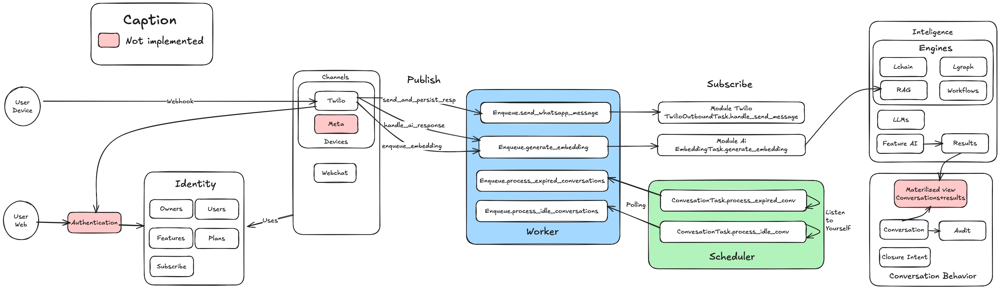

# WhatsApp Twilio AI

> Plataforma Enterprise de Automação de Conversas com IA via WhatsApp Business e Twilio.

   

## 📖 Sobre o Projeto

**WhatsApp Twilio AI** é uma plataforma robusta e escalável (SaaS Multi-tenant) projetada para automatizar interações complexas no WhatsApp Business. Utilizando **Inteligência Artificial (LLMs)** e uma arquitetura orientada a eventos (Modular Monolith), o sistema gerencia conversas, mantém contexto e executa ações de negócio de forma autônoma.

## 🏗️ Arquitetura do Sistema



### Principais Funcionalidades
- 🤖 **Agentes de IA Inteligentes**: Integração com OpenAI/LangChain, com seleção dinâmica de agentes e memória híbrida (Redis + Vector Store).
- 🏢 **Multi-Tenant**: Suporte isolado para múltiplas organizações e contas Twilio.
- ⚡ **Alta Performance**: Processamento assíncrono distribuído com filas (QueueService unificado) e Webhooks de resposta imediata.
- 🗣️ **Human Handoff**: Mecanismo para transbordo de atendimento para humanos quando a IA não resolve.
- 🔒 **Segurança e Conformidade**: Gestão segura de mídia e downloads isolados.
- 🔄 **Resiliência**: Mecanismos de Fallback, Idempotência e Recuperação de Falhas.
- 📊 **Gestão de Ciclo de Vida**: Máquina de estados completa para gerenciar conversas (Timeout, Expiração, Encerramento).

## 🚀 Tecnologias Utilizadas

- **Core**: Python 3.12+, FastAPI, Pydantic (Strict Typing), Dependency Injection (Container).
- **Arquitetura**: Modular Monolith, Clean Architecture, Repository Pattern.
- **Banco de Dados**: PostgreSQL (via Supabase/PostgREST).
- **Integrações**: Twilio API (Inbound/Outbound), OpenAI API, LangChain.
- **Mensageria/Filas**: BullMQ (Redis) via QueueService unificado.
- **DevOps**: Docker, Makefile, Scripts de verificação de ambiente.

## 📋 Pré-requisitos

Para executar este projeto localmente, você precisará de:

- **Python 3.12+**
- **Docker & Docker Compose** (para Redis e serviços auxiliares)
- **Conta Supabase** (ou instância Postgres local)
- **Conta Twilio** (para webhooks e envio de mensagens)
- **Ngrok** (para expor o webhook localmente)

## 🔧 Instalação

1. **Clone o repositório**
   ```bash
   git clone https://github.com/seu-usuario/whatsapp_twilio_ai.git
   cd whatsapp_twilio_ai
   ```

2. **Configure o ambiente virtual**
   ```bash
   python -m venv venv
   source venv/bin/activate  # Linux/Mac
   # ou
   .\venv\Scripts\activate  # Windows
   ```

3. **Instale as dependências**
   ```bash
   make install
   # ou
   pip install -r requirements.txt
   ```

4. **Configure as Variáveis de Ambiente**
   Copie o exemplo e preencha com suas credenciais:
   ```bash
   cp .env.example .env
   ```
   > **Nota**: Preencha chaves críticas como `SUPABASE_URL`, `SUPABASE_KEY`, `TWILIO_ACCOUNT_SID`, `OPENAI_API_KEY`.

5. **Verifique o Ambiente**
   Execute o script de verificação para garantir que tudo está configurado corretamente:
   ```bash
   make check-env
   ```

## ⚡ Como Usar

### Comandos Úteis (Makefile)

O projeto inclui um `Makefile` para facilitar operações comuns:

- **Iniciar a Aplicação**:
  ```bash
  make run
  ```
  O servidor estará disponível em `http://localhost:8000`.
  > **Nota**: Este comando agora verifica se o worker está rodando.

- **Iniciar Infraestrutura de Background (Obrigatório)**:
  Para o funcionamento correto do sistema, você deve rodar os workers e o scheduler em terminais separados:

  **Terminal 1 (Worker de Filas):**
  ```bash
  make run-worker
  ```

  **Terminal 2 (Scheduler de Tarefas):**
  ```bash
  make run-scheduler
  ```

- **Parar Aplicação e Workers**:
  ```bash
  make stop
  ```

- **Executar Migrations**:
  ```bash
  make migrate
  ```

- **Popular Banco de Dados (Seed)**:
  ```bash
  make seed
  ```

- **Rodar Testes**:
  ```bash
  make test
  ```

### Exemplo de Uso Local (Webhook)

1. **Exponha a porta local via Ngrok (Obrigatório)**:
   Para que o Twilio se comunique com seu localhost, execute em um novo terminal:
   ```bash
   ngrok http 8000
   ```
   Copie a URL gerada (ex: `https://abcd-123.ngrok-free.app`).

2. **Inicie os Serviços**:
   Certifique-se de ter 3 terminais rodando: `make run-worker`, `make run-scheduler` e `make run`.

3. **Configure o Twilio**:
   No Console do Twilio, defina a URL do webhook para:
   `[SUA_URL_NGROK]/api/v1/twilio/webhook`

4. **Teste**:
   Envie uma mensagem para o número do WhatsApp configurado.

## 📚 Documentação Adicional

A documentação técnica detalhada encontra-se na pasta `docs/v4/`:

- 📐 **[Arquitetura do Sistema](docs/v4/architecture.md)**
  Detalhes sobre padrões de design, fluxo de dados e decisões arquiteturais.

- 📝 **[Resumo do Projeto](docs/v4/project_summary.md)**
  Visão geral executiva, análise de conformidade e status de maturidade do projeto.

- 🔧 **[Últimas Correções](docs/v4/last_corrections.md)**
  Histórico recente de refatorações (v4.0), correções de segurança e melhorias de performance.

- 📊 **[Diagramas](docs/v3/diagrams.md)**
  Representações visuais da arquitetura, ciclo de vida e fluxos (Mermaid).

## 📂 Estrutura de Pastas

```
src/
├── core/         # Infraestrutura base (Config, DB, Queue, DI)
├── modules/      # Domínios de Negócio
│   ├── ai/             # Motores de Inteligência e Agentes
│   ├── channels/       # Integração Twilio/WhatsApp (API, Services)
│   ├── conversation/   # Gestão de Estado e Mensagens (API, Services)
│   └── identity/       # Gestão de Tenants, Usuários e Permissões (API, Services)
└── main.py       # Ponto de entrada da aplicação
```

## 🤝 Contribuindo

Contribuições são bem-vindas! Por favor, siga estes passos:

1. Faça um Fork do projeto.
2. Crie uma Branch para sua Feature (`git checkout -b feature/MinhaFeature`).
3. Commit suas mudanças (`git commit -m 'Add: Minha nova feature'`).
4. Push para a Branch (`git push origin feature/MinhaFeature`).
5. Abra um Pull Request.

**Guia de Estilo**: O projeto utiliza `black`, `isort` e `flake8`. Execute `make format` e `make lint` antes de submeter.

## 📄 Licença

Este projeto é **Proprietário**. Todos os direitos reservados.
Consulte o arquivo `LICENSE` (se disponível) ou contate os autores para permissões de uso.

## 📞 Contato / Autores

- **Lennon** - Arquiteto de Software e Desenvolvedor Líder
