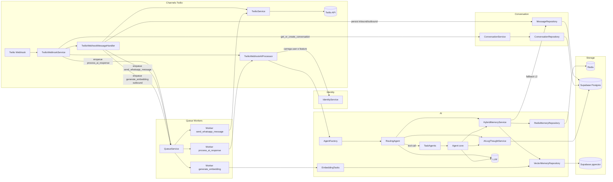
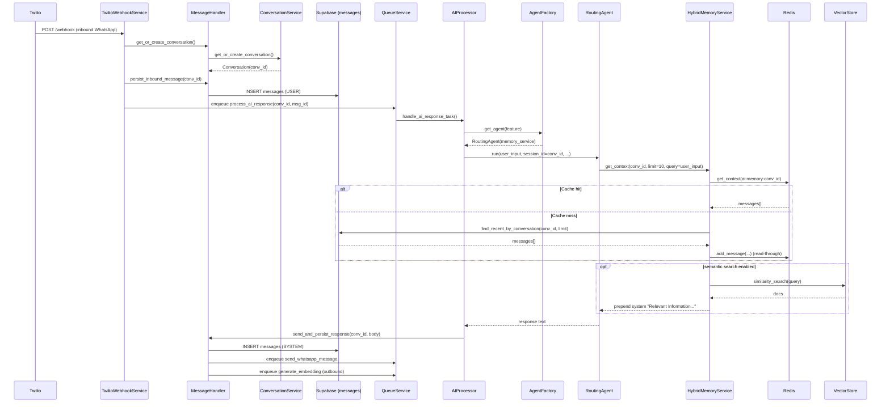
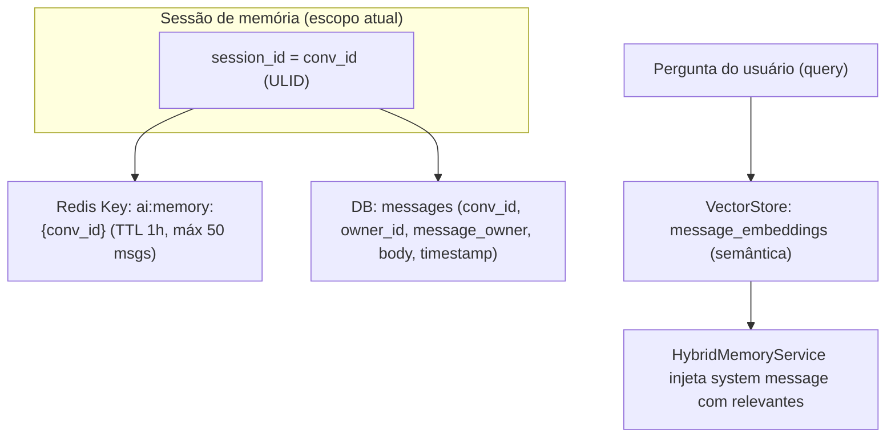

# Análise profunda do módulo `src/modules/ai/` (fluxo, memória e perda de preferências)

## Objetivo

Este documento mapeia o fluxo do módulo de IA e explica, com base no código, por que informações do usuário (gostos, preferências etc.) parecem “sumir” na próxima iteração — levando o agente a respostas do tipo: “Desculpe, mas não tenho registro dos seus gostos…”.

O ponto central é que **o sistema hoje tem memória conversacional “curta” por conversa (`conv_id`) e um perfil “durável” bem limitado (apenas `profile_name`)**. Quando a conversa muda de `conv_id` (por timeout/encerramento), ou quando a janela de contexto não alcança a mensagem onde a preferência foi dita, o modelo realmente deixa de “ver” esses dados no prompt.

---

## 1) Estrutura do módulo `ai/` (responsabilidades)

### `ai_result/` (observabilidade e auditoria)
- Persiste logs estruturados do comportamento do agente (tool calls, respostas, etc.).
- Principal ponto: [AILogThoughtService](file:///Users/lennon/projects/ai_engineering/whatsapp_twilio_ai/src/modules/ai/ai_result/services/ai_log_thought_service.py) grava eventos no repositório/serviço de resultados.

### `engines/lchain/` (orquestração LLM + ferramentas)
- **Core (genérico)**: agentes, ferramentas, schemas e utilitários.
  - [RoutingAgent](file:///Users/lennon/projects/ai_engineering/whatsapp_twilio_ai/src/modules/ai/engines/lchain/core/agents/routing_agent.py): escolhe (ou não) um `TaskAgent` via tool-calls.
  - [TaskAgent](file:///Users/lennon/projects/ai_engineering/whatsapp_twilio_ai/src/modules/ai/engines/lchain/core/agents/task_agent.py): instancia o agente “executor” (core [Agent](file:///Users/lennon/projects/ai_engineering/whatsapp_twilio_ai/src/modules/ai/engines/lchain/core/agents/agent.py)).
  - [AgentFactory](file:///Users/lennon/projects/ai_engineering/whatsapp_twilio_ai/src/modules/ai/engines/lchain/core/agents/agent_factory.py): seleciona o agente por “feature” e injeta `memory_service`.
- **Features**:
  - Finance: [create_finance_agent](file:///Users/lennon/projects/ai_engineering/whatsapp_twilio_ai/src/modules/ai/engines/lchain/feature/finance/finance_agent.py)
  - Relationships: [create_relationships_agent](file:///Users/lennon/projects/ai_engineering/whatsapp_twilio_ai/src/modules/ai/engines/lchain/feature/relationships/relationships_agent.py)

### `memory/` (memória híbrida L1/L2/L3)
- Interface: [MemoryInterface](file:///Users/lennon/projects/ai_engineering/whatsapp_twilio_ai/src/modules/ai/memory/interfaces/memory_interface.py)
- L1 Redis (cache curto por sessão): [RedisMemoryRepository](file:///Users/lennon/projects/ai_engineering/whatsapp_twilio_ai/src/modules/ai/memory/repositories/redis_memory_repository.py)
- L2 DB (mensagens persistidas por conversa): [MessageRepository](file:///Users/lennon/projects/ai_engineering/whatsapp_twilio_ai/src/modules/conversation/repositories/message_repository.py)
- L3 Vetorial (semântica / “memória longa”): [VectorMemoryRepository](file:///Users/lennon/projects/ai_engineering/whatsapp_twilio_ai/src/modules/ai/memory/repositories/vector_memory_repository.py)
- Orquestrador: [HybridMemoryService](file:///Users/lennon/projects/ai_engineering/whatsapp_twilio_ai/src/modules/ai/memory/services/hybrid_memory_service.py)

### `workers/` (embeddings)
- Enfileiramento/consumo de embeddings: [EmbeddingTasks](file:///Users/lennon/projects/ai_engineering/whatsapp_twilio_ai/src/modules/ai/workers/embedding_tasks.py)

---

## 2) Fluxo “fim a fim” (Webhook → Conversa → Memória → Resposta)

O fluxo real de execução da IA está no módulo de canal (Twilio), mas ele **injeta o contexto** (incluindo `session_id`) no agente do módulo `ai/`.

### Entrada (inbound WhatsApp)
1. Webhook entra em [TwilioWebhookService.process_webhook](file:///Users/lennon/projects/ai_engineering/whatsapp_twilio_ai/src/modules/channels/twilio/services/twilio_webhook_service.py#L48-L209).
2. Conversa é obtida/criada (por *session_key*): [ConversationService.get_or_create_conversation](file:///Users/lennon/projects/ai_engineering/whatsapp_twilio_ai/src/modules/conversation/services/conversation_service.py#L52-L114) → [ConversationFinder.calculate_session_key](file:///Users/lennon/projects/ai_engineering/whatsapp_twilio_ai/src/modules/conversation/components/conversation_finder.py#L29-L46).
3. Mensagem do usuário é persistida no DB: [persist_inbound_message](file:///Users/lennon/projects/ai_engineering/whatsapp_twilio_ai/src/modules/channels/twilio/services/webhook/message_handler.py#L126-L163).
4. Tarefa de IA é enfileirada: [TwilioWebhookAIProcessor.enqueue_ai_task](file:///Users/lennon/projects/ai_engineering/whatsapp_twilio_ai/src/modules/channels/twilio/services/webhook/ai_processor.py#L33-L53).

### Execução da IA (worker)
5. Worker chama [TwilioWebhookAIProcessor.handle_ai_response](file:///Users/lennon/projects/ai_engineering/whatsapp_twilio_ai/src/modules/channels/twilio/services/webhook/ai_processor.py#L68-L182), monta `agent_context` e chama:
   - `agent.run(user_input=payload.body, **agent_context)`
   - Onde `session_id = conversation_id (conv_id)`.

### Memória dentro do módulo `ai/`
6. [RoutingAgent.run](file:///Users/lennon/projects/ai_engineering/whatsapp_twilio_ai/src/modules/ai/engines/lchain/core/agents/routing_agent.py#L53-L286) resolve o `session_id` e carrega memória (se `memory` estiver vazio):
   - `memory_service.get_context(session_id, limit=10, query=user_input)`
7. `HybridMemoryService.get_context` aplica:
   - L1 Redis → L2 DB → L3 Vetorial (opcional): [HybridMemoryService](file:///Users/lennon/projects/ai_engineering/whatsapp_twilio_ai/src/modules/ai/memory/services/hybrid_memory_service.py#L29-L107)
8. O RoutingAgent decide:
   - **Sem tool call**: ele mesmo responde e persiste user+assistant em memória (Redis): [RoutingAgent.run](file:///Users/lennon/projects/ai_engineering/whatsapp_twilio_ai/src/modules/ai/engines/lchain/core/agents/routing_agent.py#L194-L247)
   - **Com tool call**: delega para um `TaskAgent`, que instancia [Agent](file:///Users/lennon/projects/ai_engineering/whatsapp_twilio_ai/src/modules/ai/engines/lchain/core/agents/agent.py) (core executor), que também consulta memória.

### Saída (persistência + envio)
9. Resposta final é persistida no DB + envio assíncrono: [send_and_persist_response](file:///Users/lennon/projects/ai_engineering/whatsapp_twilio_ai/src/modules/channels/twilio/services/webhook/message_handler.py#L196-L277).
10. O outbound **gera embedding** (enfileira `generate_embedding`): [message_handler.py](file:///Users/lennon/projects/ai_engineering/whatsapp_twilio_ai/src/modules/channels/twilio/services/webhook/message_handler.py#L36-L58) + [message_handler.py:L261-L263](file:///Users/lennon/projects/ai_engineering/whatsapp_twilio_ai/src/modules/channels/twilio/services/webhook/message_handler.py#L261-L263).

---

## 3) Como a memória está modelada hoje (L1/L2/L3)

### L1 (Redis) — curto prazo por sessão
- Chave: `ai:memory:{session_id}` onde `session_id` = `conv_id` no fluxo Twilio.
- TTL padrão: **3600s** (1h), renovado a cada `add_message` [redis_memory_repository.py](file:///Users/lennon/projects/ai_engineering/whatsapp_twilio_ai/src/modules/ai/memory/repositories/redis_memory_repository.py#L19-L94)
- Retém as **últimas 50 mensagens** (`ltrim -50..-1`).

Ponto crítico: o repo Redis pode se **auto-desativar** se ocorrer `ConnectionError` e, a partir daí, **sempre retorna vazio** até reiniciar o processo:
- [RedisMemoryRepository._disable](file:///Users/lennon/projects/ai_engineering/whatsapp_twilio_ai/src/modules/ai/memory/repositories/redis_memory_repository.py#L33-L43)

### L2 (DB) — histórico por conversa (`conv_id`)
Quando L1 não retorna mensagens, `HybridMemoryService` lê do DB:
- [message_repo.find_recent_by_conversation](file:///Users/lennon/projects/ai_engineering/whatsapp_twilio_ai/src/modules/conversation/repositories/message_repository.py#L108-L137)
- Converte `message_owner` em `role` user/assistant: [hybrid_memory_service.py](file:///Users/lennon/projects/ai_engineering/whatsapp_twilio_ai/src/modules/ai/memory/services/hybrid_memory_service.py#L56-L86)
- Re-popula Redis (read-through) com o que veio do DB.

### L3 (Vetorial) — memória “longa” semântica (opcional)
Se houver `query` e o `vector_repo` estiver ativo, ele faz `similarity_search` e injeta uma mensagem `system` com “Relevant Information…”:
- [HybridMemoryService.get_context](file:///Users/lennon/projects/ai_engineering/whatsapp_twilio_ai/src/modules/ai/memory/services/hybrid_memory_service.py#L87-L106)

Limitações atuais que impactam “gostos/preferências”:
1. **Embeddings são enfileirados apenas para outbound**, não para inbound.
   - Ou seja: “Eu gosto de X” dito pelo usuário **não entra no vector store** por este caminho.
2. A busca vetorial pode se auto-desativar em falhas de schema (ex.: `PGRST202`): [VectorMemoryRepository.search_relevant](file:///Users/lennon/projects/ai_engineering/whatsapp_twilio_ai/src/modules/ai/memory/repositories/vector_memory_repository.py#L55-L76).
3. A busca é “global” (sem filtro por `owner_id/user_id`), o que reduz relevância e aumenta risco de vazamento cruzado (mesmo que ainda não seja o seu problema imediato): [HybridMemoryService](file:///Users/lennon/projects/ai_engineering/whatsapp_twilio_ai/src/modules/ai/memory/services/hybrid_memory_service.py#L88-L93).

---

## 4) Onde “preferências do usuário” são persistidas hoje (e onde não são)

### Persistido de forma durável (perfil)
Hoje existe apenas **extração e persistência de nome**:
- Extrai e salva `profile_name` via Identity: [ai_processor.py](file:///Users/lennon/projects/ai_engineering/whatsapp_twilio_ai/src/modules/channels/twilio/services/webhook/ai_processor.py#L98-L116) + [profile_memory.py](file:///Users/lennon/projects/ai_engineering/whatsapp_twilio_ai/src/modules/identity/utils/profile_memory.py)
- Injeta no prompt como `additional_context`: [ai_processor.py](file:///Users/lennon/projects/ai_engineering/whatsapp_twilio_ai/src/modules/channels/twilio/services/webhook/ai_processor.py#L114-L129)

### Não persistido de forma durável (gostos, preferências, fatos do usuário)
- Não há nenhum mecanismo equivalente ao do `profile_name` para “gostos”, “preferências” ou “perfil expandido”.
- Logo, essas informações dependem de:
  - Estarem dentro da janela de memória curta (L1/L2, `limit=10`), ou
  - Estarem indexadas no L3 (o que hoje tende a falhar para preferências ditas pelo usuário, pois inbound não gera embedding).

---

## 5) Por que a memória “se perde” na próxima iteração (causas prováveis + evidências)

### Causa A — a memória é **escopada por `conv_id`** (e `conv_id` muda)
O `session_id` usado na IA é o `conversation_id` (ULID `conv_id`) do Conversation Module:
- [TwilioWebhookAIProcessor](file:///Users/lennon/projects/ai_engineering/whatsapp_twilio_ai/src/modules/channels/twilio/services/webhook/ai_processor.py#L118-L129) injeta `session_id = conversation_id`.
- [RoutingAgent.run](file:///Users/lennon/projects/ai_engineering/whatsapp_twilio_ai/src/modules/ai/engines/lchain/core/agents/routing_agent.py#L75-L94) usa esse `session_id` para buscar memória.

Quando o Conversation Module cria uma nova conversa (novo `conv_id`), a IA passa a olhar **um namespace de memória diferente** (Redis/DB por conv_id), então as preferências “ditas anteriormente” ficam fora do prompt.

**O que pode mudar `conv_id` na prática:**
1. Conversa encerrada (palavras-chave como “tchau”, “obrigado”, etc.).
2. Conversa expirada (`expires_at`) e recriada.
3. Conversa marcada como `IDLE_TIMEOUT` por job de background:
   - Scheduler enfileira: [scheduler.py](file:///Users/lennon/projects/ai_engineering/whatsapp_twilio_ai/src/modules/conversation/workers/scheduler.py#L104-L132)
   - Task executa: [tasks.py](file:///Users/lennon/projects/ai_engineering/whatsapp_twilio_ai/src/modules/conversation/workers/tasks.py#L18-L43)

E aqui existe um detalhe importante de design:
- `find_active` só retorna estados “ativos” (PENDING/PROGRESS/HUMAN_HANDOFF): [ConversationStatus.active_statuses](file:///Users/lennon/projects/ai_engineering/whatsapp_twilio_ai/src/modules/conversation/enums/conversation_status.py#L42-L50)
- Logo, se uma conversa entra em `IDLE_TIMEOUT`, o `get_or_create_conversation` **não reencontra a conversa** e cria uma nova:
  - [ConversationService.get_or_create_conversation](file:///Users/lennon/projects/ai_engineering/whatsapp_twilio_ai/src/modules/conversation/services/conversation_service.py#L65-L114)

Resultado: **“próxima iteração” pode significar “próxima conversa”** (novo `conv_id`), e aí a memória curta por conversa deixa de existir.

### Causa B — janela curta: `limit=10` (e Redis corta para 50)
Mesmo dentro do mesmo `conv_id`, as consultas usam janelas pequenas:
- RoutingAgent: `limit=10` [routing_agent.py](file:///Users/lennon/projects/ai_engineering/whatsapp_twilio_ai/src/modules/ai/engines/lchain/core/agents/routing_agent.py#L99-L121)
- Agent (executor): `limit=10` [agent.py](file:///Users/lennon/projects/ai_engineering/whatsapp_twilio_ai/src/modules/ai/engines/lchain/core/agents/agent.py#L91-L124)
- Redis mantém no máximo 50 entradas por sessão: [redis_memory_repository.py](file:///Users/lennon/projects/ai_engineering/whatsapp_twilio_ai/src/modules/ai/memory/repositories/redis_memory_repository.py#L84-L89)

Se o usuário disse preferências “há muitas mensagens atrás”, o modelo não vai ver isso e pode declarar não ter registro.

### Causa C — L3 (vetorial) não “captura” preferências do usuário (inbound)
Mesmo que você queira memória longa, hoje:
- O enfileiramento de embeddings acontece no outbound: [message_handler.py](file:///Users/lennon/projects/ai_engineering/whatsapp_twilio_ai/src/modules/channels/twilio/services/webhook/message_handler.py#L261-L263)
- Não há enfileiramento equivalente no `persist_inbound_message`.

Isso reduz drasticamente a chance de o L3 trazer “Eu gosto de X…” quando o usuário perguntar depois.

### Causa D — Redis (L1) pode estar desligando silenciosamente
Se houver intermitência do Redis, o L1 se desativa e passa a retornar sempre `[]`:
- [RedisMemoryRepository._disable](file:///Users/lennon/projects/ai_engineering/whatsapp_twilio_ai/src/modules/ai/memory/repositories/redis_memory_repository.py#L33-L43)

Nesse caso a memória depende mais do L2 (DB). Se houver inconsistências de persistência (ou consulta limitada), o efeito percebido é “perdeu memória”.

---

## 6) Diagramas (Mermaid)

### 6.1 Diagrama de componentes (visão macro)

### 6.2 Sequência (inbound → IA → memória → resposta)

### 6.3 Diagrama de dados da memória (chaves e escopo)

---

## 7) Conclusões e recomendações (práticas)

### Conclusões
1. **“Gostos/preferências” não são persistidos como perfil** (durável). Hoje só existe `profile_name`.
2. A “memória” do agente é majoritariamente **histórico curto por conversa (`conv_id`)**. Se o `conv_id` muda (idle/timeout/encerramento), a IA naturalmente “esquece”.
3. A memória vetorial (L3), que seria o caminho para lembrar preferências ao longo do tempo, **não está capturando inbound** (onde as preferências geralmente aparecem) e pode estar desativada por falhas de schema/config.

### Recomendações (sem alterar código, apenas direções)
1. **Decidir o escopo desejado** para “memória do usuário”:
   - Memória por conversa (`conv_id`) é adequada para contexto imediato.
   - Preferências do usuário exigem **memória por usuário** (`user_id`) ou por sessão-key (números), independente de `conv_id`.
2. **Persistir preferências estruturadas** no módulo Identity (ex.: `preferences_json`) ou em uma tabela dedicada, evitando depender só de histórico.
3. **Habilitar memória longa (L3) de forma completa**:
   - Enfileirar embeddings também no inbound.
   - Filtrar busca por `owner_id` e idealmente `user_id`.
4. Se o objetivo é “memória contínua” mesmo após `IDLE_TIMEOUT`:
   - Ajustar a estratégia para que `get_or_create_conversation` também considere conversas “paused” (ou recupere contexto do `previous_conversation_id` ao criar nova).

---

## 8) Relatório técnico (reflexões e pontos de melhoria)

O módulo `ai/` está bem modularizado (agentes, memória, workers e logging), mas hoje “memória de preferências” está sendo tratada como se fosse “memória conversacional”, o que é frágil por natureza: janelas pequenas, troca de `conv_id` e dependência de infraestrutura (Redis/Vetor). Separar explicitamente **memória de curto prazo (por conversa)** de **memória durável (por usuário)** reduz a variabilidade do comportamento e torna as respostas mais consistentes.

Para evolução segura e escalável, o próximo passo natural é formalizar um “perfil do usuário” (Identity) e/ou um “User Memory Store” com governança (escopo por owner/user, políticas de retenção, e controles de privacidade). Em paralelo, a memória vetorial deve ser completada para indexar inbound e ter filtros por tenant, evitando recuperar informação irrelevante e reduzindo risco de vazamento entre clientes.
