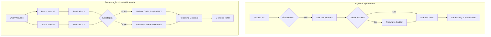
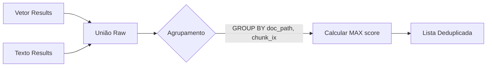
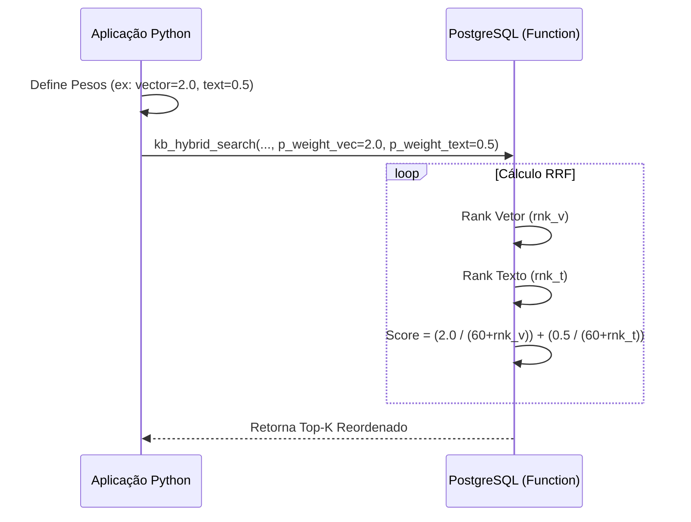
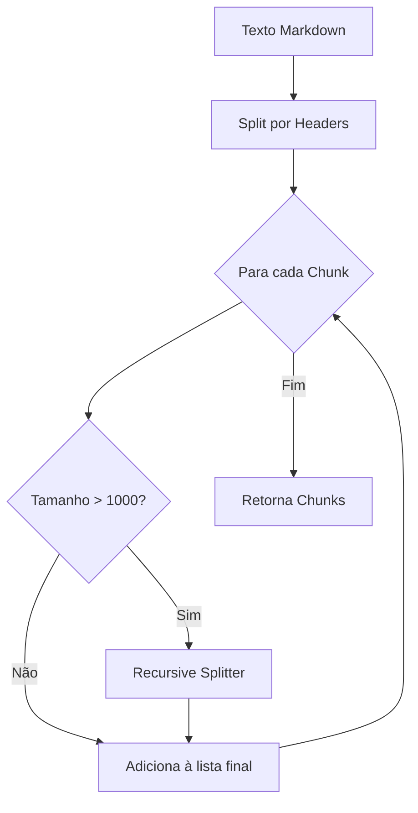

# Guia de Implementação: Correções e Melhorias no RAG Híbrido

Este guia prático complementa a análise anterior, fornecendo **diagramas visuais (Mermaid)** e **exemplos de código** concretos para implementar as correções identificadas.

---

## 1. Visão Geral da Solução Proposta

O diagrama abaixo ilustra o fluxo aprimorado de ingestão e recuperação, destacando os pontos de intervenção.



---

## 2. Correção: Deduplicação na Busca Híbrida (Union)

**Problema:** A implementação atual de `UNION` permite que o mesmo trecho de texto apareça duas vezes se for encontrado tanto pela busca vetorial quanto pela textual.

### Diagrama de Fluxo: Deduplicação



### Solução SQL (`sql/kb/03_functions.sql`)

Modifique a função `kb_hybrid_union` para agregar resultados duplicados.

```sql
create or replace function public.kb_hybrid_union(
  query_text text,
  query_embedding text,
  p_k int,
  p_threshold double precision default null,
  p_client_id uuid default null,
  p_empresa text default null,
  p_chunking text default null
)
returns table (
  doc_path text,
  chunk_ix int,
  content text,
  score double precision,
  meta jsonb
) language sql stable as $$
  with v as (
    -- Busca Vetorial
    select doc_path, chunk_ix, content, score, meta 
    from public.kb_vector_search(query_embedding, p_k, p_threshold, p_client_id, p_empresa, p_chunking)
  ), t as (
    -- Busca Textual
    select doc_path, chunk_ix, content, score, meta 
    from public.kb_text_search(query_text, p_k, p_client_id, p_empresa, p_chunking)
  ), u as (
    -- União simples (pode conter duplicatas)
    select * from v
    union all
    select * from t
  )
  -- Agrupamento para deduplicação
  select doc_path, chunk_ix, 
         max(content) as content, -- conteúdo é igual, pega qualquer um
         max(score) as score,     -- pega o maior score entre as estratégias
         max(meta) as meta
  from u
  group by doc_path, chunk_ix
  order by max(score) desc
  limit p_k
$$;
```

---

## 3. Melhoria: Parametrização do RRF (Reciprocal Rank Fusion)

**Problema:** Os pesos do RRF estão "hardcoded" no SQL (1.5 para vetor, 1.0 para texto), impedindo ajustes finos via aplicação.

### Diagrama de Sequência: Chamada Parametrizada



### Solução SQL (`sql/kb/03_functions.sql`)

Atualize a assinatura da função para aceitar pesos.

```sql
create or replace function public.kb_hybrid_search(
  query_text text,
  query_embedding text,
  p_k int,
  p_threshold double precision default null,
  p_client_id uuid default null,
  p_empresa text default null,
  p_chunking text default null,
  p_weight_vec double precision default 1.5,  -- Novo parâmetro
  p_weight_text double precision default 1.0  -- Novo parâmetro
)
returns table (
  -- ... assinatura de retorno igual ...
  doc_path text,
  chunk_ix int,
  content text,
  score double precision,
  meta jsonb
) language sql stable as $$
  with v as (
    select doc_path, chunk_ix, content, score, meta,
           row_number() over (order by score desc) as rnk_v
    from public.kb_vector_search(query_embedding, p_k, p_threshold, p_client_id, p_empresa, p_chunking)
  ), t as (
    select doc_path, chunk_ix, content, score, meta,
           row_number() over (order by score desc) as rnk_t
    from public.kb_text_search(query_text, p_k, p_client_id, p_empresa, p_chunking)
  ), u as (
    select coalesce(v.doc_path, t.doc_path) as doc_path,
           coalesce(v.chunk_ix, t.chunk_ix) as chunk_ix,
           coalesce(v.content, t.content) as content,
           coalesce(v.meta, t.meta) as meta,
           v.rnk_v, t.rnk_t
    from v full outer join t
      on v.doc_path = t.doc_path and v.chunk_ix = t.chunk_ix
  ), r as (
    -- Cálculo RRF usando os parâmetros
    select doc_path, chunk_ix, content, meta,
           coalesce(p_weight_vec / (60 + rnk_v), 0) + coalesce(p_weight_text / (60 + rnk_t), 0) as score
    from u
  )
  select doc_path, chunk_ix, content, score, meta
  from r
  order by score desc
  limit p_k
$$;
```

---

## 4. Melhoria: Chunking Markdown Híbrido

**Problema:** Documentos Markdown longos sem subtítulos geram chunks gigantes, degradando a busca vetorial.

### Diagrama de Lógica: Splitter Inteligente



### Solução Python (`app/rag/loaders.py`)

Atualize `split_markdown` para usar um splitter recursivo como fallback.

```python
from langchain_text_splitters import RecursiveCharacterTextSplitter, MarkdownHeaderTextSplitter

def split_markdown(text: str, *, chunk_size: int = 800, chunk_overlap: int = 200) -> List[str]:
    """
    Markdown awareness com fallback para RecursiveCharacterTextSplitter
    se os blocos resultantes forem muito grandes.
    """
    # 1. Divisão Estrutural (Headers)
    md_splitter = MarkdownHeaderTextSplitter(
        headers_to_split_on=[("#", "h1"), ("##", "h2"), ("###", "h3")]
    )
    docs = md_splitter.split_text(text)
    
    final_chunks = []
    
    # 2. Refinamento por Tamanho (Fallback)
    recursive_splitter = RecursiveCharacterTextSplitter(
        chunk_size=chunk_size,
        chunk_overlap=chunk_overlap,
        length_function=len
    )
    
    for doc in docs:
        if len(doc.page_content) > chunk_size:
            # Se o bloco do header for muito grande, divide novamente
            sub_chunks = recursive_splitter.split_text(doc.page_content)
            final_chunks.extend(sub_chunks)
        else:
            final_chunks.append(doc.page_content)
            
    return final_chunks
```

---

## Resumo dos Arquivos Afetados

| Componente | Arquivo | Ação |
| :--- | :--- | :--- |
| **SQL Functions** | `sql/kb/03_functions.sql` | Atualizar `kb_hybrid_union` e `kb_hybrid_search` |
| **Loaders** | `app/rag/loaders.py` | Atualizar `split_markdown` |
| **Tools** | `app/rag/tools.py` | Atualizar chamadas SQL para passar novos pesos (se necessário) |

Este guia fornece o roteiro completo "copy-paste" para aplicar as correções sugeridas na análise.
