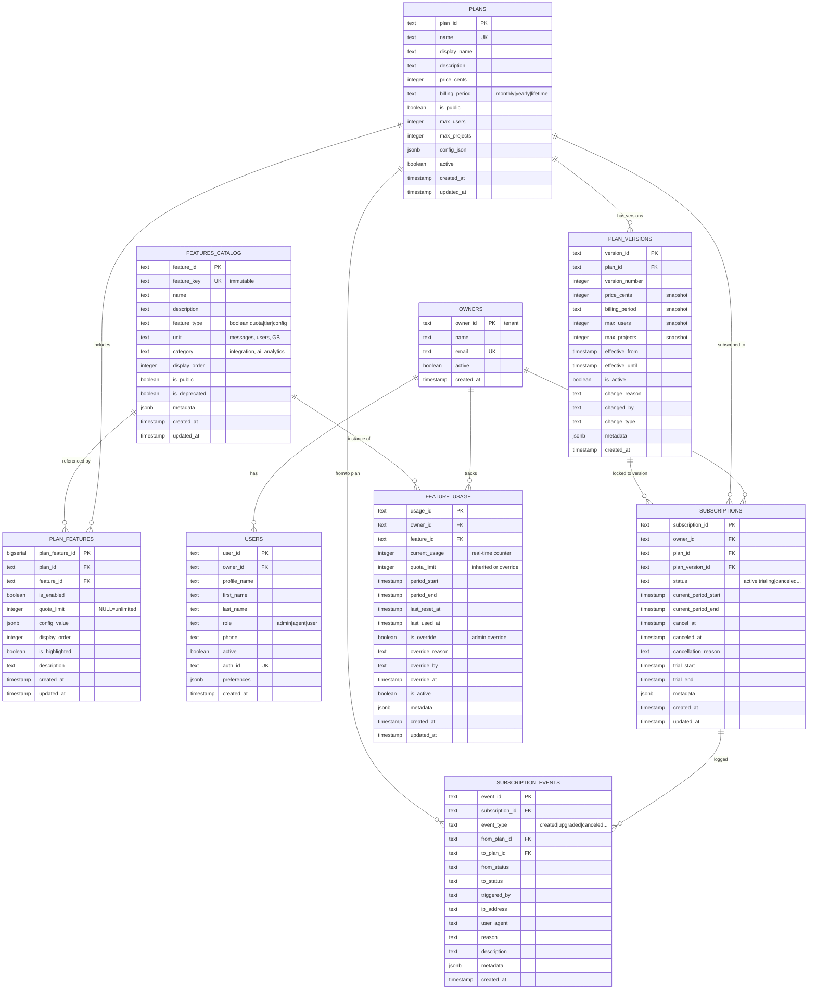
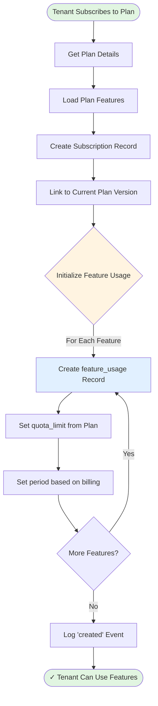
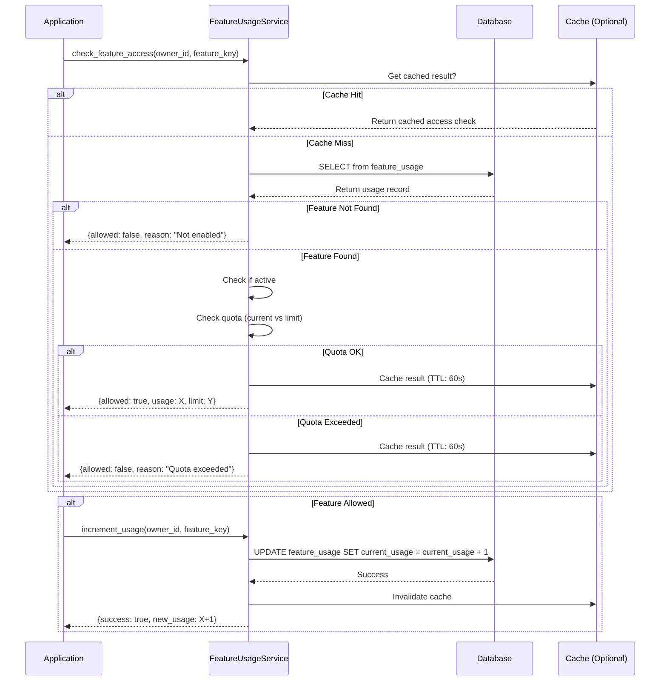
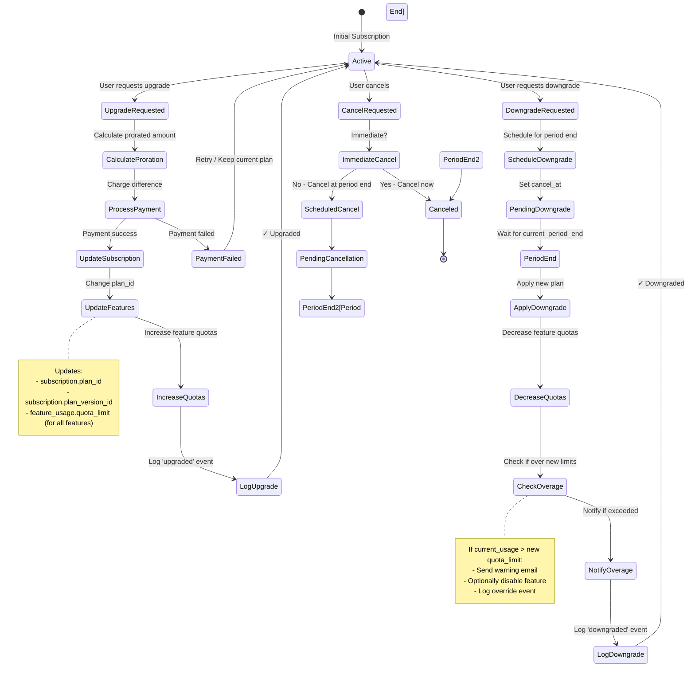
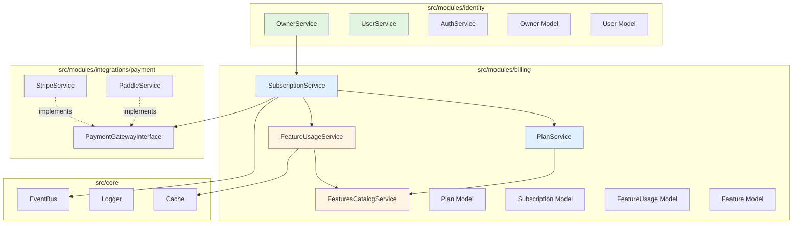
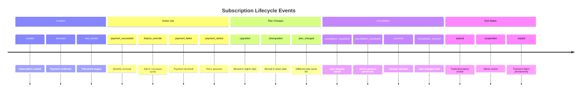
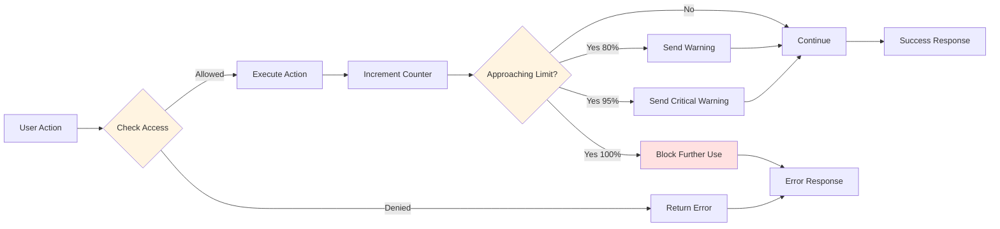
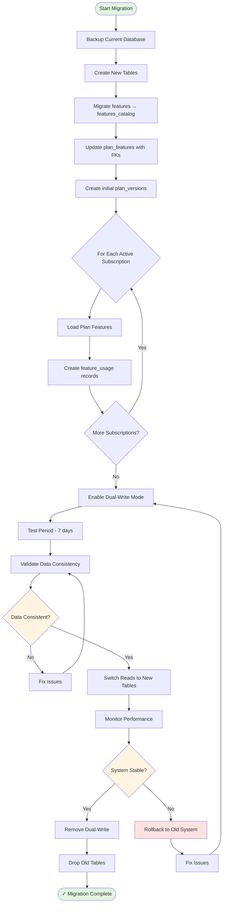

# Arquitetura SaaS Multi-Tenant - Diagramas

## 1. Modelo de Dados Completo

## 2. Fluxo de Feature Inheritance

## 3. Fluxo de Verificação de Feature Access

## 4. Fluxo de Upgrade/Downgrade

## 5. Arquitetura de Módulos (Separação Proposta)

## 6. Event Flow (Subscription Lifecycle)

## 7. Quota Tracking Flow

## 8. Data Migration Strategy

