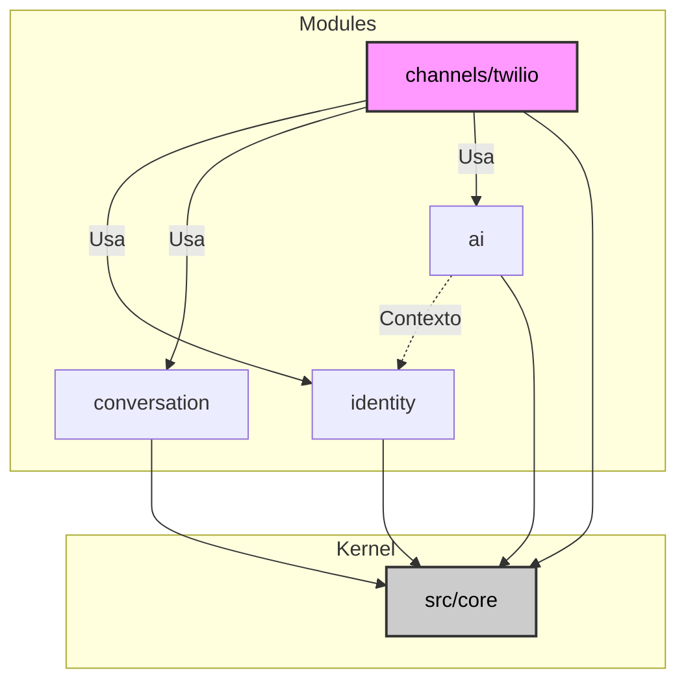

# Análise de Acoplamento e Coesão dos Módulos

**Data:** 04/02/2026
**Escopo:** `src/core`, `src/modules/{ai, conversation, identity, channels/twilio}`
**Contexto:** Análise baseada no estado atual do código e nos relatórios de conformidade recentes (Jan/2026).

## 1. Visão Geral Executiva

A arquitetura do projeto segue um modelo modular com camadas bem definidas. Observa-se uma clara distinção entre **módulos de domínio** (`identity`, `conversation`, `ai`), que são altamente coesos e desacoplados entre si, e **módulos de integração** (`channels/twilio`), que atuam como orquestradores e possuem alto acoplamento eferente (dependem de muitos outros).

O `src/core` atua como um *Shared Kernel*, provendo infraestrutura (DB, Logs, Config) para todos os módulos. Embora isso gere um acoplamento global com o Core, é uma decisão arquitetural comum e aceitável para manter a consistência técnica.

### Resumo de Métricas Qualitativas

| Módulo | Coesão | Acoplamento Eferente (Depende de...) | Acoplamento Aferente (Usado por...) | Classificação |
|---|---|---|---|---|
| `identity` | **Alta** | Baixo (`core`) | Alto (`channels`, `ai`) | **Core Domain** |
| `conversation` | **Alta** | Baixo (`core`) | Alto (`channels`) | **Core Domain** |
| `ai` | **Alta** | Baixo (`core`) | Médio (`channels`) | **Core Domain** |
| `channels/twilio` | **Média** | **Alto** (`conversation`, `identity`, `ai`, `core`) | Baixo (Webhook externo) | **Adapter / Orchestrator** |
| `core` | **Média** | Baixo (Libs externas) | **Altíssimo** (Todos) | **Shared Kernel** |

---

## 2. Análise Detalhada por Módulo

### 2.1. `src/modules/identity` (Alta Coesão / Baixo Acoplamento)
Este módulo é a fundação de permissionamento e multi-tenancy.
- **Coesão:** Focada exclusivamente na gestão de *Owners*, *Users*, *Plans* e *Subscriptions*. Não mistura lógica de mensagens ou IA.
- **Acoplamento:**
  - **Interno:** Não importa nada de outros módulos (`conversation` ou `ai`). Totalmente independente.
  - **Externo:** É consumido pelo `channels/twilio` (para resolver o dono da mensagem) e pelo `ai` (para memória e personalização).
- **Mudanças Recentes:** A estrutura reflete uma maturidade de domínio, sem grandes alterações estruturais recentes, mantendo-se estável.

### 2.2. `src/modules/conversation` (Alta Coesão / Baixo Acoplamento)
Módulo responsável pela persistência e ciclo de vida das conversas.
- **Coesão:** A introdução da V2 e a quebra em componentes (`Finder`, `Lifecycle`, `Closer`) aumentou significativamente a coesão. Cada componente tem responsabilidade única.
- **Acoplamento:**
  - **Interno:** Independente. Não conhece `ai` ou `twilio`.
  - **Externo:** Seus DTOs e Services são amplamente usados pelo `channels/twilio` para injetar mensagens.
- **Ponto de Atenção:** A coexistência de V1 e V2 ainda gera um leve ruído, mas a V2 mostra um design limpo.

### 2.3. `src/modules/ai` (Alta Coesão / Acoplamento Controlado)
Módulo complexo internamente, mas exposto como uma "caixa preta" de inteligência.
- **Coesão:** Alta. Organizado em *Features* (`finance`, `relationships`) e *Core* (`engines/lchain`). As features são *Bounded Contexts* menores dentro do módulo.
- **Acoplamento:**
  - **Interno:** Não depende de `conversation` ou `channels`. Depende levemente de `identity` (conceitualmente) para contexto, mas via interfaces ou dados passados.
  - **Externo:** É orquestrado pelo `channels/twilio`.
- **Evolução:** A arquitetura de *Plugins/Features* permite crescer horizontalmente sem afetar o núcleo.

### 2.4. `src/modules/channels/twilio` (Coesão Média / Alto Acoplamento)
Atua como o **Adapter** e **Orchestrator** do sistema. É o ponto de entrada das mensagens.
- **Coesão:** Média. Mistura lógica de recebimento de webhook, download de mídia, chamadas de IA e envio de resposta. Embora use *Services* para separar responsabilidades (`TwilioWebhookService`, `AIProcessor`, `AudioProcessor`), ele inerentemente "sabe demais" sobre o sistema.
- **Acoplamento:** **Crítico**. Importa e usa diretamente:
  - `IdentityService` (para resolver Owner)
  - `ConversationService` (para salvar mensagens)
  - `AgentFactory` / `TranscriptionService` (para processar IA)
- **Risco:** Qualquer mudança na assinatura de métodos dos outros módulos quebra o Twilio Channel. É o ponto mais frágil em termos de manutenção.

### 2.5. `src/core` (Coesão Média / Acoplamento Onipresente)
- **Coesão:** Agrupa utilitários técnicos diversos (Config, DB, Logger, Queue). É coeso no sentido de "Infraestrutura", mas funcionalmente diverso.
- **Acoplamento:** Todo o sistema depende dele.
- **Risco:** Efeitos colaterais em imports (como visto no `load_dotenv` e conexão DB global) afetam todos os módulos consumidores.

---

## 3. Diagrama de Acoplamento Atual

## 4. Recomendações de Evolução

### 4.1. Desacoplar `channels/twilio` via Eventos
Atualmente, o Twilio chama os serviços explicitamente (`identity_service.get_user`, `conversation_service.add_message`).
- **Sugestão:** Implementar um padrão de **Domain Events** (mesmo que síncrono ou via fila interna).
- **Cenário:** O Webhook publica `MessageReceived`.
  - Um *Handler* no módulo `conversation` escuta e persiste.
  - Um *Handler* no módulo `ai` escuta e processa.
- **Benefício:** O módulo Twilio deixa de conhecer a implementação interna dos outros módulos, atuando apenas como um *Gateway* de entrada/saída.

### 4.2. Reforçar Fronteiras do `core`
Para mitigar os riscos apontados na análise do Core:
- Remover inicializações globais (DB, Envs) no momento do import.
- Usar Injeção de Dependência estrita para que os módulos não precisem importar `src.core.database.session.db` diretamente, mas recebam uma instância de sessão.

### 4.3. Contratos Estáveis em `identity`
Como `identity` é usado por todos (para tenant resolution), seus DTOs e Interfaces devem ser extremamente estáveis.
- Evitar que `channels` conheça detalhes de implementação do `repository` de identidade. O uso atual via `Service` está correto, mas deve-se garantir que o Service retorne DTOs puros, não modelos do ORM/DB.

## 5. Conclusão

O sistema possui uma **saúde arquitetural positiva**. A decisão de manter `conversation`, `identity` e `ai` desacoplados entre si é o ponto mais forte, evitando o "Monólito Distribuído". O acoplamento concentrado no `channels/twilio` é natural para um adaptador de entrada, mas deve ser monitorado para não se tornar uma "God Class" que gerencia regras de negócio que deveriam estar nos domínios.

As mudanças recentes (V2 conversation, Modular AI) reforçaram essa separação, indicando que a equipe está atenta à coesão. O próximo passo lógico é diminuir a dependência direta do Twilio Channel através de abstrações ou eventos.
