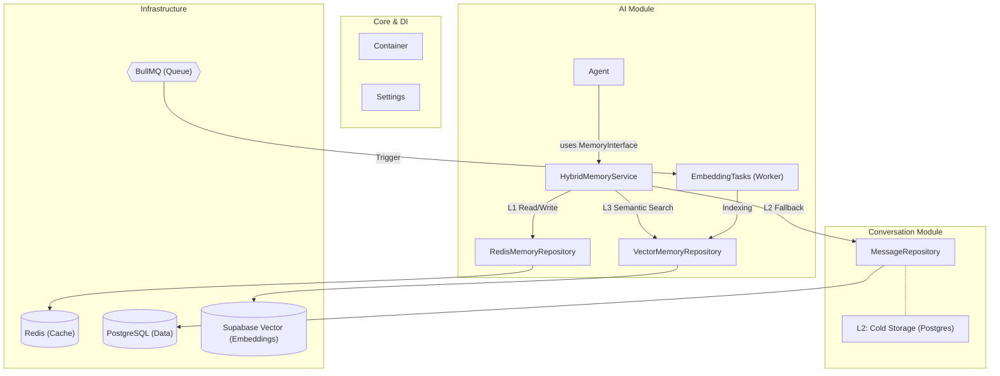
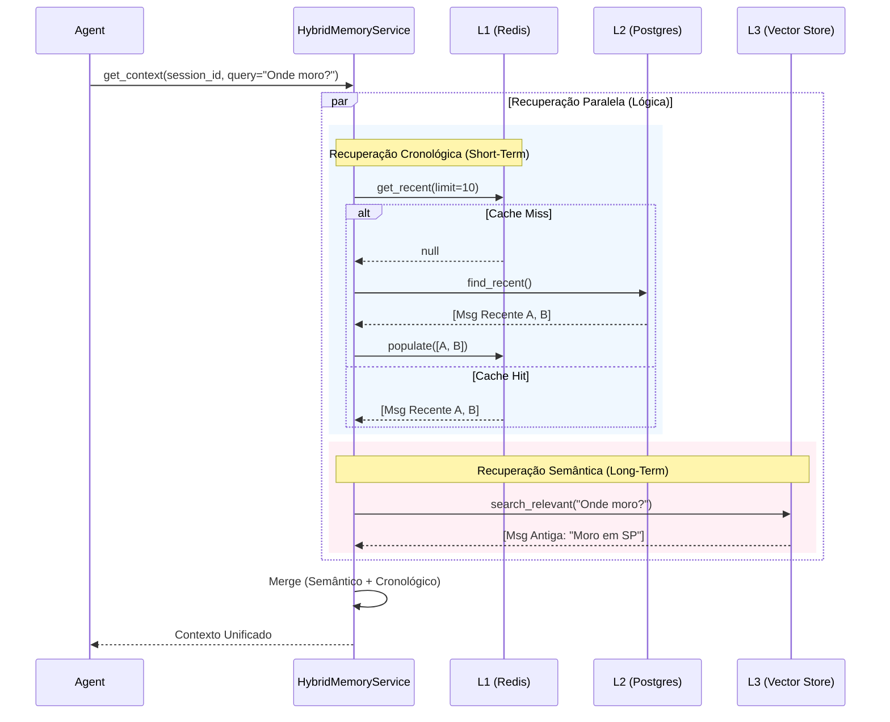
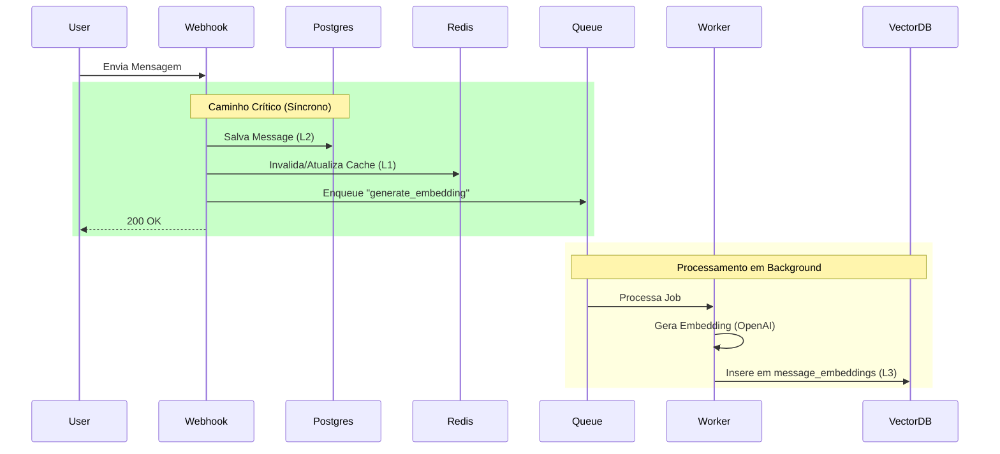

# ADR 018: Arquitetura de Memória Híbrida e Semântica para Agentes de IA

**Data:** 29/01/2026
**Status:** Aceito e Implementado
**Decisores:** Lennon, Assistant
**Contexto Relacionado:** `research_memory_system_analysis_02.md`, `report_vector_memory_integration_17.md`

---

## 1. Contexto e Problema

O sistema de Agentes de IA do projeto `whatsapp_twilio_ai` enfrentava limitações críticas em relação à gestão do contexto conversacional:

1.  **Amnésia de Sessão:** O Agente dependia de memória em tempo de execução (`self.memory`), perdendo o contexto a cada reinício de serviço ou expiração de workers.
2.  **Latência de Acesso:** Consultar o banco de dados principal (PostgreSQL) a cada interação do agente para recuperar histórico completo adicionaria latência indesejada (>50ms/query).
3.  **Amnésia de Longo Prazo:** O agente não conseguia recuperar informações relevantes mencionadas fora da janela de contexto imediata (ex: 10 últimas mensagens).
4.  **Risco de Duplicação:** Havia uma tendência inicial de criar tabelas separadas para histórico de IA (`ai_chat_history`), duplicando dados da tabela oficial de mensagens.

Necessitávamos de uma solução que oferecesse **baixa latência** para conversas ativas, **persistência confiável** e **recuperação semântica** de informações antigas, sem duplicar a fonte da verdade.

## 2. Decisão

Optou-se por implementar uma **Arquitetura de Memória Híbrida em Três Camadas (L1/L2/L3)**, utilizando o padrão *Read-Through* para cache e processamento assíncrono para indexação vetorial.

### 2.1. As Três Camadas de Memória

| Camada | Tecnologia | Função | Características |
| :--- | :--- | :--- | :--- |
| **L1 (Hot)** | **Redis** | Cache de Sessão Ativa | Acesso < 5ms. TTL curto (1h). Armazena últimas N mensagens. |
| **L2 (Cold)** | **PostgreSQL** | Persistência (Source of Truth) | Tabela `messages` existente. Garantia de durabilidade. |
| **L3 (Semantic)** | **Vector Store** | Memória de Longo Prazo | Supabase (`pgvector`). Busca por similaridade semântica (RAG). |

### 2.2. Decisões Chave de Design

1.  **Reutilização de Dados:** Rejeitamos a criação de uma tabela `ai_chat_history`. O Agente lê diretamente da tabela `messages` (via repositório) quando há *Cache Miss* no Redis.
2.  **Indexação Assíncrona:** A geração de embeddings (OpenAI `text-embedding-3-small`) ocorre em *background* via fila (`QueueService` / BullMQ) para não penalizar o tempo de resposta do webhook.
3.  **Injeção de Dependência:** O `Agent` foi refatorado para não gerenciar estado interno. Ele recebe uma abstração `MemoryInterface`, implementada pelo `HybridMemoryService`.

---

## 3. Arquitetura Detalhada

### 3.1. Diagrama de Componentes

A estrutura modular separa claramente as responsabilidades de ingestão, armazenamento e recuperação.



### 3.2. Fluxo de Recuperação (Retrieval Flow)

O `HybridMemoryService` orquestra a busca para entregar o contexto mais rico possível ao agente.



### 3.3. Fluxo de Ingestão e Indexação (Ingestion Flow)

Para garantir performance, a "memória" é persistida em etapas síncronas (para segurança) e assíncronas (para enriquecimento).



---

## 4. Estrutura de Dados

### 4.1. Cache Redis (L1)
*   **Key:** `ai:memory:{session_id}`
*   **Type:** List (JSON)
*   **TTL:** 3600s (Renovado a cada acesso/escrita)
*   **Conteúdo:** Lista serializada de objetos `Message` (role, content, timestamp).

### 4.2. Vector Store (L3)
Tabela `message_embeddings` no PostgreSQL (via extensão `vector`).

```sql
CREATE TABLE message_embeddings (
  id UUID PRIMARY KEY DEFAULT uuid_generate_v4(),
  message_id UUID REFERENCES messages(id) ON DELETE CASCADE,
  embedding vector(1536), -- OpenAI text-embedding-3-small
  content TEXT,
  metadata JSONB,
  created_at TIMESTAMPTZ DEFAULT NOW()
);
```

---

## 5. Consequências

### Positivas
*   **Performance:** Acesso ao contexto recente é extremamente rápido (Redis), reduzindo carga no Postgres.
*   **Inteligência:** O Agente agora possui "memória infinita" virtual, capaz de lembrar fatos antigos via busca semântica.
*   **Escalabilidade:** O processamento pesado (embeddings) é desacoplado do fluxo de resposta do usuário.
*   **Manutenibilidade:** O código do Agente foi simplificado, delegando a gestão de estado para serviços especializados.

### Negativas / Riscos
*   **Consistência Eventual:** Pode haver um pequeno atraso entre a mensagem ser recebida e estar disponível na busca vetorial (tempo de processamento da fila).
*   **Complexidade Operacional:** Introduz dependência de Workers e Redis para o funcionamento "ótimo" da memória (embora haja fallback para o DB).
*   **Custo:** Armazenamento de vetores e chamadas de API de Embedding geram custos adicionais, mitigados pela seleção de modelos eficientes (`text-embedding-3-small`).

## 6. Referências de Código

*   **Interface:** [`memory_interface.py`](src/modules/ai/memory/interfaces/memory_interface.py)
*   **Serviço Híbrido:** [`hybrid_memory_service.py`](src/modules/ai/memory/services/hybrid_memory_service.py)
*   **Redis Repo:** [`redis_memory_repository.py`](src/modules/ai/memory/repositories/redis_memory_repository.py)
*   **Vector Repo:** [`vector_memory_repository.py`](src/modules/ai/memory/repositories/vector_memory_repository.py)
*   **Worker:** [`embedding_tasks.py`](src/modules/ai/workers/embedding_tasks.py)
