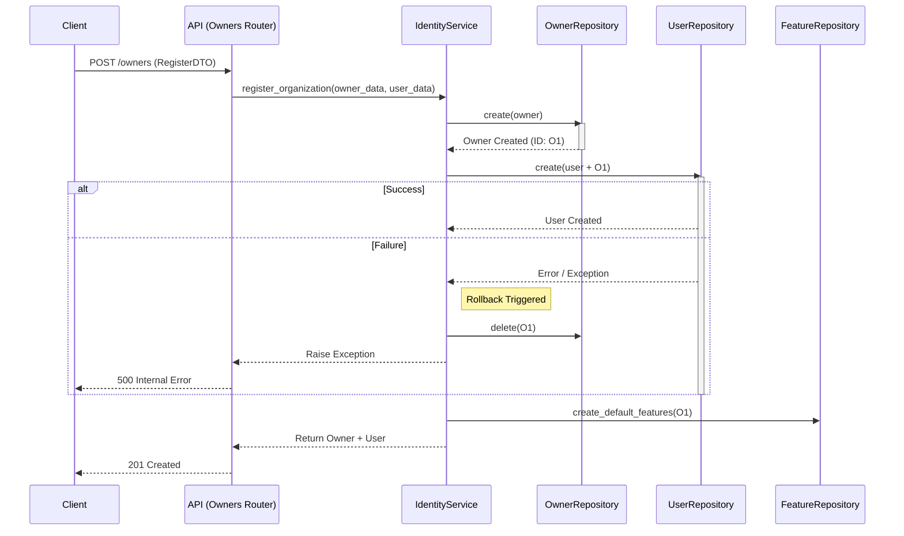
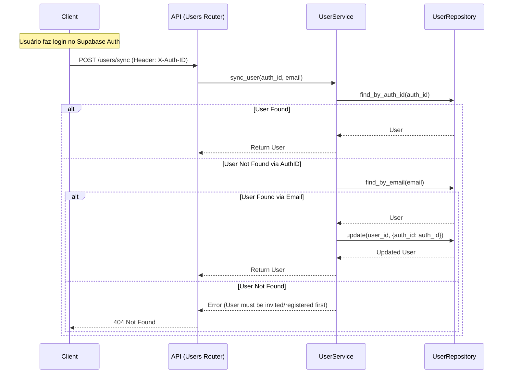

# ADR 005: Refinamento da API de Identidade e Fluxo de Onboarding

**Data**: 2026-01-26
**Status**: Aceito
**Contexto**: O módulo Identity precisava expor fluxos complexos de negócio (Onboarding de Organização, Sincronização de Usuários) via API REST, garantindo consistência de dados mesmo sem suporte nativo a transações distribuídas no cliente HTTP do banco de dados (Supabase).

## 1. Contexto e Problema

O módulo `Identity` é o núcleo de gestão de inquilinos (Owners), usuários e permissões. Identificamos os seguintes problemas na implementação anterior:
1.  **Lógica Órfã**: O endpoint `POST /owners` criava apenas o registro na tabela `owners`, ignorando a criação obrigatória do usuário admin e features iniciais, que estava encapsulada apenas no `IdentityService` mas não exposta.
2.  **Dualidade de Autenticação**: A autenticação é gerenciada externamente (Supabase Auth), gerando um `auth_id` (UUID) que precisa ser mapeado para o `user_id` (ULID) interno do sistema. Não havia um fluxo claro para essa sincronização ("User Sync").
3.  **Gestão de Assinaturas**: A exposição de dados de assinatura carecia de validações de segurança adequadas (verificação de ownership).

## 2. Decisão

Decidimos refatorar a camada de API (`v1`) do módulo Identity adotando as seguintes estratégias arquiteturais:

### 2.1. Fachada de Serviços (Service Facade)
Utilizar o `IdentityService` como fachada principal para operações que envolvem múltiplas entidades (`Owner`, `User`, `Feature`). O Controller (Router) não deve orquestrar chamadas de repositório diretamente para operações complexas.

### 2.2. Atomicidade via Compensação (Manual Rollback)
Devido à utilização do cliente Supabase via HTTP (que não mantém estado de transação SQL persistente entre requisições), adotamos o padrão de **Compensação** no `IdentityService.register_organization`.
*   **Decisão**: Se a criação do `User` ou `Features` falhar após a criação do `Owner`, o sistema captura a exceção e executa explicitamente a deleção do `Owner` criado (Rollback Manual).
*   **Justificativa**: Garante que não existam organizações "zumbis" (sem usuários admins) no banco de dados.

### 2.3. Sincronização de Identidade (User Sync)
Implementar um fluxo explícito de sincronização (`POST /users/sync`) e recuperação de contexto (`GET /users/me`).
*   **Decisão**: O frontend envia o `X-Auth-ID` (obtido do JWT). O backend busca o usuário por e-mail e atualiza o campo `auth_id` se estiver vazio.
*   **Justificativa**: Desacopla a criação do usuário (convite/registro) da autenticação (login), permitindo que usuários sejam criados antes mesmo de terem conta no provedor de Auth.

### 2.4. Injeção de Dependência
Reforçar o uso do container de injeção de dependência (`Provide[Container.service]`) em todos os endpoints para facilitar testes e substituição de implementações.

## 3. Diagramas

### 3.1. Fluxo de Onboarding (com Rollback)

### 3.2. Fluxo de Sincronização de Usuário (User Sync)

## 4. Consequências

### Positivas
*   **Consistência de Dados**: Redução drástica da probabilidade de estados inconsistentes no banco de dados.
*   **Segurança**: O `auth_id` é vinculado de forma segura e controlada.
*   **Manutenibilidade**: A lógica complexa reside no Service, mantendo os Routers leves ("Thin Controllers").

### Negativas/Riscos
*   **Latência**: O rollback manual implica em chamadas de rede adicionais em caso de erro.
*   **Concorrência**: Existe uma janela de tempo mínima entre a criação e o rollback onde o dado pode ser visível (embora improvável de afetar o sistema dado que o ID não foi retornado ao cliente).

## 5. Referências
*   [Report de Implementação](../report/result_identity_endpoints_06.md)
*   [Plan Feature Model](../../src/modules/identity/models/plan_feature.py)
