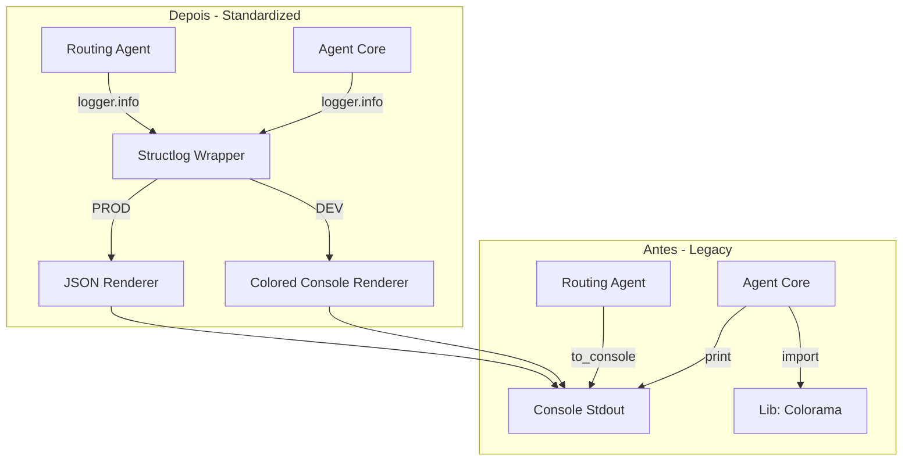
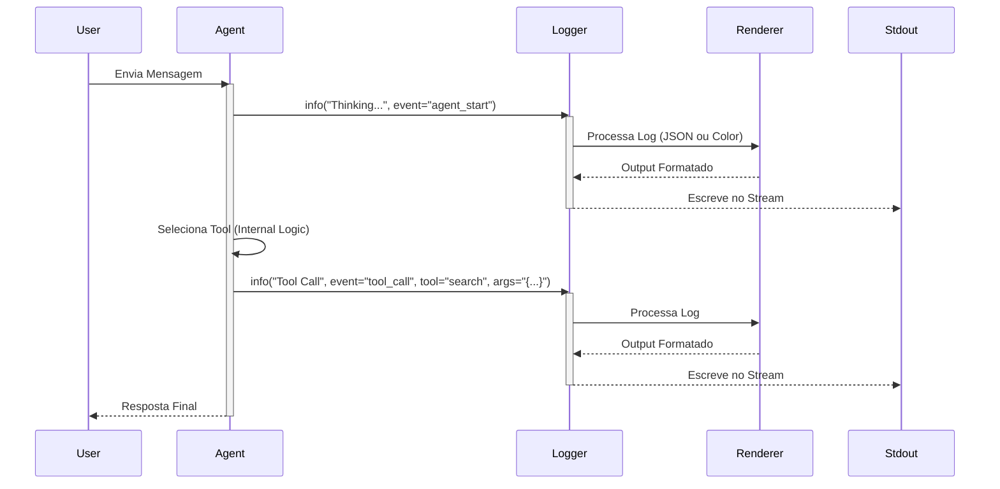

# ADR 14: Migração de Logging do AI Engine para Padrão Estruturado

**Status:** Aceito  
**Data:** 28/01/2026  
**Autores:** Equipe de Engenharia AI  
**Contexto Técnico:** AI Engine, Logging, Observabilidade, Structlog

## 1. Contexto

O "AI Engine" (`src/modules/ai/engines/lchain`) é o componente central responsável pela orquestração de agentes e execução de ferramentas. Historicamente, este módulo utilizava `print` e métodos auxiliares `to_console` (com a biblioteca `colorama`) para exibir informações de execução.

Isso gerava inconsistências com a estratégia de logging definida no **ADR 13**, especificamente:
1.  **Logs não estruturados:** Texto plano difícil de indexar e filtrar.
2.  **Acoplamento de UI/Lógica:** O código do agente continha lógica de formatação de cores.
3.  **Bloqueio de IO:** O uso extensivo de `print` em loops de pensamento do agente podia causar gargalos de performance.
4.  **Perda de Contexto:** Falta de metadados padronizados (correlation_id, owner_id) nos logs de decisão do agente.

## 2. Decisão

Decidimos migrar todo o logging do AI Engine para utilizar o wrapper centralizado `src.core.utils.logging.get_logger`, removendo completamente o uso de `print` e `colorama` nos componentes core.

### 2.1. Mudanças Implementadas

*   **Substituição de Prints:** Todas as chamadas `print()` e `self.to_console()` foram substituídas por `logger.info()`, `logger.warning()` ou `logger.error()`.
*   **Log Estruturado:** Adoção de chaves semânticas para facilitar a busca:
    *   `event`: Tipo do evento (ex: `tool_call`, `routing_agent_context`, `agent_start`).
    *   `agent_name`: Nome do agente em execução.
    *   `tool_name`: Nome da ferramenta invocada.
    *   `input_keys`: Chaves dos argumentos recebidos.
*   **Remoção de Dependências:** Remoção das bibliotecas `colorama` e `termcolor` dos arquivos de agente, delegando a coloração para o `ColoredConsoleRenderer` (em DEV) configurado no `logging.py`.

## 3. Diagramas

### 3.1. Arquitetura de Logging (Antes vs Depois)

### 3.2. Fluxo de Sequência de Log

## 4. Consequências

### Positivas
*   **Observabilidade em Produção:** Logs agora são emitidos em JSON, permitindo ingestão direta por Datadog/Splunk com campos indexáveis.
*   **Limpeza de Código:** Remoção de métodos utilitários de formatação visual (`to_console`) de dentro das classes de negócio.
*   **Padronização:** Todo o projeto agora segue o mesmo padrão de logging, facilitando o onboarding de novos desenvolvedores.
*   **Flexibilidade:** A formatação (cores, JSON) é controlada via configuração global, não hardcoded nos agentes.

### Negativas/Riscos
*   **Verbosidade:** Logs estruturados podem ser mais verbosos em disco se não configurados corretamente (mitigado pelo uso de JSON apenas em PROD).
*   **Curva de Aprendizado:** Desenvolvedores precisam se habituar a usar `logger.info(msg, key=value)` em vez de f-strings no print.

## 5. Referências
*   ADR 13: Estratégia Híbrida de Logging e Observabilidade
*   [Structlog Best Practices](https://www.structlog.org/en/stable/best-practices.html)
