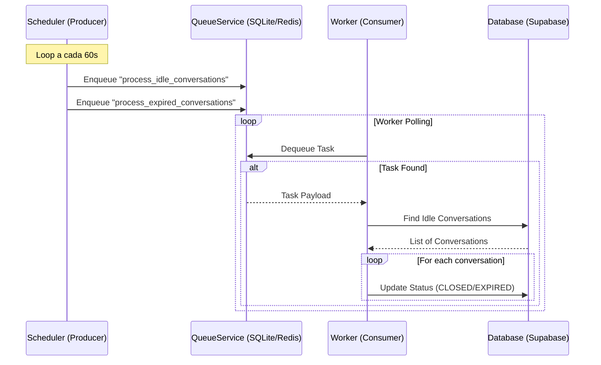

# Relatório de Conformidade: Correção da Infraestrutura de Background Tasks

**Data:** 26/01/2026
**Responsável:** Assistant
**ID:** conformity_background_tasks_fix_02

## 1. Contexto
Foi solicitada uma verificação no módulo `src/modules/conversation/workers/` para assegurar que as conversas estavam sendo finalizadas corretamente em background (timeouts e expiração). Durante a análise, constatou-se que, embora o código de negócio estivesse correto, as conversas não eram processadas automaticamente devido à ausência de execução do componente agendador (`scheduler.py`) na infraestrutura do projeto.

## 2. Diagnóstico
A arquitetura de background tasks do projeto segue o padrão **Producer-Consumer**:
- **Producer (Scheduler):** Responsável por verificar periodicamente (a cada 60s) se existem tarefas a serem executadas (ex: `process_idle_conversations`) e enfileirá-las.
- **Consumer (Worker):** Responsável por ler a fila e executar a lógica de negócio pesada.

**Problema Identificado:**
O código do `worker.py` (Consumer) estava configurado para rodar via `make run-worker`, mas não havia comando ou serviço configurado para rodar o `scheduler.py` (Producer). Sem o Producer, a fila permanecia vazia e o Worker, embora ativo, não tinha nada para processar.

## 3. Solução Implementada

### 3.1. Atualização de Infraestrutura
Foram realizadas alterações nos arquivos de orquestração para garantir a execução simultânea de ambos os processos:

- **Makefile:** Adicionado comando `make run-scheduler` para facilitar a execução local.
- **docker-compose.yml:** Adicionados serviços dedicados `worker` e `scheduler` para garantir que o ambiente de containers suba a stack completa de processamento assíncrono.

### 3.2. Documentação
O arquivo `src/modules/conversation/workers/docs/how_to_use.md` foi atualizado para refletir a necessidade de rodar ambos os serviços e fornecer instruções claras de uso.

## 4. Arquitetura da Solução

O diagrama abaixo ilustra o fluxo de dados restabelecido com as correções:

## 5. Validação
Foi criado um script de teste (`scripts/test_scheduler_worker.py`) que simulou o ciclo completo:
1.  **Cenário Inicial:** Identificadas conversas ociosas no banco.
2.  **Execução Scheduler:** O script rodou o agendador manualmente, que publicou as tarefas na fila.
3.  **Execução Worker:** O script rodou o worker, que consumiu as tarefas.
4.  **Resultado:** As conversas foram atualizadas para `idle_timeout` e `expired` com sucesso.

## 6. Conclusão
O sistema de background tasks agora está operacional. A lógica de negócio em `src/core/queue/worker.py` permanece válida e segura, sendo agora alimentada corretamente pelo Scheduler. Para operação contínua, é mandatório que ambos os serviços (`worker` e `scheduler`) estejam em execução.
