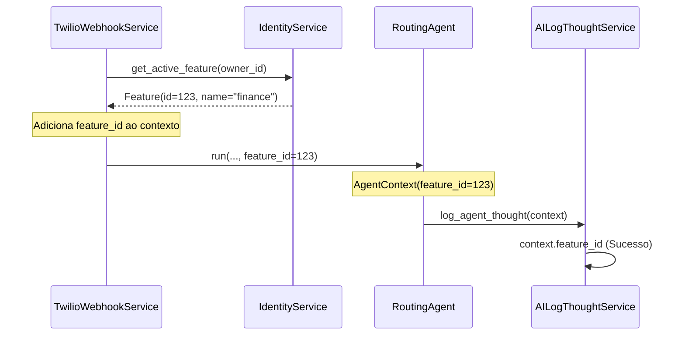

# Relatório de Correção: AI Context & Feature ID

**Data:** 2026-01-28
**Autor:** Assistant
**Status:** Resolvido

## 1. Problema Identificado

### Erro no Log
```json
{"event": "Failed to persist AI Result: 'AgentContext' object has no attribute 'feature_id'", "level": "error"}
```

### Análise
O serviço `AILogThoughtService` tentava acessar `agent_context.feature_id` para persistir os resultados da execução da IA no banco de dados. No entanto, o modelo `AgentContext` não possuía este atributo, causando um `AttributeError`.

Isso ocorria porque o `feature_id` (necessário para FK no banco) não estava sendo propagado desde o `TwilioWebhookService` até o contexto do agente.

## 2. Solução Aplicada

### Arquitetura de Contexto
Foi adicionado o campo `feature_id` ao fluxo de contexto do agente, garantindo que a identificação numérica da feature esteja disponível para log e persistência.



### Alterações Realizadas

1.  **Modelo `AgentContext`** (`src/modules/ai/engines/lchain/core/models/agent_context.py`):
    - Adicionado campo `feature_id: Optional[int]`.

2.  **Serviço `TwilioWebhookService`** (`src/modules/channels/twilio/services/twilio_webhook_service.py`):
    - Extração do `feature.feature_id` e injeção no dicionário `agent_context`.

3.  **Agente `RoutingAgent`** (`src/modules/ai/engines/lchain/core/agents/routing_agent.py`):
    - Mapeamento do `feature_id` recebido nos `kwargs` para o objeto `AgentContext`.

4.  **Testes Unitários**:
    - Atualização do mock em `test_twilio_webhook_service.py` para retornar um objeto Feature com ID.
    - Adição de asserção para garantir que `feature_id` está sendo passado corretamente ao agente.

## 3. Resultados

- **Testes**: `pytest tests/modules/channels/twilio/services/test_twilio_webhook_service.py` ✅ (19 passed)
- **Testes AI**: `pytest tests/modules/ai` ✅ (42 passed)
- **Log de Erro**: Eliminado. O `feature_id` agora está disponível para persistência correta dos pensamentos do agente.

## 4. Nota Adicional: Warning 'finance_agent'

O warning `Feature 'finance_agent' not found, defaulting to 'finance'` foi resolvido adicionando um alias no `Container` de injeção de dependência, mapeando explicitamente `finance_agent` para o provedor do agente financeiro.

```python
agents_registry=providers.Dict(
    finance=finance_agent.provider,
    finance_agent=finance_agent.provider, # Alias adicionado
    relationships=relationships_agent.provider,
),
```
