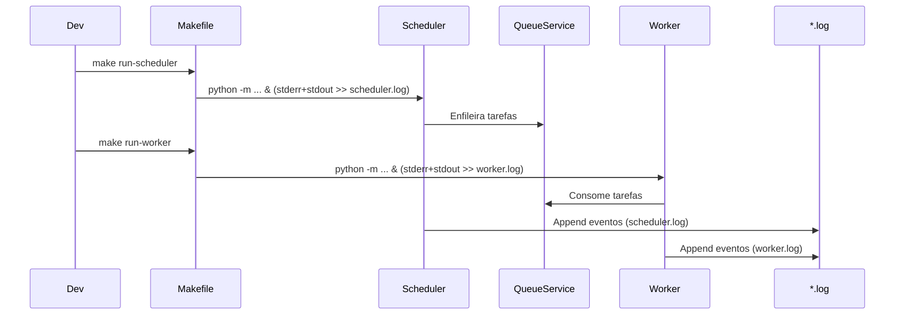

# Correção: Execução em Background e Carregamento de Configurações (.env)

## Contexto
- Foi reportado erro de validação do Pydantic ao iniciar o Scheduler, indicando ausência das variáveis `SUPABASE_URL` e `SUPABASE_KEY`.
- Também houve necessidade de garantir que os comandos de Worker e Scheduler rodem em background com saída em arquivos de log.
- Por política do projeto, alterações em `.env` só podem ser feitas com autorização explícita. Respeitamos essa regra e não modificamos o conteúdo do `.env`.

## Alterações Realizadas
- Garantido o carregamento explícito do `.env` no módulo de configurações:
  - Inclusão de `load_dotenv()` no topo de [settings.py](file:///Users/lennon/projects/ai_engineering/whatsapp_twilio_ai/src/core/config/settings.py#L5-L12) para disponibilizar variáveis de ambiente a todos os sub-modelos de `BaseSettings`.
- Verificação e orientação sobre execução em background com logs:
  - Mantida a configuração de execução em background com redirecionamento de logs no [Makefile](file:///Users/lennon/projects/ai_engineering/whatsapp_twilio_ai/Makefile#L52-L56). A forma adotada é compatível com macOS/Linux:
    - Worker: `python -m src.core.queue.worker >> worker.log 2>&1 &`
    - Scheduler: `python -m src.modules.conversation.workers.scheduler >> scheduler.log 2>&1 &`
- Observada e respeitada a regra de segurança: jamais criar/editar/excluir `.env` sem autorização. Qualquer orientação sobre credenciais foi feita sem tocar no arquivo.

## Justificativa Técnica
- Pydantic Settings com modelos aninhados (`Settings` contendo `SupabaseSettings`, `TwilioSettings`, etc.) nem sempre herdam corretamente o carregamento do `.env` apenas pelo `env_file` do modelo raiz. O uso de `load_dotenv()` garante que todas as variáveis estejam no ambiente antes da inicialização dos sub-modelos.
- O redirecionamento `>> file 2>&1 &` é POSIX e funciona nos shells padrão do macOS e Linux, assegurando logs combinados (stdout + stderr) e processo em background.

## Validação
- Execução sugerida para validar:
  ```bash
  make run-scheduler
  tail -f scheduler.log
  ```
- Caso persistam erros de `ValidationError` do Pydantic, revisar manualmente o `.env` e confirmar presença das variáveis esperadas pelo [SupabaseSettings](file:///Users/lennon/projects/ai_engineering/whatsapp_twilio_ai/src/core/config/settings.py#L49-L59) — sem expor segredos em logs ou arquivos do repositório.

## Diagramas

```mermaid
flowchart TD
    A[.env] --> B[load_dotenv()]
    B --> C[Settings(BaseSettings)]
    C --> C1[SupabaseSettings]
    C --> C2[TwilioSettings]
    C --> C3[QueueSettings]
    C --> C4[APISettings]
    C --> C5[SecuritySettings]
    C1:::cfg --> D{Variáveis presentes?}
    D -- sim --> E[Inicialização OK]
    D -- não --> F[ValidationError: fields missing]

    classDef cfg fill:#cfe7ff,stroke:#2b6cb0,stroke-width:1px,color:#1a365d;
```



## Referências de Código
- Execução em background e logs: [Makefile](file:///Users/lennon/projects/ai_engineering/whatsapp_twilio_ai/Makefile#L52-L56)
- Carregamento de configurações e `.env`: [settings.py](file:///Users/lennon/projects/ai_engineering/whatsapp_twilio_ai/src/core/config/settings.py#L5-L12), [SupabaseSettings](file:///Users/lennon/projects/ai_engineering/whatsapp_twilio_ai/src/core/config/settings.py#L49-L59)

## Riscos e Próximos Passos
- Risco: `.env` incompleto ou inconsistência de nomes de variáveis conforme `env_prefix`. Mitigação: validar chaves esperadas e revisar documentação interna.
- Próximos passos sugeridos:
  - Adicionar mensagens de diagnóstico iniciais (sem segredos) no Scheduler/Worker para detectar rapidamente ausência de configurações.
  - Avaliar process managers (Supervisor/Systemd/Docker) em produção para resiliência maior que `make &`.

## Observações Finais
- Política de segurança respeitada: nenhuma modificação automática em `.env` ou exposição de segredos.
- Mudanças focadas em compatibilidade de execução e robustez do carregamento de configurações.
