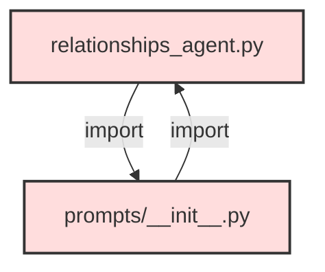
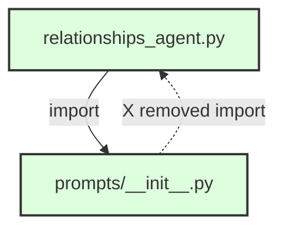
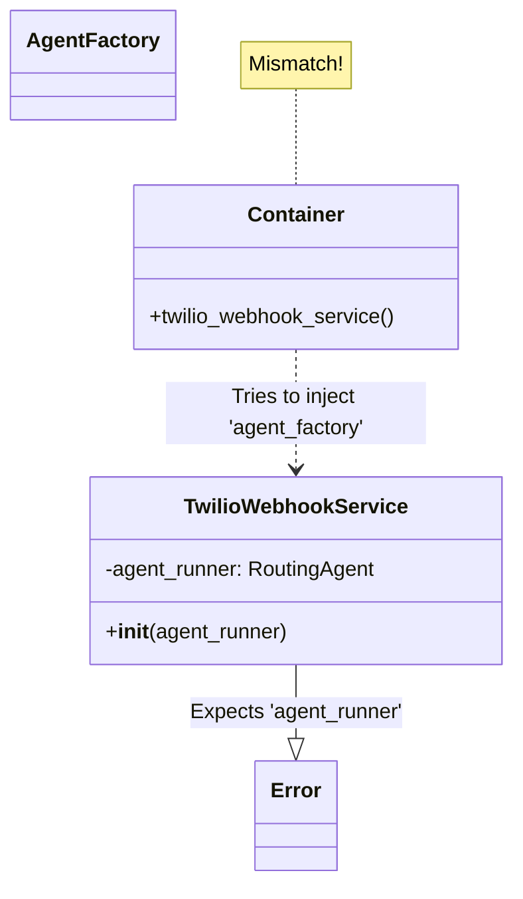
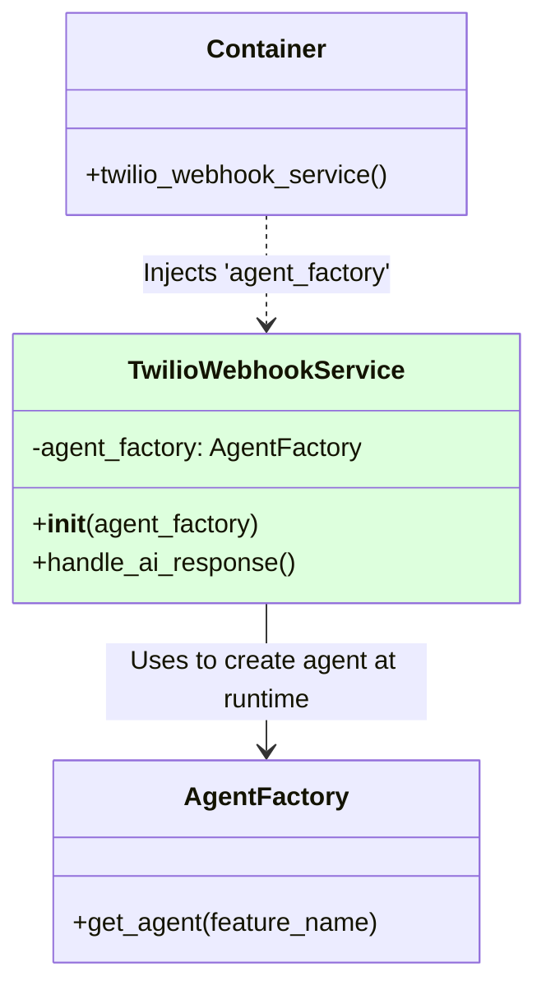

# Relatório de Correção: Dependências Circulares e Injeção de Dependência

**Data:** 27/01/2026
**Autor:** Trae AI Assistant
**Contexto:** Estabilização da inicialização da aplicação após refatorações no módulo de Agentes e Webhooks.

## 1. Resumo Executivo

Durante a inicialização da aplicação e execução dos workers, foram identificados três bloqueios críticos que impediam o funcionamento do sistema:
1.  **Circular Import:** Ciclo de dependência entre o agente de relacionamentos e seus prompts.
2.  **NameError:** Referência a classe não importada no serviço de Webhook.
3.  **Dependency Injection Mismatch:** Incompatibilidade entre o objeto injetado pelo Container (Factory) e o esperado pelo Serviço (Agent Runner).

Todas as falhas foram corrigidas e validadas, permitindo a injeção correta dos serviços e a execução livre de erros de importação.

---

## 2. Detalhamento das Correções

### 2.1. Correção de Importação Circular (`ImportError`)

**Problema:**
O módulo `relationships_agent.py` importava `prompts.routing`, que por sua vez (via `__init__.py`) tentava importar `relationships_agent` de volta. Isso criava um ciclo infinito durante o carregamento do módulo.



**Solução:**
Removida a importação desnecessária de `relationships_agent` dentro de `prompts/__init__.py`. O arquivo `__init__.py` agora serve apenas como namespace, sem dependências lógicas do agente consumidor.



---

### 2.2. Correção de Definição de Tipo (`NameError`)

**Problema:**
O arquivo `twilio_webhook_service.py` utilizava a classe `RoutingAgent` na anotação de tipo do construtor, mas a classe não estava importada no cabeçalho do arquivo.

**Solução:**
Adicionada a importação explícita:
```python
from src.modules.ai.engines.lchain.core.agents.routing_agent import RoutingAgent
```
*(Nota: Posteriormente, esta dependência foi removida em favor da `AgentFactory` na correção 2.3)*

---

### 2.3. Correção de Injeção de Dependência (`TypeError`)

**Problema:**
Havia um descompasso entre a definição do Container de DI e a implementação do Serviço.
- **Container (`container.py`):** Injetava `agent_factory` (instância de `AgentFactory`).
- **Serviço (`TwilioWebhookService`):** Esperava `agent_runner` (instância de `RoutingAgent`).

Isso gerava o erro: `TypeError: TwilioWebhookService.__init__() got an unexpected keyword argument 'agent_factory'`.



**Solução:**
O construtor do `TwilioWebhookService` foi refatorado para aceitar `AgentFactory`. Isso não apenas resolveu o erro, mas também alinhou o serviço com a arquitetura multi-tenant, onde o agente deve ser criado dinamicamente com base na feature ativa, e não injetado estaticamente.

```python
# Antes
def __init__(self, ..., agent_runner: RoutingAgent, ...):
    self.agent_runner = agent_runner

# Depois (Corrigido)
def __init__(self, ..., agent_factory: AgentFactory, ...):
    self.agent_factory = agent_factory
```



## 3. Resultados e Validação

- **Teste de Importação:** Scripts de teste confirmaram que `relationships_agent` e `TwilioWebhookService` agora são importados sem erros.
- **Teste de Instanciação:** Script de verificação de DI (`verify_di.py`) confirmou que o `Container` consegue instanciar o `TwilioWebhookService` com todas as dependências resolvidas corretamente.

## 4. Próximos Passos Recomendados

1.  **Monitoramento:** Acompanhar os logs do worker na primeira execução completa do fluxo de IA para garantir que a `AgentFactory` está instanciando os agentes corretamente em tempo de execução.
2.  **Linting:** Rodar verificação estática (mypy/pylint) no módulo `channels` para prevenir futuros `NameError` ou incompatibilidades de tipo.
