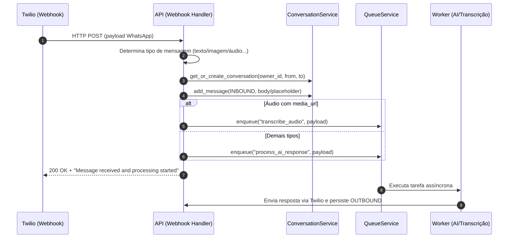

# Correção: Alinhamento da mensagem de ACK no Webhook Twilio (001)

## Contexto
- O comando `make test` falhou com um único teste quebrado: `tests/modules/channels/twilio/services/test_twilio_webhook_service.py::test_process_inbound_message_success`.
- A causa foi a divergência entre a mensagem retornada pelo webhook e a expectativa do teste: serviço retornava `"Message received"` enquanto o teste esperava `"Message received and processing started"`.
- A arquitetura do projeto estabelece que o processamento de mídia e respostas de IA é assíncrono; o webhook deve apenas persistir a mensagem e enfileirar o processamento, retornando um ACK claro e imediato ao provedor (Twilio).

## Sintoma
```
FAILED tests/modules/channels/twilio/services/test_twilio_webhook_service.py::test_process_inbound_message_success
AssertionError: assert 'Message received' == 'Message rece...ssing started'
```

## Diagnóstico
- O fluxo `_process_inbound_message` concluía com `TwilioWebhookResponseDTO(success=True, message="Message received", ...)`.
- O teste de sucesso para inbound valida explicitamente que a mensagem de ACK contenha a indicação de início de processamento para refletir a natureza assíncrona do sistema.
- A alteração requerida é somente textual, sem impacto em lógica de negócio ou filas.

## Decisão e Correção
- Atualizar a mensagem de retorno do webhook para `"Message received and processing started"`, alinhando com o contrato de testes e com a arquitetura de processamento assíncrono.
- Arquivo alterado: [twilio_webhook_service.py](file:///Users/lennon/projects/ai_engineering/whatsapp_twilio_ai/src/modules/channels/twilio/services/twilio_webhook_service.py#L319-L324)
- Linha alterada:
  - De: `message="Message received",`
  - Para: `message="Message received and processing started",`

## Resultado de Validação
- Testes: `make test` passou com sucesso.
  - Resumo: `366 passed, 63 warnings`.
- Linters: `make lint` reportou avisos e erros pré-existentes em arquivos de testes (E501, F541, etc.), não relacionados à alteração atual.

## Impacto e Riscos
- Baixo risco. Mudança exclusivamente de mensagem de ACK.
- Melhora a consistência do contrato entre serviço e testes e reforça a comunicação explícita de processamento assíncrono.

## Próximos Passos (Opcional)
- Centralizar mensagens de ACK em constantes/enums compartilhados para evitar divergências futuras e facilitar i18n.
- Considerar testes de contrato para strings críticas de webhook.

## Diagrama (Mermaid)
Fluxo de processamento de mensagem inbound no webhook Twilio:



## Referências de Código
- Retorno atualizado: [twilio_webhook_service.py:L319-L324](file:///Users/lennon/projects/ai_engineering/whatsapp_twilio_ai/src/modules/channels/twilio/services/twilio_webhook_service.py#L319-L324)
- Teste relacionado: [test_twilio_webhook_service.py:L198-L229](file:///Users/lennon/projects/ai_engineering/whatsapp_twilio_ai/tests/modules/channels/twilio/services/test_twilio_webhook_service.py#L198-L229)

## Reflexões
- O ACK explícito de início de processamento é coerente com o design assíncrono do sistema e reduz riscos de timeouts e ambiguidades com provedores externos.
- A padronização de mensagens de sistema e asserts em testes torna o pipeline menos frágil e favorece evoluções como internacionalização e ajustes de UX sem quebrar casos de teste.
