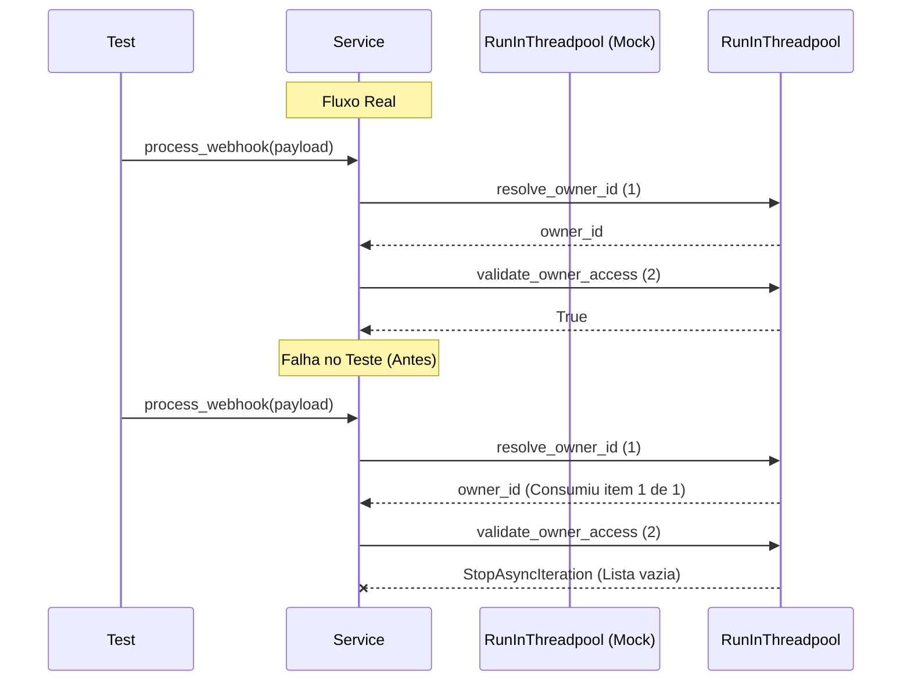

# Relatório de Correção: Testes Unitários Twilio Webhook

**Data:** 27/01/2026
**Atividade:** Correção de falhas na suíte de testes do módulo Twilio
**Sequência:** 07
**Status:** Concluído

## 1. Contexto e Problema

Durante a execução da suíte de testes automatizados (`make test`), foram identificadas múltiplas falhas no arquivo `tests/modules/channels/twilio/services/test_twilio_webhook_service.py`. As falhas impediam a validação contínua da integridade do serviço de webhook do WhatsApp.

### Sintomas
1.  **TypeError na Inicialização**: `TypeError: TwilioWebhookService.__init__() got an unexpected keyword argument 'agent_runner'`
2.  **Erro de Iteração em Mock**: `StopAsyncIteration` no teste `test_process_webhook_inbound`.

## 2. Diagnóstico

A análise do código fonte e dos logs de erro revelou duas causas raiz distintas decorrentes de refatorações anteriores no código de produção que não foram refletidas nos testes:

### 2.1. Desalinhamento de Injeção de Dependência
O serviço `TwilioWebhookService` foi refatorado recentemente para utilizar `AgentFactory` em vez de receber um `AgentRunner` diretamente, visando suportar múltiplos tipos de agentes (ex: Finance, Support). No entanto, a fixture `mock_services` e a instanciação do serviço nos testes ainda tentavam injetar `agent_runner`.

### 2.2. Mock de `run_in_threadpool` Insuficiente
O método `process_webhook` executa operações bloqueantes (banco de dados) via `run_in_threadpool`. O fluxo de execução para mensagens *inbound* agora inclui duas chamadas sequenciais:
1.  `resolve_owner_id`
2.  `identity_service.validate_owner_access`

O teste `test_process_webhook_inbound` configurava o mock (`side_effect`) para retornar apenas um valor (para a primeira chamada). Quando o código tentava a segunda chamada, o iterador do `side_effect` se esgotava, lançando `StopAsyncIteration`.



## 3. Solução Implementada

### 3.1. Atualização das Fixtures e Setup
Substituímos a injeção de `agent_runner` por `agent_factory` nas fixtures do Pytest.

```python
@pytest.fixture
def mock_services():
    return {
        # ... outros serviços
        "agent_factory": MagicMock(), # Substitui agent_runner
        "queue_service": AsyncMock(),
    }
```

### 3.2. Ajuste dos Mocks de Threadpool
Atualizamos o `side_effect` do mock para fornecer retornos para todas as chamadas esperadas no fluxo.

```python
# Antes
mock_run.side_effect = [owner_id]

# Depois
mock_run.side_effect = [
    owner_id,  # 1. resolve_owner_id
    True,      # 2. validate_owner_access
]
```

### 3.3. Atualização de Asserções de Agente
Como o `TwilioWebhookService` agora solicita um agente à factory antes de executá-lo, atualizamos os testes para mockar essa cadeia de chamadas.

```python
# Mock da Factory retornando um Agente Mockado
mock_agent = MagicMock()
mock_agent.run.return_value = "AI Response"
mock_services["agent_factory"].get_agent.return_value = mock_agent

# ... execução ...

# Verificação
mock_services["agent_factory"].get_agent.assert_called_once()
mock_agent.run.assert_called_once()
```

## 4. Resultados

Após as correções, a execução completa da suíte de testes (`make test`) foi concluída com sucesso.

| Métrica | Antes | Depois |
| :--- | :---: | :---: |
| Status | **FALHA** | **SUCESSO** |
| Erros | 19 | 0 |
| Testes Passados | 347 | 366 |
| Tempo de Execução | ~5s (interrompido) | 4.81s |

## 5. Arquivos Alterados

- [`tests/modules/channels/twilio/services/test_twilio_webhook_service.py`](file:///Users/lennon/projects/ai_engineering/whatsapp_twilio_ai/tests/modules/channels/twilio/services/test_twilio_webhook_service.py)

## 6. Lições Aprendidas

1.  **Refatoração de Dependências**: Sempre que alterar as dependências no construtor (`__init__`) de uma classe, deve-se buscar imediatamente por instâncias dessa classe nos arquivos de teste.
2.  **Fragilidade de Mocks Ordenados**: O uso de `side_effect` com listas em mocks de funções utilitárias globais (como `run_in_threadpool`) cria acoplamento com a ordem exata de execução.
    *   *Sugestão Futura*: Refatorar para usar `side_effect` com uma função lambda que inspeciona os argumentos recebidos para decidir o retorno, tornando o teste resiliente a mudanças na ordem de execução.

---
*Gerado via Trae AI Assistant*
