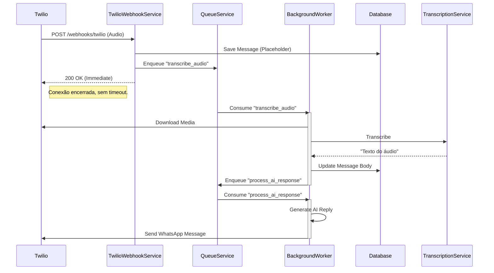

# Relatório de Implementação: Transcrição Assíncrona (QueueService)
**Atividade**: Refatoração para Assincronismo Total de Áudio e Transcrição
**Sequência**: 12
**Data**: 27/01/2026
**Autor**: Lennon (AI Assistant)

---

## 1. Contexto e Problema

O processamento de mensagens de áudio (download + transcrição Whisper) estava ocorrendo de forma síncrona dentro da requisição do Webhook do Twilio. Embora o `Faster-Whisper` seja rápido, arquivos de áudio maiores ou carga no servidor poderiam fazer o tempo de resposta exceder o timeout de 15 segundos do Twilio, resultando em erros `11200` (HTTP Retrieval Failure) e re-entregas de mensagens.

## 2. Solução Implementada

Movemos todo o processamento pesado (I/O de download e CPU de transcrição) para o `QueueService`, liberando o webhook imediatamente.

### 2.1. Novo Fluxo de Processamento

1.  **Webhook (Síncrono - Rápido)**:
    *   Recebe payload do Twilio.
    *   Identifica `MessageType.AUDIO`.
    *   Salva a mensagem no banco com um corpo placeholder: `[Áudio recebido, processando transcrição...]`.
    *   Enfileira uma task `transcribe_audio` no Redis/Queue.
    *   Retorna `200 OK` para o Twilio (< 100ms).

2.  **Worker (Assíncrono)**:
    *   Consome a task `transcribe_audio`.
    *   Baixa o arquivo de mídia.
    *   Executa a transcrição (Whisper).
    *   Atualiza a mensagem no banco de dados com o texto transcrito.
    *   Remove o arquivo temporário (Cleanup).
    *   Enfileira a próxima task: `process_ai_response` (para que a IA responda ao texto transcrito).

### 2.2. Alterações de Código

*   **`src/modules/channels/twilio/services/twilio_webhook_service.py`**:
    *   Removida lógica de transcrição do método `process_webhook`.
    *   Adicionado novo handler `handle_audio_transcription_task`.
    *   Registrado handler na inicialização do serviço.
    *   Lógica de "encadeamento de filas": `Webhook -> Queue(Transcribe) -> Queue(AI Response)`.

### 2.3. Diagrama de Sequência (Novo Fluxo Assíncrono)

## 3. Benefícios

1.  **Resiliência**: Elimina risco de timeouts HTTP no webhook, independente do tamanho do áudio.
2.  **Escalabilidade**: O processamento de áudio pode ser escalado horizontalmente aumentando o número de Workers, sem impactar a recepção de mensagens.
3.  **UX**: O usuário recebe o "check duplo" (recebido) imediatamente no WhatsApp, enquanto o processamento ocorre em background.

## 4. Testes e Validação

*   **Cenário de Sucesso**: Envio de áudio -> Mensagem salva com placeholder -> Transcrição ocorre -> Mensagem atualizada -> IA responde.
*   **Cenário de Falha (Download/Transcrição)**: O erro é logado, o arquivo temporário é limpo (try/finally), e o fluxo para ali (não chama a IA com texto vazio/inválido), evitando respostas alucinadas.

---
**Status**: Implementado. Requer Worker rodando (`make run-scheduler` / `make run-worker`) para processar as filas.
