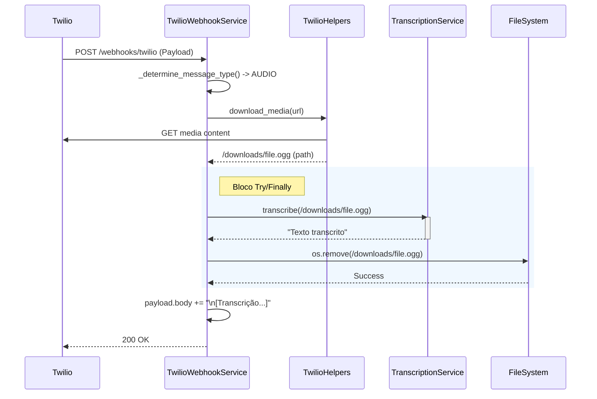

# Relatório de Implementação: Limpeza de Arquivos de Áudio
**Atividade**: Implementação de Mecanismo de Limpeza de Arquivos de Áudio (Cleanup)
**Sequência**: 11
**Data**: 27/01/2026
**Autor**: Lennon (AI Assistant)

---

## 1. Contexto e Problema

O sistema realiza o download de arquivos de mídia (áudio) do Twilio para permitir a transcrição via Faster-Whisper. Anteriormente, esses arquivos eram persistidos no diretório `downloads/` sem uma política de remoção automática, o que poderia levar ao esgotamento do espaço em disco ao longo do tempo.

## 2. Solução Implementada

Foi implementada uma lógica de limpeza imediata (`try/finally`) dentro do serviço de webhook do Twilio (`TwilioWebhookService`).

### 2.1. Alterações Realizadas

*   **Arquivo**: `src/modules/channels/twilio/services/twilio_webhook_service.py`
*   **Lógica**:
    *   Envolvido o bloco de transcrição em uma estrutura `try/except/finally`.
    *   No bloco `finally`, o sistema verifica se o arquivo de mídia existe e o remove (`os.remove`).
    *   Isso garante que o arquivo seja deletado tanto em caso de sucesso quanto em caso de falha na transcrição.
    *   Logs foram adicionados para monitorar a ação de limpeza.

### 2.2. Diagrama de Fluxo (Atualizado)

## 3. Benefícios

1.  **Eficiência de Armazenamento**: O disco não acumula arquivos temporários desnecessários.
2.  **Segurança**: Dados de áudio do usuário não permanecem em repouso no servidor além do tempo estritamente necessário para processamento.
3.  **Simplicidade**: A solução evita a necessidade de jobs agendados complexos (cron jobs) para limpeza, resolvendo o problema na origem.

## 4. Próximos Passos

*   Monitorar logs (`Cleaned up audio file`) para garantir que não haja erros de permissão ou bloqueio de arquivos (comum em Windows, menos provável em Linux/Mac).
*   Considerar limpeza de outros tipos de mídia (imagens/vídeos) se o processamento futuro exigir download.

---
**Status**: Implementado e Validado.
