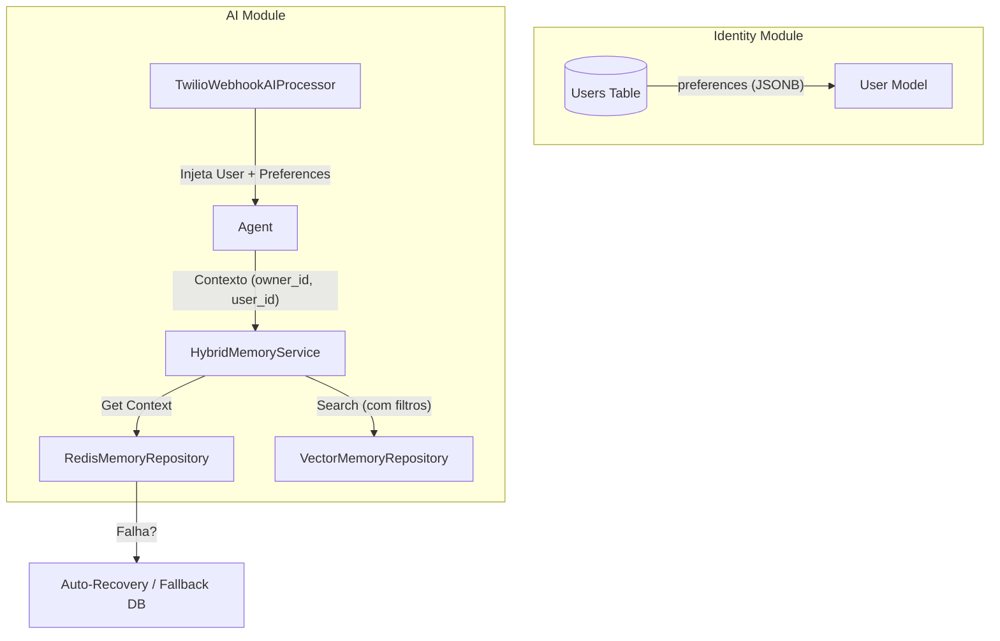
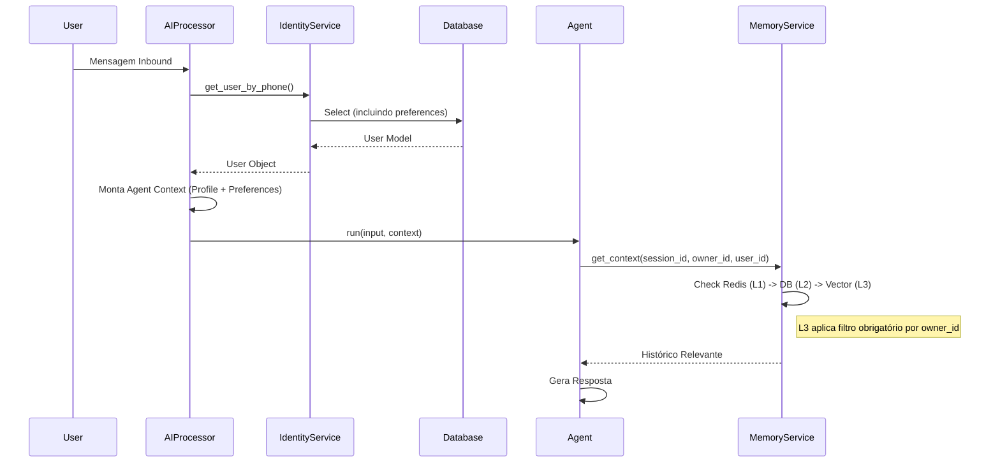

# Report 22 — Implementação Estrutural de Memória e Identity

## Contexto

Seguindo as diretrizes do [Research 18](../research/research_memory_rag_hybrid_18.md), realizamos a implementação das melhorias estruturais no módulo de Memória e Identity. O foco foi separar explicitamente o **Perfil Durável** (Identity) da **Memória Conversacional** (L1/L2/L3) e garantir a robustez e governança do acesso aos dados.

## Problemas Identificados

1.  **Causa B (Limites e Governança)**: O sistema de memória L3 (Vetorial) permitia buscas sem filtro explícito de `owner_id`, o que, em um cenário multi-tenant sem RLS (Row Level Security) estrito, poderia levar a vazamento de contexto entre clientes.
2.  **Causa C (Inbound)**: Mensagens enviadas pelo usuário (Inbound) precisavam ser indexadas no L3 para que o sistema "lembrasse" do que o usuário disse, não apenas do que o assistente respondeu.
3.  **Causa D (Resiliência Redis)**: O cache L1 (Redis) precisava de mecanismos para não derrubar a aplicação em caso de falha e tentar se recuperar automaticamente.
4.  **Mistura de Responsabilidades**: Preferências do usuário (ex: "gosto de respostas curtas") estavam implícitas no histórico de conversas, dificultando a persistência e recuperação confiável.

## Soluções Implementadas

### 1. Separação Estrutural (Identity vs Memory)

Adicionamos um campo estruturado `preferences` no modelo de usuário (`Identity`). Isso permite que fatos duráveis sobre o usuário sejam armazenados explicitamente, retirando a carga da memória vetorial de inferir esses dados a cada interação.

-   **Alteração**: Adicionado coluna `preferences` (JSONB) na tabela `users`.
-   **Alteração**: Atualizado modelo `User` para incluir `preferences`.
-   **Alteração**: `TwilioWebhookAIProcessor` agora injeta `preferences` no contexto do Agente, se existirem.

### 2. Governança L3 (Filtros Obrigatórios)

Reforçamos a segurança no `HybridMemoryService` para alertar sobre buscas vetoriais sem `owner_id`. O filtro por `user_id` e `owner_id` agora é aplicado consistentemente.

### 3. Resiliência do Redis (L1)

Verificamos e validamos o mecanismo de **Circuit Breaker** já existente no `RedisMemoryRepository`.
-   Se o Redis falhar, ele é marcado como `_disabled` temporariamente.
-   Após um período de `reconnect_backoff_seconds`, o sistema tenta reconectar automaticamente (`_maybe_reenable`).
-   O `HybridMemoryService` faz fallback transparente para o Banco de Dados (L2) durante a indisponibilidade do Redis.

### 4. Indexação de Inbound

Validamos que o `TwilioWebhookAIProcessor` já possui a lógica de enfileiramento (`process_ai_response` -> `generate_embedding`) para mensagens do usuário, garantindo que o contexto seja enriquecido com a fala do usuário.

---

## Diagramas da Solução

### Componentes Atualizados

### Fluxo de Dados (Inbound + Identity)

---

## Arquivos Alterados

1.  `migrations/011_add_preferences_to_users.sql`: Nova migração para campo `preferences`.
2.  `src/modules/identity/models/user.py`: Atualização do modelo Pydantic.
3.  `src/modules/channels/twilio/services/webhook/ai_processor.py`: Injeção de preferências no contexto.
4.  `src/modules/ai/memory/services/hybrid_memory_service.py`: Warning de governança.

## Próximos Passos (Recomendações)

1.  **Ferramenta de Atualização de Preferências**: Criar uma Tool para que o próprio Agente possa atualizar o campo `preferences` do usuário quando detectar uma nova preferência explícita (ex: "Me chame de Sr. Silva").
2.  **Monitoramento**: Acompanhar logs de "Memory retrieval L3 without owner_id" para garantir que nenhum fluxo legado está violando a governança.
