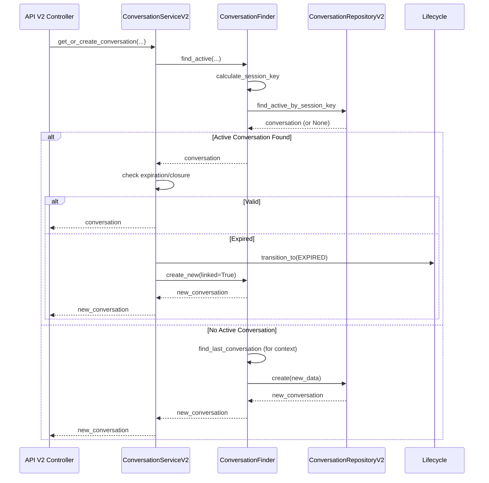

# Relatório de Migração V1 -> V2: Fase 1 (Infraestrutura)

## 📋 Resumo da Atividade

Conforme planejado no roteiro de migração, a Fase 1 focou na preparação da infraestrutura para suportar a coexistência dos módulos de conversação V1 (Legado) e V2 (Nova Arquitetura). O objetivo principal foi configurar o Container de Injeção de Dependência (DI) para servir ambas as versões simultaneamente e estabelecer a estrutura base da API V2.

**Status:** ✅ Concluído
**Data:** 29 de Janeiro de 2026

## 🛠️ Alterações Realizadas

### 1. Injeção de Dependência (DI Container)

Atualizamos o `src/core/di/container.py` para registrar os componentes da V2 sem remover os da V1.

- **Novos Providers Registrados:**
  - `ConversationRepositoryV2`: Repositório especializado da V2.
  - `ConversationFinder`: Componente de busca/criação.
  - `ConversationLifecycle`: Componente de gestão de estado.
  - `ConversationCloser`: Componente de detecção de fechamento.
  - `ConversationServiceV2`: Facade principal da V2.

- **Nomenclatura:** Utilizamos o sufixo `_v2` ou nomes específicos (ex: `finder`) para evitar colisão com os serviços legados.

### 2. Implementação de Métodos de Leitura na V2

Para suportar a API REST, adicionamos métodos de leitura ao `ConversationServiceV2` e `ConversationRepositoryV2` que não estavam explicitamente detalhados na fase de design inicial, mas são necessários para paridade de funcionalidades básicas (GET/LIST).

- **ConversationRepositoryV2:**
  - Adicionado `find_active_by_owner(owner_id, limit)`: Busca genérica de conversas ativas.
  
- **ConversationServiceV2:**
  - Adicionado `get_conversation_by_id(conv_id)`
  - Adicionado `get_active_conversations(owner_id, limit)`
  - Adicionado `get_conversation_messages(conv_id, limit, offset)`

### 3. API V2 Paralela

Criamos a estrutura de rotas para a V2, mantendo a compatibilidade de URLs base mas versionando o prefixo.

- **Nova Estrutura de Arquivos:**
  - `src/modules/conversation/api/v2/conversations.py`: Endpoints V2.
  - `src/modules/conversation/api/v2/router.py`: Router V2.

- **Endpoints Disponibilizados (Base Path: `/conversation/v2`):**
  - `POST /conversations/`: Create/Get Active Conversation
  - `GET /conversations/{conv_id}`: Get Conversation
  - `GET /conversations/`: List Active Conversations
  - `GET /conversations/{conv_id}/messages`: Get Messages
  - `POST /conversations/{conv_id}/messages`: Add Message
  - `POST /conversations/{conv_id}/close`: Close Conversation (Explicit)

- **Router Principal (`src/modules/conversation/api/router.py`):**
  - Configurado para incluir tanto `/v1` quanto `/v2`.

## 📊 Diagramas

### Diagrama de Componentes (DI Wiring)

```mermaid
graph TB
    subgraph "DI Container"
        RepoV1[ConversationRepository (V1)]
        RepoV2[ConversationRepositoryV2]
        MsgRepo[MessageRepository]
        
        ServiceV1[ConversationService (V1)]
        
        Finder[ConversationFinder]
        Lifecycle[ConversationLifecycle]
        Closer[ConversationCloser]
        
        ServiceV2[ConversationServiceV2 (Facade)]
    end
    
    RepoV1 --> ServiceV1
    MsgRepo --> ServiceV1
    
    RepoV2 --> Finder
    RepoV2 --> Lifecycle
    RepoV2 --> ServiceV2
    
    MsgRepo --> ServiceV2
    
    Finder --> ServiceV2
    Lifecycle --> ServiceV2
    Closer --> ServiceV2
    
    style ServiceV1 fill:#ffcccc,stroke:#333,stroke-width:2px
    style ServiceV2 fill:#ccffcc,stroke:#333,stroke-width:2px
```

### Diagrama de Sequência: Criação de Conversa (V2)



## ✅ Validação

Foi criado um script de verificação (`scripts/verify_v2_di.py`) para validar a injeção de dependência.

**Resultado dos Testes:**
```
Checking V1 Service...
✅ V1 Service resolved: <class 'src.modules.conversation.services.conversation_service.ConversationService'>
Checking V2 Service...
✅ V2 Service resolved: <class 'src.modules.conversation.v2.services.conversation_service.ConversationServiceV2'>
✅ V2 Service is instance of ConversationServiceV2
Checking V2 Service dependencies...
   - Finder: ...ConversationFinder object...
   - Lifecycle: ...ConversationLifecycle object...
   - Closer: ...ConversationCloser object...
   - Repo: ...ConversationRepositoryV2 object...
✅ DI Verification Complete
```

## 📝 Próximos Passos (Fase 2)

Com a infraestrutura pronta, podemos avançar para a migração dos componentes que consomem o serviço de conversação:

1. **Migrar Twilio Webhook Handler:** Atualizar `TwilioWebhookMessageHandler` para usar `ConversationServiceV2`.
2. **Migrar Workers:** Atualizar jobs de expiração para usar `ConversationLifecycle` (via ServiceV2 ou direto).

---
**Responsável:** Lennon (AI Assistant)
