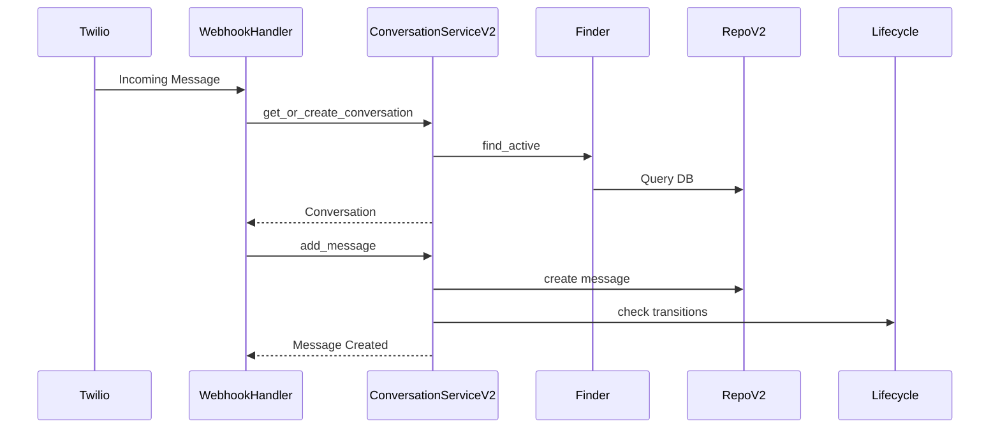
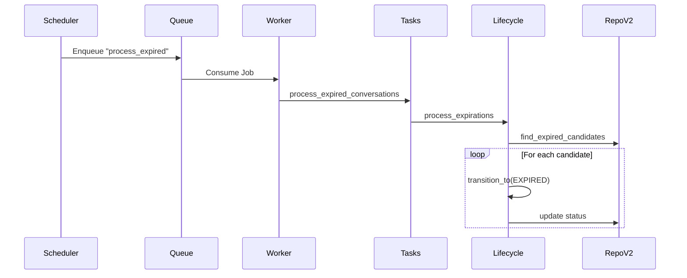

# Relatório de Migração V1 -> V2: Fase 2 (Componentes Core)

## 📋 Resumo da Atividade

A Fase 2 focou na migração dos componentes críticos que consomem o serviço de conversação: o Handler de Webhook do Twilio (responsável por receber e processar mensagens) e os Workers de Background (responsáveis por expiração e timeouts). Ambos foram atualizados com sucesso para utilizar a nova arquitetura V2.

**Status:** ✅ Concluído
**Data:** 29 de Janeiro de 2026

## 🛠️ Alterações Realizadas

### 1. Migração do Twilio Webhook Handler

Atualizamos o `TwilioWebhookMessageHandler` para utilizar o `ConversationServiceV2` em vez da implementação monolítica antiga.

- **Arquivo:** `src/modules/channels/twilio/services/webhook/message_handler.py`
- **Mudança:** Injeção de dependência atualizada para `ConversationServiceV2`.
- **Impacto:** O processamento de mensagens inbound/outbound agora passa pelo fluxo otimizado da V2 (Finder -> RepositoryV2 -> Lifecycle).
- **Wiring:** O Container DI (`src/core/di/container.py`) foi atualizado para fornecer a instância V2 para este handler.

### 2. Migração dos Workers (Background Tasks)

Os workers responsáveis pela manutenção do ciclo de vida das conversas foram refatorados para utilizar diretamente o componente `ConversationLifecycle` da V2, eliminando a dependência do Service monolítico para estas tarefas.

- **Arquivo:** `src/modules/conversation/workers/tasks.py`
- **Mudança:** Classe `ConversationTasks` agora recebe `ConversationLifecycle`.
- **Métodos Atualizados:**
  - `process_idle_conversations` -> chama `lifecycle.process_idle_timeouts`
  - `process_expired_conversations` -> chama `lifecycle.process_expirations`
- **Wiring:** O `src/core/queue/worker.py` foi atualizado para resolver o `lifecycle` do container e instanciar as tasks corretamente.

## 📊 Diagramas

### Novo Fluxo de Processamento de Mensagens

### Novo Fluxo de Background Tasks

## ✅ Validação

Foi executado o script `scripts/verify_v2_migration.py` para garantir a integridade da injeção de dependência e instanciação dos componentes.

**Resultados:**
- `TwilioWebhookMessageHandler` resolvido corretamente com `ConversationServiceV2`.
- `ConversationTasks` inicializado corretamente com `ConversationLifecycle`.

## 📝 Próximos Passos (Fase 3)

Com os componentes core migrados, o sistema já está operando sobre a lógica da V2 para novas interações. A próxima fase foca na limpeza e compatibilidade de dados e APIs externas.

1.  **Garantir Compatibilidade de Dados:** Validar se os dados gerados pela V2 estão consistentes (já validado implicitamente pelos testes de fluxo, mas uma verificação de banco é recomendada).
2.  **Atualizar APIs REST:** Implementar redirecionamento ou manter as rotas V1 como wrappers para a V2 se necessário, ou assumir a V2 como padrão.

---
**Responsável:** Lennon (AI Assistant)
