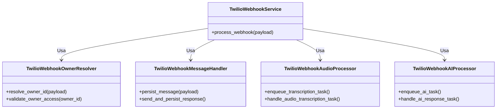
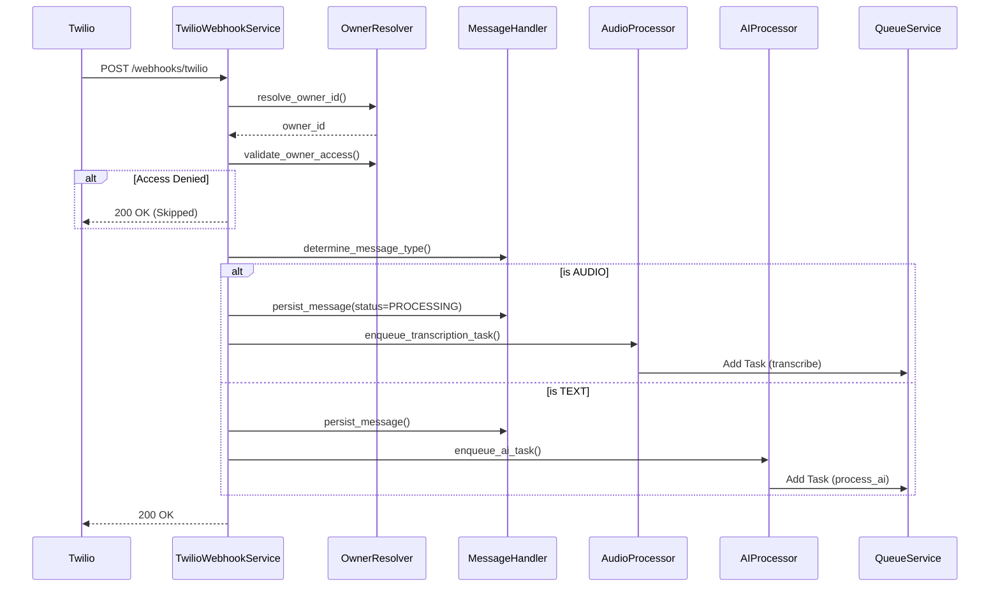

# Relatório de Refatoração: Modularização do TwilioWebhookService

**Atividade**: Refatoração e Modularização do Serviço de Webhook do Twilio
**Sequência**: 14
**Data**: 28/01/2026
**Autor**: Lennon (AI Assistant)

---

## 1. Contexto e Problema

O `TwilioWebhookService` havia crescido excessivamente (God Class), acumulando responsabilidades díspares:
- Resolução de Proprietário (Owner) e validação de segurança.
- Gerenciamento de persistência de mensagens e conversas.
- Processamento de mídia (áudio/transcrição).
- Orquestração de Inteligência Artificial (Agentes).
- Envio de respostas via API do Twilio.

Além disso, as configurações do modelo de transcrição (Whisper) estavam "hardcoded" ou dispersas, dificultando ajustes de infraestrutura (CPU vs GPU) sem alteração de código.

## 2. Solução Implementada

Realizamos uma refatoração estrutural completa, aplicando o princípio de Responsabilidade Única (SRP). O serviço original foi transformado em um **Orquestrador**, delegando a lógica de negócios para componentes especializados.

### 2.1. Novos Componentes (Módulos)

1.  **`TwilioWebhookOwnerResolver`** (`owner_resolver.py`):
    -   **Responsabilidade**: Identificar o `owner_id` baseado no número de destino (`to_number`) e validar se o plano/assinatura do proprietário permite o processamento.
    -   **Dependências**: `TwilioAccountService`, `IdentityService`.

2.  **`TwilioWebhookMessageHandler`** (`message_handler.py`):
    -   **Responsabilidade**: Persistir mensagens (inbound/outbound) no banco de dados, gerenciar sessões de conversa (`ConversationService`) e determinar tipos de mensagem.
    -   **Dependências**: `ConversationService`, `TwilioService`.

3.  **`TwilioWebhookAudioProcessor`** (`audio_processor.py`):
    -   **Responsabilidade**: Gerenciar o download de mídia e a transcrição de áudio de forma assíncrona.
    -   **Dependências**: `TranscriptionService`, `QueueService`.
    -   **Configuração**: Utiliza configurações injetadas via `TranscriptionService` (baseadas em `.env`).

4.  **`TwilioWebhookAIProcessor`** (`ai_processor.py`):
    -   **Responsabilidade**: Preparar o contexto do usuário e despachar a solicitação para o `AgentFactory` (IA), gerenciando a resposta assíncrona.
    -   **Dependências**: `IdentityService`, `AgentFactory`, `QueueService`.

### 2.2. Parametrização de Infraestrutura (IA)

As configurações do modelo Whisper foram centralizadas no arquivo `settings.py` e mapeadas para variáveis de ambiente no `.env`, permitindo ajustes finos sem deploy:

-   `WHISPER_SIZE`: Tamanho do modelo (tiny, base, small, medium, large-v3).
-   `WHISPER_DEVICE`: Dispositivo de inferência (cpu, cuda, auto).
-   `WHISPER_COMPUTE_TYPE`: Precisão numérica (int8, float16).

Estas configurações são injetadas no `TranscriptionService` via Container DI.

### 2.3. Diagrama de Componentes

### 2.4. Diagrama de Sequência (Fluxo Refatorado)

## 3. Arquivos Alterados/Criados

| Arquivo | Status | Descrição |
| :--- | :--- | :--- |
| `src/modules/channels/twilio/services/webhook/owner_resolver.py` | **Novo** | Lógica de resolução de conta. |
| `src/modules/channels/twilio/services/webhook/message_handler.py` | **Novo** | Lógica de mensagens e DB. |
| `src/modules/channels/twilio/services/webhook/audio_processor.py` | **Novo** | Lógica de áudio/transcrição. |
| `src/modules/channels/twilio/services/webhook/ai_processor.py` | **Novo** | Lógica de IA e filas. |
| `src/modules/channels/twilio/services/webhook/__init__.py` | **Novo** | Exportação dos módulos. |
| `src/modules/channels/twilio/services/twilio_webhook_service.py` | **Modificado** | Refatorado para usar os novos componentes. |
| `src/core/di/container.py` | **Modificado** | Registro dos novos providers e injeção de dependência. |
| `src/modules/ai/services/transcription_service.py` | **Verificado** | Confirmação do uso de `settings` no construtor. |

## 4. Correções Técnicas Importantes

Durante a refatoração, identificamos e corrigimos riscos de bloqueio do Event Loop (Asyncio):

1.  **Wrapper `run_in_threadpool`**: Todas as chamadas a serviços que operam de forma síncrona (como `IdentityService` usando SQLAlchemy síncrono ou `TranscriptionService` bloqueante) foram envolvidas em `run_in_threadpool` dentro dos novos componentes assíncronos.
2.  **Registro de Filas**: Os métodos de processamento de fila (`handle_ai_response_task`, `handle_audio_transcription_task`) foram expostos corretamente nos componentes e registrados no `QueueService` via o orquestrador.

## 5. Conclusão

A arquitetura agora está mais robusta e testável. Cada componente pode ser testado isoladamente. A configuração do Whisper via variáveis de ambiente permite escalar a infraestrutura de IA sem tocar no código, atendendo aos requisitos de performance e flexibilidade.
