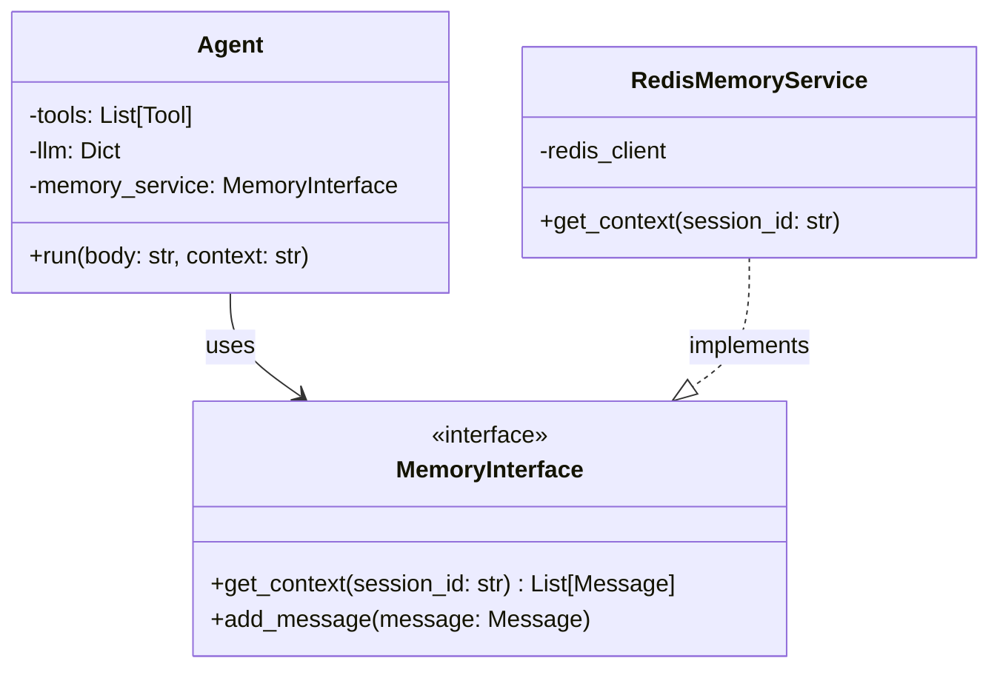
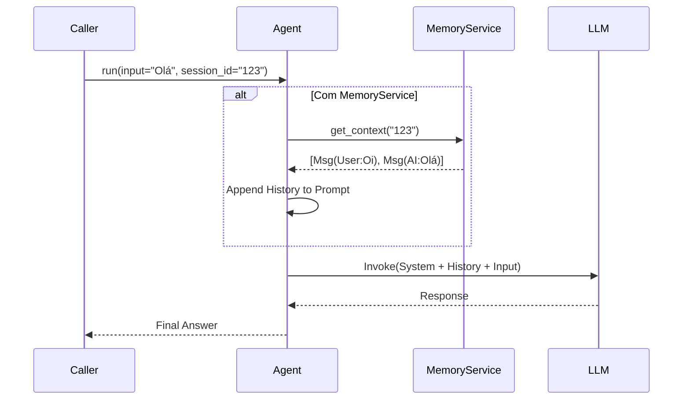

# Relatório de Refatoração do Agent - Fase 1

**Data:** 29/01/2026
**Autor:** Assistant
**Referência:** `plan/v4/research/research_memory_system_analysis_02.md`

## 1. Escopo e Localização

*   **Arquivo Alvo:** `src/modules/ai/engines/lchain/core/agents/agent.py`
*   **Classe:** `Agent`
*   **Atividade:** Refatoração estrutural para injeção de dependência do serviço de memória.

## 2. Problema Identificado

Atualmente, a classe `Agent` possui um atributo `self.memory = []` inicializado no construtor, mas que atua apenas como um armazenamento efêmero ou, em muitos casos, não utilizado para a persistência real do histórico de conversas entre sessões.

A gestão do contexto (histórico) é feita externamente e passada como string (`context` ou `user_context`), o que descentraliza a lógica de recuperação de memória e dificulta a implementação de estratégias híbridas (Redis + Postgres + Vector) transparentes para o agente.

## 3. Riscos

1.  **Inconsistência de Estado:** O uso de listas em memória (`self.memory`) é volátil e se perde a cada reinício da aplicação ou worker.
2.  **Acoplamento:** Sem uma interface definida, a lógica de como buscar o histórico fica espalhada nos *callers* do agente (ex: Webhook ou Services), violando o princípio de responsabilidade única.
3.  **Escalabilidade:** Carregar todo o histórico sem controle (como cache L1) pode degradar a performance.

## 4. Solução Proposta

Implementar a **Injeção de Dependência** de um `MemoryInterface` na classe `Agent`. O Agente deixará de gerenciar uma lista interna e passará a consultar o serviço de memória para obter o contexto relevante antes de iniciar o raciocínio.

### Alterações Previstas:

1.  **Remover:** `self.memory = []` do `__init__`.
2.  **Adicionar:** Parâmetro `memory_service: Optional[MemoryInterface] = None` no `__init__`.
3.  **Fluxo:** No método `run`, se `memory_service` estiver disponível, invocar `get_context(session_id)` para pré-carregar o histórico na `step_history` ou no prompt do sistema.

## 5. Diagramas

### 5.1 Diagrama de Classes (Proposto)

### 5.2 Diagrama de Sequência (Fluxo de Execução)

## 6. Próximos Passos Imediatos

1.  Criar a interface `src/modules/ai/memory/interfaces/memory_interface.py`.
2.  Alterar `src/modules/ai/engines/lchain/core/agents/agent.py` para aceitar a nova dependência.
