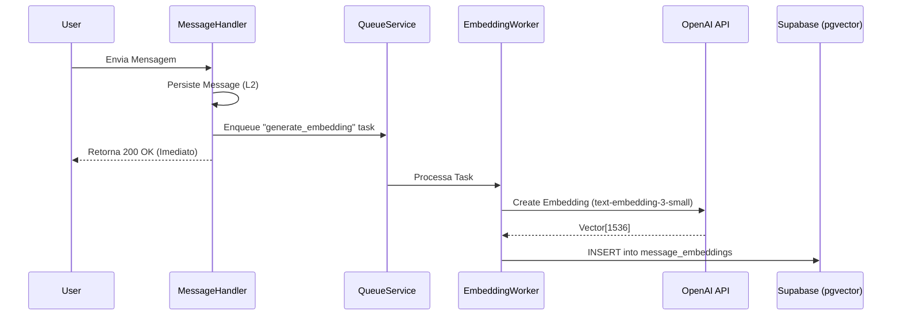
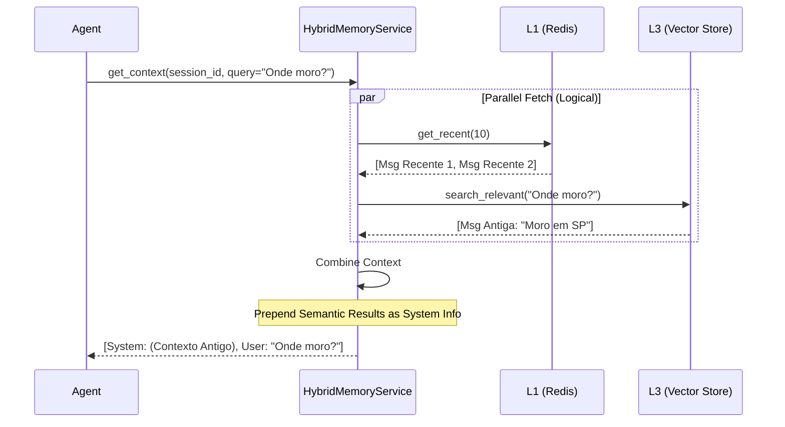

# Relatório de Implementação: Memória Semântica (Vector Store)

**Data:** 29/01/2026
**Autor:** Assistant
**Atividade:** Integração de Memória Semântica (Fase 3)
**Sequência:** 17

---

## 1. Contexto e Problema

O sistema de memória L1/L2 (Redis/Postgres) resolve o problema de contexto recente, mas possui limitações fundamentais:
- **Problema:** O Agente sofre de "amnésia" em relação a informações antigas que saem da janela de contexto (ex: últimas 10 mensagens). Fatos importantes mencionados dias atrás são esquecidos.
- **Necessidade:** Capacidade de recuperar informações relevantes baseadas no significado (semântica) e não apenas na ordem cronológica.

## 2. Análise de Riscos

| Risco | Descrição | Mitigação |
| :--- | :--- | :--- |
| **Latência na Resposta** | Gerar embeddings (chamada de API OpenAI) durante o fluxo de resposta do usuário adicionaria 200-500ms de latência. | **Processamento Assíncrono:** A geração de embeddings é feita em background via fila (`EmbeddingTasks`). |
| **Complexidade de Infra** | Adicionar um banco vetorial dedicado (Pinecone/Qdrant) aumentaria a complexidade operacional. | **Stack Unificada:** Uso do `pgvector` no próprio Supabase (Postgres), aproveitando a conexão existente. |
| **Custo de API** | Embeddar todas as mensagens pode gerar custos desnecessários. | (Futuro) Filtrar mensagens triviais (ex: "olá", "ok") antes de indexar. Por enquanto, indexamos tudo para garantir recall. |

## 3. Solução Implementada

Implementada a camada **L3 (Semântica)** na arquitetura de Memória Híbrida.

### 3.1. Arquitetura de Ingestão (Async Write)

O fluxo de escrita é desacoplado da resposta ao usuário para garantir performance.

### 3.2. Arquitetura de Recuperação (Hybrid Retrieval)

O Agente consulta o `HybridMemoryService`, que agora combina resultados cronológicos e semânticos.

## 4. Componentes e Alterações

### 4.1. Banco de Dados (Supabase)
*   **Migração SQL:** `plan/v4/migrations/001_setup_vector_store.sql`
    *   Habilita extensão `vector`.
    *   Cria tabela `message_embeddings`.
    *   Cria função de busca `match_message_embeddings`.

### 4.2. Código Fonte

1.  **Repositório (`VectorMemoryRepository`):**
    *   Local: `src/modules/ai/memory/repositories/`
    *   Usa `langchain-community` para abstrair interação com Supabase Vector.
    *   Configurado para usar modelo `text-embedding-3-small`.

2.  **Worker (`EmbeddingTasks`):**
    *   Local: `src/modules/ai/workers/`
    *   Consome tarefas da fila e chama o repositório para salvar embeddings.

3.  **Integração Webhook:**
    *   `TwilioWebhookMessageHandler` agora enfileira a tarefa `generate_embedding` logo após persistir a mensagem no Postgres.

4.  **Serviço Híbrido (`HybridMemoryService`):**
    *   Atualizado para aceitar `VectorMemoryRepository` opcional.
    *   Método `get_context` aceita parâmetro `query` e realiza busca semântica se disponível.

5.  **Configuração e DI:**
    *   `Settings`: Adicionada seção `EMBEDDING`.
    *   `Container`: Registrado `VectorMemoryRepository` e `EmbeddingTasks`.
    *   `Worker`: Registrado handler para fila `generate_embedding`.

## 5. Resultados e Próximos Passos

A infraestrutura para memória de longo prazo está completa.
*   **Teste:** Unitários criados para validar a lógica do repositório.
*   **Integração:** O fluxo ponta a ponta (Webhook -> Queue -> Vector -> Agent) está conectado.

**Ação Pendente:**
*   Executar o script SQL de migração no ambiente de produção/desenvolvimento.

---
**Status:** Fase 3 Concluída (Aguardando execução de migração).
