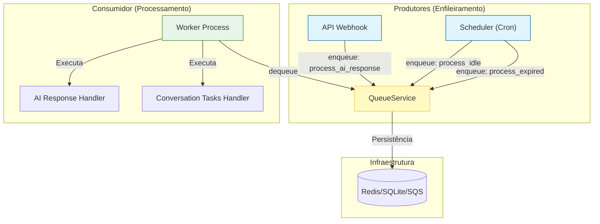

# Relatório de Resolução: Dualidade no Processamento em Background

## 1. Contexto do Problema
O sistema apresentava um risco de "Dualidade Perigosa" no processamento de tarefas em background. Isso se manifestava de duas formas potenciais:
1.  **Concorrência de Tecnologias**: O código importava `fastapi.BackgroundTasks`, sugerindo o uso de tarefas em memória (frágeis a reinicializações), concorrendo com o sistema robusto de filas (`QueueService`).
2.  **Ambiguidade de Responsabilidades**: A existência de um arquivo `background_tasks.py` gerava confusão sobre se ele era um executor ou um agendador, e se competia com o `worker.py`.

## 2. Ações Realizadas

### 2.1. Limpeza de Código (Remoção de BackgroundTasks)
-   **Remoção de Import Não Utilizado**: Identificamos e removemos a importação de `BackgroundTasks` do FastAPI no arquivo `src/modules/channels/twilio/api/webhooks.py`.
-   **Validação**: Confirmamos que o `TwilioWebhookService` já estava migrado para utilizar exclusivamente o `QueueService.enqueue`, garantindo persistência e confiabilidade no processamento de mensagens.
-   **Varredura**: Uma busca completa no codebase confirmou que não há mais usos ativos de `fastapi.BackgroundTasks` ou `asyncio.create_task` para lógica de negócios crítica.

### 2.2. Reestruturação e Renomeação (Scheduler vs Worker)
-   **Renomeação**: O arquivo `src/modules/conversation/workers/background_tasks.py` foi renomeado para **`src/modules/conversation/workers/scheduler.py`**.
    -   *Motivo*: O nome anterior causava confusão com o conceito de tarefas do FastAPI. O novo nome reflete exatamente sua função: um agendador periódico (Cron) que enfileira tarefas, mas não as executa.
-   **Atualização de Injeção de Dependência**: O container DI (`src/core/di/container.py`) foi atualizado para apontar para o novo módulo.

## 3. Arquitetura Resultante (Unificada)

A "dualidade" foi eliminada em favor de uma arquitetura **Produtor-Consumidor** clara e unificada sobre o `QueueService`.

### Diagrama de Fluxo

### Papéis Definidos
1.  **API (Webhooks)**: Recebe requisições HTTP e delega processamento pesado para a fila imediatamente. Não roda tarefas em background locais.
2.  **Scheduler (`scheduler.py`)**: Responsável **apenas** pelo "batimento cardíaco" (heartbeat) do sistema, enfileirando tarefas de manutenção periodicamente. Não processa nada.
3.  **Worker (`worker.py`)**: O único responsável por **executar** a lógica de negócios pesada. Consome da fila e garante retries e tratamento de erros.

## 4. Conclusão
O risco foi mitigado. O sistema agora possui uma única via de processamento assíncrono (`QueueService`), eliminando a perda de dados em reinicializações (risco do `BackgroundTasks` em memória) e clarificando a responsabilidade de cada componente.
