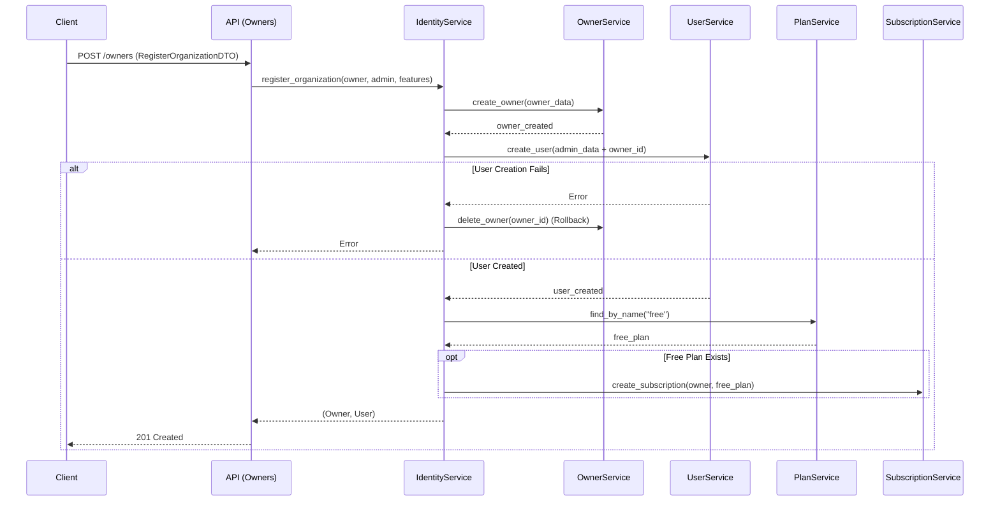
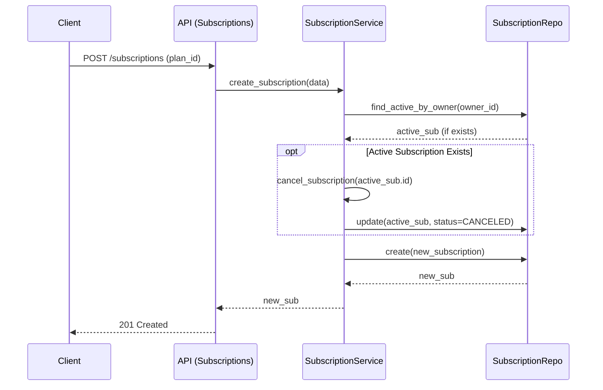

# Relatório de Implementação: Consolidação do Identity Module

**Data**: 26/01/2026
**Responsável**: Assistant

## 1. Resumo das Atividades

Este relatório documenta a implementação das melhorias planejadas no módulo de Identidade, focando na unificação do onboarding, refinamento de assinaturas e seeding de planos.

As seguintes tarefas foram concluídas conforme o plano `research_identity_improvement_04_consolidated.md`:

1.  **Seed de Planos**: Criação do script `scripts/seed_plans.py` para popular planos "Free" e "Pro".
2.  **Refinamento de Assinaturas**: Implementação da lógica de "Assinatura Única Ativa" no `SubscriptionService`.
3.  **Unificação do Onboarding**: Atualização do `IdentityService.register_organization` para incluir a criação automática de uma assinatura "Free" para novas organizações.

## 2. Detalhes da Implementação

### 2.1. Seed de Planos (`scripts/seed_plans.py`)

Criado um script robusto que popula o banco de dados com planos padrão ("Free" e "Pro") e suas respectivas features.

*   **Planos Criados**:
    *   **Free Tier**: Gratuito, limites reduzidos (2 usuários, 1 projeto).
    *   **Pro Tier**: Pago (R$ 99,00), limites expandidos (10 usuários, 5 projetos).
*   **Features Seedadas**:
    *   `whatsapp_integration`: Limites de mensagens.
    *   `ai_responses`: Modelo e limites de IA.
    *   `analytics`: Disponível apenas no Pro.

### 2.2. Assinatura Única Ativa (`SubscriptionService`)

Modificado o método `create_subscription` para garantir que um Owner tenha apenas uma assinatura ativa por vez.

*   **Lógica**: Antes de criar uma nova assinatura, o serviço verifica se existe uma assinatura ativa (`find_active_by_owner`). Se existir, ela é cancelada automaticamente antes de prosseguir com a criação da nova. Isso facilita fluxos de Upgrade/Downgrade.
*   **Arquivo**: [subscription_service.py](src/modules/identity/services/subscription_service.py)

### 2.3. Onboarding com Plano Gratuito (`IdentityService`)

O fluxo de registro de organização foi aprimorado para entregar uma organização pronta para uso.

*   **Fluxo**:
    1.  Cria Owner (Tenant).
    2.  Cria Usuário Admin.
    3.  **(Novo)** Busca o plano "free".
    4.  **(Novo)** Cria uma assinatura ativa do plano "free" para o novo Owner.
*   **Arquivo**: [identity_service.py](src/modules/identity/services/identity_service.py)

## 3. Diagramas de Fluxo

### 3.1. Fluxo Unificado de Onboarding

### 3.2. Fluxo de Upgrade/Downgrade de Assinatura

## 4. Próximos Passos

*   Executar o script de seed em ambiente de desenvolvimento/staging (`python scripts/seed_plans.py`).
*   Validar os endpoints com testes de integração.
*   Implementar middleware de autenticação para validar o `X-Auth-ID` e permissões de role (Admin vs Member).
