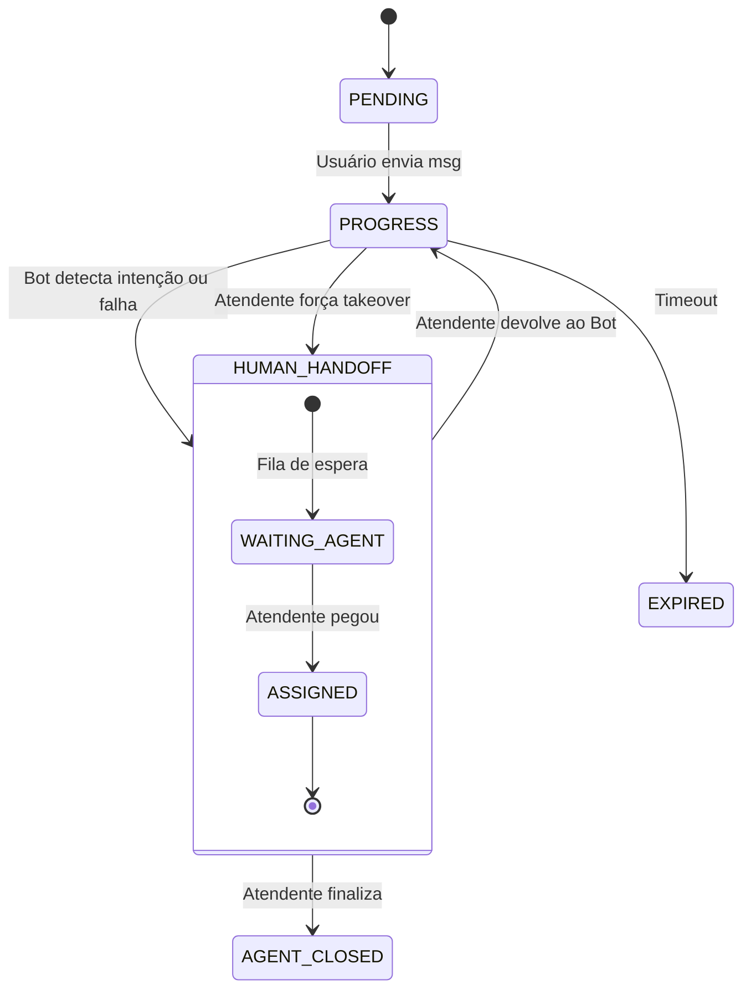
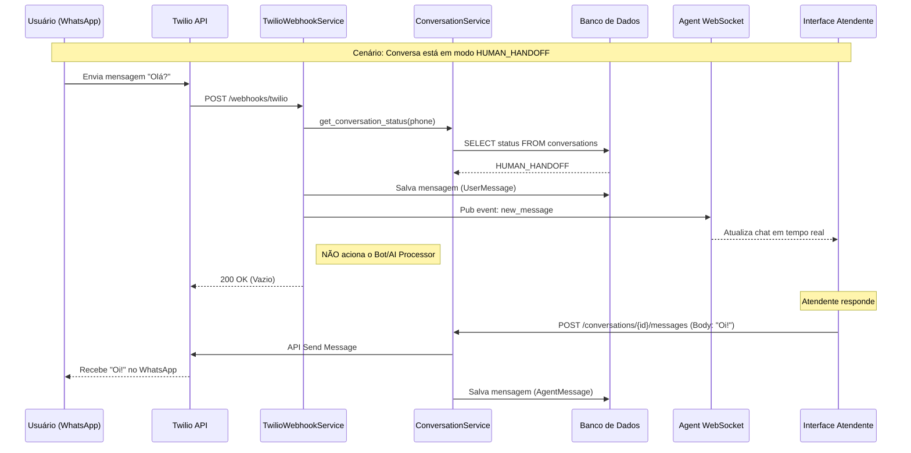

# Análise de Conformidade e Planejamento de Handoff Humano

## 1. Análise de Conformidade: Módulo Twilio (`src/modules/channels/twilio/`)

### 1.1. Estrutura de Diretórios: `workers/`

**Pergunta:** O diretório `/Users/lennon/projects/ai_engineering/whatsapp_twilio_ai/src/modules/channels/twilio/workers/` faz sentido com esse nome?

**Análise Atual:**
Atualmente, o diretório contém arquivos como `sender.py` e `sender_user.py`. A análise do código revela que `sender.py` é um **script de CLI (Command Line Interface)** utilizado para testes manuais e simulação de webhooks. Ele não implementa o padrão de "Worker" (Consumidor de Fila) que existe na arquitetura do projeto (`src.core.queue.worker`).

**Veredito:**
O nome `workers/` está **semânticamente incorreto** para o conteúdo atual (scripts), mas é o **nome correto** para a intenção futura (processamento assíncrono de mensagens outbound).

**Plano de Correção:**

1.  **Limpeza Imediata:**
    *   Mover `src/modules/channels/twilio/workers/sender.py` para `scripts/twilio/sender_cli.py` ou `src/tools/twilio_sender.py`.
    *   Este arquivo é uma ferramenta de apoio ao desenvolvimento, não parte do runtime de produção.

2.  **Uso Futuro de `workers/`:**
    *   O diretório deve ser reservado para classes que herdam de `src.core.queue.worker.BaseWorker`.
    *   **Exemplo de uso correto:** `TwilioOutboundWorker` (responsável por consumir a fila `whatsapp_outbound` e despachar mensagens via API do Twilio, lidando com retries e rate limits).

---

## 2. Planejamento: Handoff Humano

**Contexto:** Baseado na pesquisa `plan/v4/research/research_handoff_humano_twilio_16.md`, o objetivo é permitir que um atendente humano assuma uma conversa que iniciou com o bot.

### 2.1. Estrutura da Solução

A lógica de Handoff não deve residir puramente no módulo `twilio`, pois é uma regra de negócio que transcende o canal. A implementação deve ocorrer principalmente no módulo `conversation`, com integração no `twilio`.

#### 2.1.1. Localização das Mudanças

| Componente | Diretório | Responsabilidade |
| :--- | :--- | :--- |
| **Enum de Estado** | `src/modules/conversation/enums/conversation_status.py` | Adicionar status `HUMAN_HANDOFF`. |
| **Modelo de Dados** | `src/modules/conversation/models/conversation.py` | Adicionar campos `agent_id` (quem assumiu) e `handoff_at` (timestamp). |
| **Lógica de Controle** | `src/modules/conversation/services/conversation_service.py` | Métodos `request_handoff()`, `assign_agent()`, `release_to_bot()`. |
| **Webhook Twilio** | `src/modules/channels/twilio/services/twilio_webhook_service.py` | Verificar status antes de chamar o Bot/AI. Se `HUMAN_HANDOFF`, apenas salvar mensagem e notificar. |
| **API Backend** | `src/modules/conversation/api/v1/router.py` | Endpoints para o frontend do atendente (assumir, responder, devolver). |

### 2.2. Diagramas de Solução (Mermaid)

#### A. Diagrama de Estados da Conversa

#### B. Diagrama de Sequência: Fluxo de Handoff

### 2.3. Especificação de Riscos e Soluções

| Problema | Risco | Solução |
| :--- | :--- | :--- |
| **Concorrência** | Bot responder simultaneamente ao humano logo após a transição. | **Lock de Estado:** O Webhook deve verificar o estado *antes* de qualquer processamento de IA. Se a flag `HUMAN_HANDOFF` estiver ativa, o pipeline de IA é curto-circuitado imediatamente. |
| **Sessão Presa** | Atendente assume, não responde e vai embora. Conversa fica presa em `HUMAN_HANDOFF` para sempre. | **Timeout de Handoff:** Um Job (Cron/Scheduler) deve monitorar conversas em `HUMAN_HANDOFF` sem interação do agente por X minutos e devolver para o Bot ou escalar para supervisor. |
| **Contexto Perdido** | Atendente não sabe o que o bot já falou. | **Histórico Completo:** A API `GET /conversations/{id}/messages` deve retornar tanto mensagens do usuário quanto do Bot (`message_owner='ai'`). |

### 2.4. Roteiro de Implementação (Roadmap)

1.  **Refatoração (Limpeza)**
    *   [x] Mover scripts de `twilio/workers/` para `scripts/`.
2.  **Core (Conversation)**
    *   [x] Atualizar `ConversationStatus` com `HUMAN_HANDOFF`.
    *   [x] Adicionar campos na tabela `conversations` (migration).
    *   [x] Implementar métodos de transição de estado no `ConversationService`.
3.  **Integração (Twilio)**
    *   [x] Alterar `TwilioWebhookService` para respeitar o estado `HUMAN_HANDOFF`.
4.  **API e Realtime**
    *   [x] Criar endpoints para o Painel do Atendente (Listar filas, Assumir, Enviar msg).
    *   [ ] (Opcional MVP) Implementar Polling ou WebSocket simples para notificação.
5.  **Infraestrutura de Saída (Outbound)**
    *   [x] Criar `TwilioOutboundWorker` em `src/modules/channels/twilio/workers/outbound_worker.py`.
    *   [x] Atualizar `MessageHandler` para enfileirar mensagens em vez de enviar diretamente.
    *   [x] Registrar Worker no `QueueService`.

---
**Nota:** Este documento deve ser salvo em `plan/v4/research/research_compliance_handoff_17.md`.
