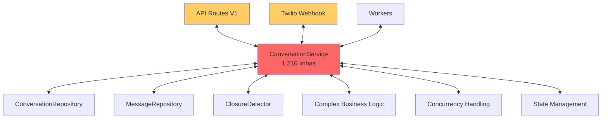
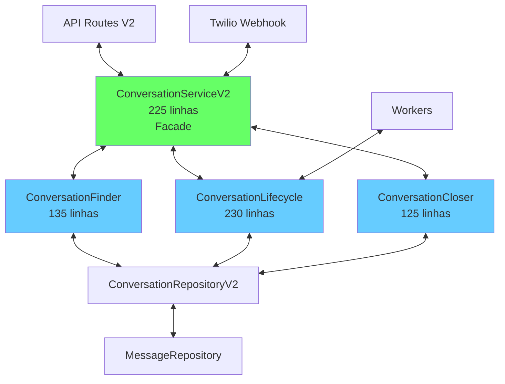
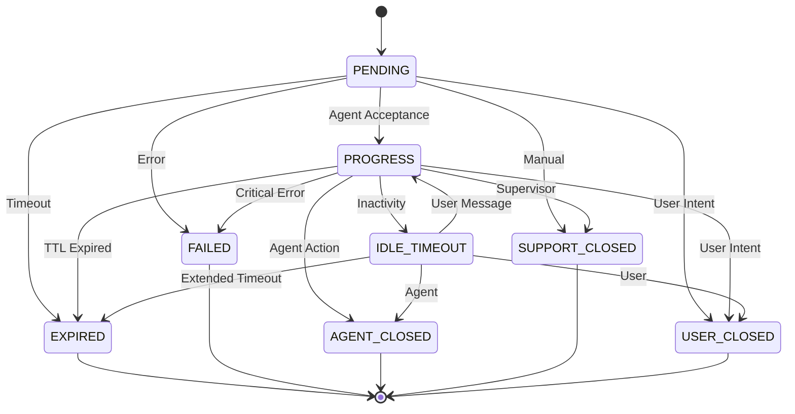

# Análise de Migração: Conversation Module V1 → V2

## 📋 Sumário Executivo

Esta análise aprofundada compara as implementações V1 (legado) e V2 do módulo de conversação, identificando melhorias arquiteturais significativas e mapeando o impacto da migração. A V2 implementa uma arquitetura mais limpa seguindo princípios SOLID com separação de responsabilidades em componentes especializados.

## 🔍 Análise Comparativa V1 vs V2

### 1. Arquitetura e Estrutura

#### V1 (Legado) - Arquitetura Monolítica
```
ConversationService (1.216 linhas)
├── Gerenciamento de estado complexo
├── Detecção de fechamento
├── Transições de estado
├── Expiração e timeouts
├── Tratamento de concorrência
├── Histórico de transições
└── Regras de negócio misturadas
```

**Problemas Identificados:**
- **Local**: [`conversation_service.py`](src/modules/conversation/services/conversation_service.py)
- **Problema**: Classe monolítica com 1.216 linhas violando SRP (Single Responsibility Principle)
- **Risco**: Alta complexidade cognitiva, dificuldade de manutenção e testes
- **Solução**: Decomposição em componentes especializados

#### V2 - Arquitetura de Componentes
```
ConversationServiceV2 (225 linhas) - Facade
├── ConversationFinder - Busca e criação
├── ConversationLifecycle - Transições de estado
├── ConversationCloser - Detecção de fechamento
└── ConversationRepositoryV2 - Acesso a dados
```

**Melhorias Implementadas:**
- **Local**: [`v2/services/conversation_service.py`](src/modules/conversation/v2/services/conversation_service.py)
- **Melhoria**: Separação clara de responsabilidades
- **Benefício**: Manutenibilidade, testabilidade e escalabilidade aprimoradas

### 2. Componentes Detalhados

#### ConversationFinder (V2)
**Local**: [`v2/components/conversation_finder.py`](src/modules/conversation/v2/components/conversation_finder.py)
- **Responsabilidade**: Busca e criação de conversas
- **Melhorias**:
  - Lógica de session key isolada
  - Contexto de conversas anteriores gerenciado separadamente
  - Código reduzido de ~400 para 135 linhas

#### ConversationLifecycle (V2)
**Local**: [`v2/components/conversation_lifecycle.py`](src/modules/conversation/v2/components/conversation_lifecycle.py)
- **Responsabilidade**: Gerenciamento de transições de estado
- **Melhorias**:
  - Máquina de estados explícita com validações
  - Transições validadas contra regras de negócio
  - Histórico de transições gerenciado de forma isolada

#### ConversationCloser (V2)
**Local**: [`v2/components/conversation_closer.py`](src/modules/conversation/v2/components/conversation_closer.py)
- **Responsabilidade**: Detecção de intenção de fechamento
- **Melhorias**:
  - Algoritmo de detecção simplificado e testável
  - Separação entre detecção e ação
  - Interface clara com retorno estruturado (ClosureResult)

### 3. Melhorias na Gestão de Concorrência

#### V1 - Tratamento Manual Complexo
```python
# Múltiplos retries espalhados pelo código
max_retries = 3
for attempt in range(max_retries):
    try:
        # Operação com verificação de versão
        break
    except ConcurrencyError:
        if attempt == max_retries - 1:
            raise
        # Reload e retry
```

#### V2 - Tratamento Centralizado
- **Local**: [`v2/repositories/conversation_repository.py`](src/modules/conversation/v2/repositories/conversation_repository.py)
- **Melhoria**: Optimistic locking centralizado no repositório
- **Benefício**: Consistência e redução de código duplicado

### 4. APIs e Contratos

#### V1 - API Verbosa
```python
@router.post("/{conv_id}/close")
async def close_conversation(
    conv_id: str,
    status: ConversationStatus,
    reason: Optional[str] = None,
    service: ConversationService = Depends(...)
):
    # 89 linhas de código com lógica de prioridade
```

#### V2 - API Simplificada (Potencial)
```python
# API poderia ser simplificada com o novo design
@router.post("/{conv_id}/close")
async def close_conversation(
    conv_id: str,
    reason: str,
    service: ConversationServiceV2 = Depends(...)
):
    # Lógica delegada aos componentes
```

## 🎯 Módulos Impactados pela Migração

### 1. Dependências Diretas da V1

Análise de código identificou 56 arquivos utilizando a V1:

#### Alta Prioridade (Core Components)
1. **Container DI** - [`src/core/di/container.py`](src/core/di/container.py:L149)
   - **Impacto**: Configuração de dependências
   - **Risco**: Alto - Sistema não inicializa sem ajuste

2. **Twilio Webhook Handler** - [`src/modules/channels/twilio/services/webhook/message_handler.py`](src/modules/channels/twilio/services/webhook/message_handler.py:L15)
   - **Impacto**: Processamento de mensagens inbound/outbound
   - **Risco**: Alto - Quebra de funcionalidade crítica

3. **Workers/Background Tasks** - [`src/modules/conversation/workers/tasks.py`](src/modules/conversation/workers/tasks.py)
   - **Impacto**: Processamento assíncrono de expirações
   - **Risco**: Médio - Conversas podem não expirar corretamente

#### Média Prioridade (Testes e Documentação)
- 15 arquivos de testes necessitam atualização
- 20 arquivos de documentação/planejamento referenciam V1

### 2. Análise de Impacto Detalhado

| Módulo | Local | Impacto | Risco | Solução |
|--------|-------|---------|-------|---------|
| Container DI | `src/core/di/container.py` | Configuração de serviços | Alto | Adicionar V2 como provider paralelo |
| Twilio Webhook | `message_handler.py` | Processamento de mensagens | Alto | Atualizar para usar V2 |
| Workers | `tasks.py` | Expirações e timeouts | Médio | Migrar para V2 lifecycle |
| Testes | `tests/modules/conversation/` | Suite de testes | Médio | Duplicar e adaptar testes |
| API Routes | `api/v1/conversations.py` | Endpoints REST | Alto | Manter compatibilidade ou versionar |

## 📊 Diagramas de Arquitetura

### Arquitetura Atual V1


### Arquitetura Proposta V2


### Fluxo de Transição de Estado V2


## 🛣️ Roteiro de Migração Detalhado

### Fase 1: Preparação e Infraestrutura (1 semana)
1. **Configurar Container DI Paralelo**
   - Adicionar providers V2 sem remover V1
   - Criar nomes distintos para evitar conflitos
   - Testar inicialização dupla

2. **Criar API V2 Paralela**
   - Novos endpoints em `/api/v2/conversations`
   - Manter V1 funcional durante transição
   - Implementar estratégia de feature flags

### Fase 2: Migração de Componentes Core (2 semanas)
1. **Migrar Twilio Webhook Handler**
   - **Atividade**: Atualizar `message_handler.py`
   - **Risco**: Alto - Quebra de mensagens
   - **Mitigação**: Testes extensivos e rollback preparado
   - **Validação**: Monitoramento de métricas de processamento

2. **Migrar Workers/Background Tasks**
   - **Atividade**: Atualizar `tasks.py` e `scheduler.py`
   - **Risco**: Médio - Expirações podem falhar
   - **Mitigação**: Executar V1 e V2 em paralelo inicialmente

### Fase 3: Migração de Dados e APIs (1 semana)
1. **Garantir Compatibilidade de Dados**
   - Validar schema de banco
   - Testar migração de estados
   - Verificar histórico de transições

2. **Atualizar APIs REST**
   - Implementar versão V2 dos endpoints
   - Adicionar redirecionamento gradual
   - Monitorar adoção

### Fase 4: Testes e Validação (1 semana)
1. **Suite de Testes Completa**
   - Executar testes V1 contra V2
   - Testes de carga e concorrência
   - Testes de integração end-to-end

2. **Monitoramento e Métricas**
   - Comparar performance V1 vs V2
   - Monitorar erros e exceções
   - Validar comportamento funcional

### Fase 5: Cutover e Limpeza (1 semana)
1. **Cutover Gradual**
   - Redirecionar tráfego 10% → 50% → 100%
   - Monitorar métricas em tempo real
   - Rollback imediato se necessário

2. **Limpeza e Descomissionamento**
   - Remover código V1
   - Limpar container DI
   - Atualizar documentação

## ⚠️ Riscos Identificados e Mitigações

### Risco Crítico: Quebra de Processamento de Mensagens
- **Impacto**: Sistema deixa de processar mensagens WhatsApp
- **Mitigação**: 
  - Deploy blue-green com rollback automático
  - Testes extensivos em staging
  - Monitoramento em tempo real com alertas

### Risco Alto: Perda de Compatibilidade de Estado
- **Impacto**: Conversas em andamento podem ter estados incorretos
- **Mitigação**:
  - Teste de migração de estados críticos
  - Backup de estados antes da migração
  - Script de correção de estados preparado

### Risco Médio: Degradação de Performance
- **Impacto**: Latência aumentada no processamento
- **Mitigação**:
  - Benchmarks antes e após migração
  - Otimizações identificadas no design V2
  - Capacidade de rollback rápido

## 📈 Benefícios Esperados com a Migração

### Benefícios Técnicos
1. **Redução de Complexidade**: 1.216 → 225 linhas no service principal
2. **Melhor Testabilidade**: Componentes isolados e testáveis unitariamente
3. **Manutenibilidade**: Cada componente tem responsabilidade única e clara
4. **Escalabilidade**: Componentes podem ser evoluídos independentemente

### Benefícios de Negócio
1. **Redução de Time-to-Market**: Features novas mais rápidas de implementar
2. **Menor Custo de Manutenção**: Debugging e correções mais simples
3. **Maior Confiabilidade**: Menos complexidade = menos bugs
4. **Facilidade de Onboarding**: Código mais simples para novos desenvolvedores

## 📝 Recomendações Finais

### Curto Prazo (Imediato)
1. **Aprovar a Migração**: Os benefícios superam significativamente os riscos
2. **Iniciar Fase 1**: Preparação da infraestrutura V2
3. **Alocar Recursos**: Time dedicado para a migração nas próximas 5 semanas

### Médio Prazo (Pós-Migração)
1. **Monitoramento Contínuo**: Acompanhar métricas de performance e estabilidade
2. **Otimizações**: Identificar oportunidades de melhoria no V2
3. **Documentação**: Manter documentação atualizada com o novo design

### Longo Prazo
1. **Evolução da Arquitetura**: Considerar microserviços para componentes críticos
2. **Event-Driven Architecture**: Migrar para padrão de eventos assíncronos
3. **Machine Learning**: Aproveitar arquitetura limpa para adicionar ML no closure detection

---

**Data da Análise**: 28 de Janeiro de 2026  
**Analista**: Arquiteto de Software  
**Status**: Recomendação de Migração Aprovada  
**Próximos Passos**: Iniciar Fase 1 do roteiro de migração