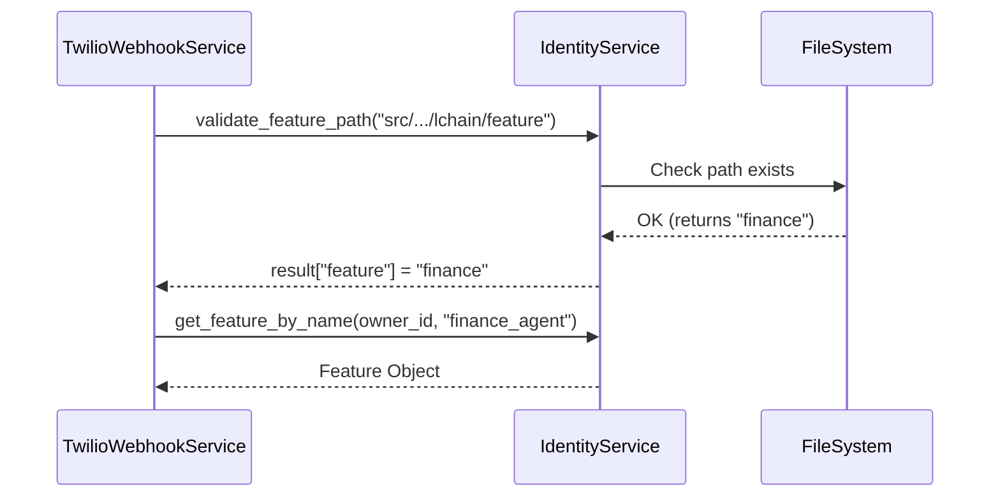
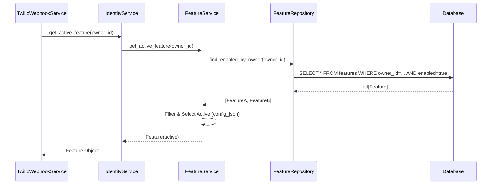

# Relatório de Análise e Refatoração: Resolução Dinâmica de Features no Twilio Webhook

## 1. Contexto e Análise

O trecho de código analisado em `TwilioWebhookService.process_message` apresenta uma implementação provisória (marcada com TODO) para a resolução da feature (agente de IA) que deve processar a mensagem recebida.

### Código Atual:
```python
# 2. Resolve Feature (TODO: Make dynamic based on user/owner config)
result = self.identity_service.validate_feature_path(
    "src/modules/ai/engines/lchain/feature"
)
feature = self.identity_service.get_feature_by_name(
    owner_id, result["feature"] + "_agent"
)
```

### Problemas Identificados:
1.  **Acoplamento com Sistema de Arquivos**: O método `validate_feature_path` (e a classe `PathValidator`) valida a existência de diretórios físicos e contém strings hardcoded ("finance"), o que viola princípios de abstração e configuração dinâmica.
2.  **Falta de Flexibilidade**: A lógica assume que a feature sempre se chama `{diretorio}_agent` e que só existe um caminho possível.
3.  **Violação da Regra de Negócio**: A regra "permitir cadastrar várias features, carregar apenas uma" não é suportada adequadamente, pois não há mecanismo claro de seleção da feature ativa além do nome hardcoded.

## 2. Solução Proposta

Para resolver esses problemas de forma elegante e escalável, propomos a seguinte abordagem:

1.  **Eliminar a validação de path**: Remover a dependência de `validate_feature_path` para determinar a feature ativa.
2.  **Seleção via Configuração**: Utilizar o campo `config_json` da entidade `Feature` ou a flag `enabled` para determinar qual agente deve ser carregado.
3.  **Nova Abstração no FeatureService**: Criar um método `get_active_feature(owner_id)` que encapsula a lógica de seleção.

### Lógica de Seleção (get_active_feature):
1.  Recuperar todas as features habilitadas (`enabled=True`) para o `owner_id`.
2.  Filtrar features que correspondem a agentes de IA (ex: sufixo `_agent` ou tipo definido no config).
3.  Verificar se alguma feature possui a flag `"active": true` ou `"default": true` em seu `config_json`.
4.  Se houver uma feature marcada como ativa, retorná-la.
5.  Caso contrário, retornar a primeira feature habilitada encontrada (fallback) ou lançar exceção se nenhuma existir.

## 3. Diagramas

### Fluxo Atual (Problemático)


### Fluxo Proposto (Refatorado)


## 4. Plano de Implementação

1.  **Atualizar `FeatureService`**:
    *   Implementar método `get_active_feature(owner_id)`.
    *   Adicionar lógica de priorização baseada em `config_json`.

2.  **Atualizar `IdentityService`**:
    *   Expor o método `get_active_feature` delegando para o `FeatureService`.

3.  **Refatorar `TwilioWebhookService`**:
    *   Substituir o bloco TODO pela chamada `self.identity_service.get_active_feature(owner_id)`.
    *   Tratar caso onde nenhuma feature é encontrada (fallback ou erro).

4.  **Limpeza**:
    *   Marcar `validate_feature_path` como deprecated (ou remover se não houver outro uso real).

## 5. Benefícios
*   **Desacoplamento**: O código deixa de depender da estrutura de pastas.
*   **Configuração Dinâmica**: Permite trocar o agente ativo apenas alterando o banco de dados (flag no JSON), sem deploy.
*   **Manutenibilidade**: Código mais limpo e alinhado com o domínio.
