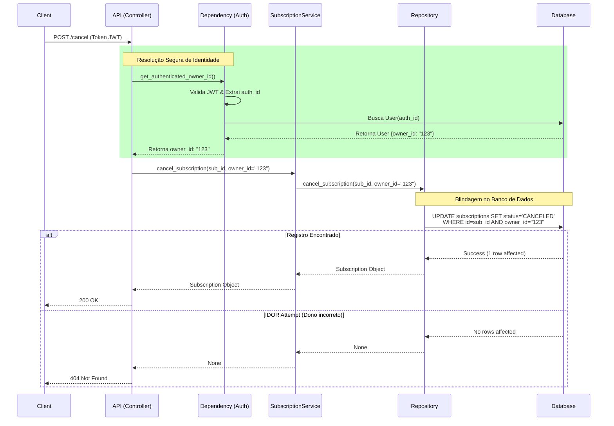
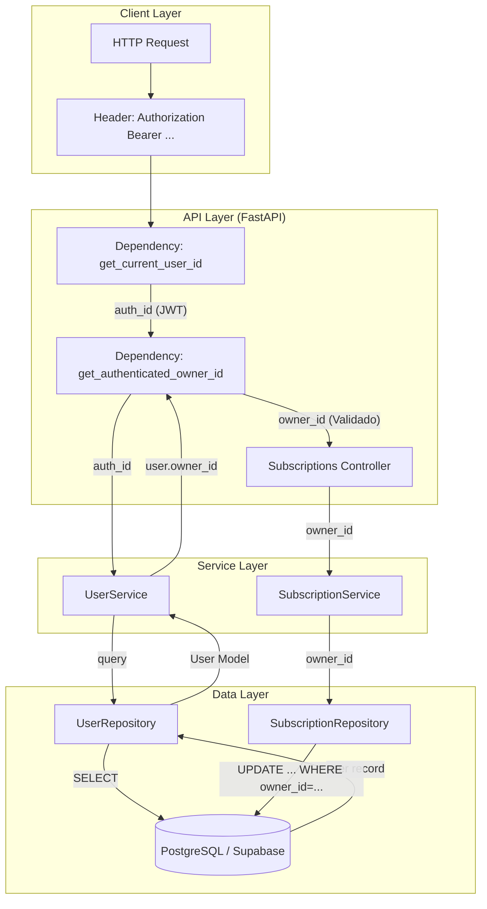
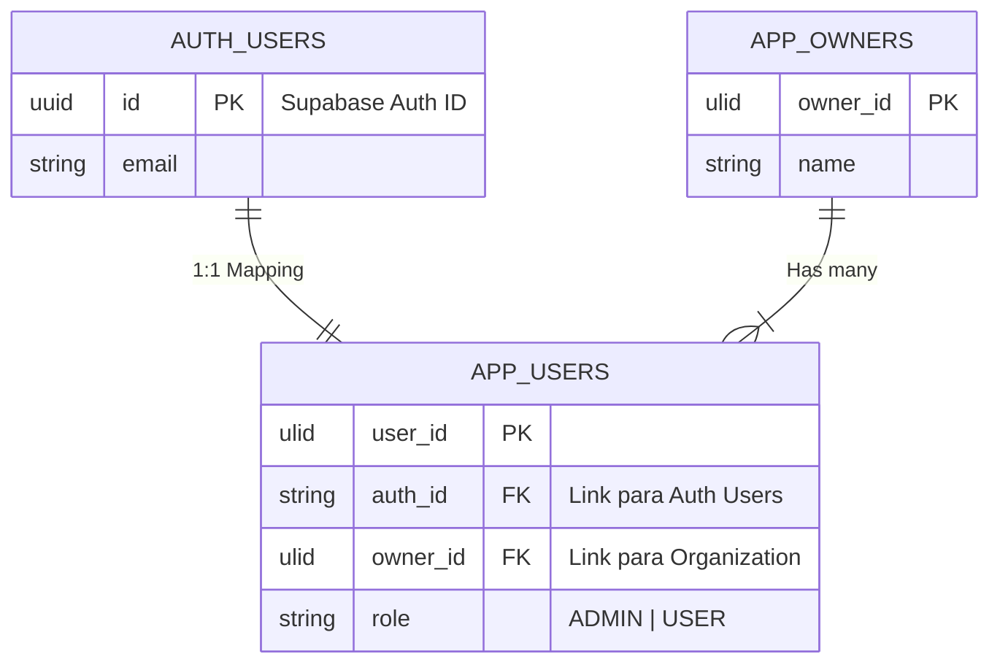

# ADR: Remoção do Header Inseguro X-Auth-ID e Correção de IDOR

| Status | Data | Autor | Versão |
| :--- | :--- | :--- | :--- |
| **Implementado** | 05/02/2026 | Trae AI | 1.0.0 |

## 1. Contexto e Problema

O sistema utilizava um mecanismo híbrido de autenticação que apresentava uma vulnerabilidade crítica de segurança:

1.  **Autenticação Dupla**: A API aceitava tanto Tokens JWT quanto um header customizado `X-Auth-ID`.
2.  **Vetor de Ataque (Spoofing)**: O header `X-Auth-ID` era confiado cegamente pelos endpoints, permitindo que qualquer agente malicioso personificasse outro usuário apenas alterando o valor deste header.
3.  **Vulnerabilidade IDOR**: No endpoint de cancelamento de assinaturas (`POST /subscriptions/{id}/cancel`), não havia verificação se a assinatura pertencia ao usuário que solicitou o cancelamento, permitindo que usuários cancelassem assinaturas de terceiros.

## 2. Decisão Arquitetural

Decidiu-se **remover completamente o suporte ao header `X-Auth-ID`** e centralizar a resolução de identidade exclusivamente no **Token JWT** (Supabase Auth).

### Princípios Adotados:
*   **Zero Trust no Cliente**: Nenhuma identificação de usuário enviada via headers customizados (exceto `Authorization`) será aceita.
*   **Single Source of Truth**: O `auth.uid()` extraído do JWT validado é a única fonte confiável para identificar o usuário (`auth_id`).
*   **Defense in Depth**: A verificação de propriedade (`owner_id`) deve ocorrer tanto na camada de API (Dependency Injection) quanto na camada de Dados (Repositories).

## 3. Solução Implementada

### 3.1. Nova Dependência de Segurança
Criada a dependência `get_authenticated_owner_id` que encapsula a lógica de resolução segura:
1.  Valida Token JWT.
2.  Extrai `auth_id` (sub).
3.  Consulta banco para obter `owner_id` associado.
4.  Retorna `owner_id` ou erro 401/403.

### 3.2. Refatoração de Endpoints
Todos os endpoints em `subscriptions.py`, `features.py`, `owners.py` e `users.py` foram refatorados para usar a nova dependência, eliminando o parâmetro `x_auth_id`.

### 3.3. Blindagem de Repositórios
Os métodos críticos de escrita (ex: `cancel_subscription`) foram alterados para exigir o `owner_id` como parâmetro obrigatório e utilizá-lo na cláusula `WHERE` da query SQL.

## 4. Diagramas

### 4.1. Diagrama de Sequência: Fluxo de Cancelamento Seguro

### 4.2. Diagrama de Componentes: Fluxo de Autenticação

### 4.3. Modelo de Dados de Identidade

## 5. Resultados e Consequências

### Positivos (Ganhos)
*   ✅ **Eliminação de IDOR**: Impossível cancelar assinaturas de terceiros, pois o `owner_id` é forçado pelo token.
*   ✅ **Anti-Spoofing**: Remoção completa da possibilidade de injetar identidades falsas via header `X-Auth-ID`.
*   ✅ **Código Limpo**: Redução de dívida técnica e código duplicado nos controllers.
*   ✅ **Conformidade**: Alinhamento com as políticas de RLS do banco de dados que já esperavam JWT.

### Negativos (Riscos/Custos)
*   **Breaking Change**: Qualquer cliente legado (se existisse) que dependesse exclusivamente de `X-Auth-ID` pararia de funcionar. *Mitigação: Não há clientes públicos legados conhecidos neste estágio do projeto.*

## 6. Próximos Passos Recomendados
1.  Monitorar logs de erro 401/403 para identificar tentativas de acesso inválido.
2.  Considerar migrar o campo `auth_id` na tabela `users` para o tipo `UUID` nativo no futuro (atualmente é `TEXT`), para maior rigor no esquema do banco.
