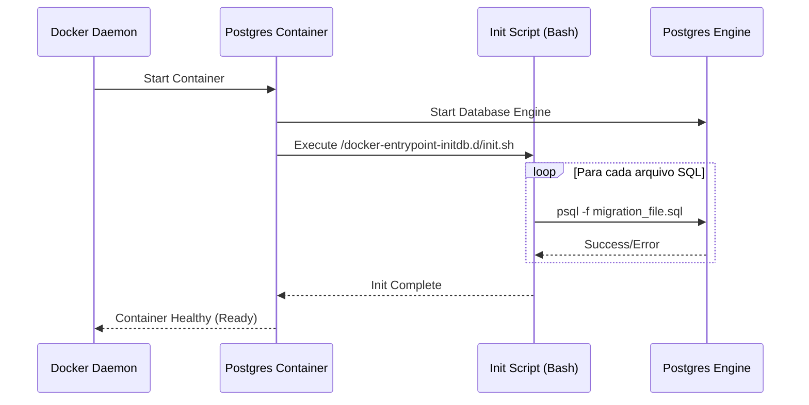
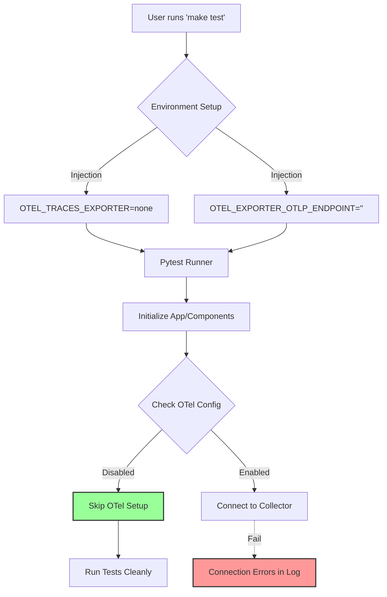

# Relatório Técnico de Ajustes de Infraestrutura e Testes

**Data:** 03/02/2026  
**Autor:** Assistant (Trae IDE)  
**Contexto:** Refinamento da inicialização do ambiente Docker e limpeza de logs em testes automatizados.

---

## 1. Observação: Inicialização do Postgres no Docker

### Especificações
- **Local:** `docker-compose.yml`, `scripts/docker_postgres_init.sh`
- **Problema:** O script original de migração (`scripts/migrate_postgres.sh`) era baseado em Python. No entanto, a imagem oficial do Postgres utilizada (`pgvector/pgvector:pg16`) não possui interpretador Python instalado, impossibilitando a execução direta das migrações durante o startup do container.
- **Risco:** Falha na inicialização do serviço de banco de dados (`Exit Code 127` ou `CrashLoopBackOff`), impedindo que a aplicação suba corretamente em um ambiente limpo.
- **Solução:** 
    1. Criação de um script Shell (`docker_postgres_init.sh`) nativo, utilizando o cliente `psql` já presente na imagem.
    2. Mapeamento correto dos volumes no `docker-compose.yml` para disponibilizar tanto o script de init quanto os arquivos SQL de migração.
    3. Garantia de permissão de execução (`chmod +x`) no script.

### Diagrama de Sequência (Inicialização)

---

## 2. Observação: Ruído de Telemetria (OTel) nos Testes

### Especificações
- **Local:** `Makefile`, `tests/.env.test.example`
- **Problema:** Ao executar a suíte de testes (`make test`), a aplicação tentava conectar-se ao OpenTelemetry Collector (configurado por padrão no `.env`). Como o stack de observabilidade não é levantado para testes unitários, isso gerava múltiplos erros de conexão (`Transient error StatusCode.UNAVAILABLE`) e poluição visual nos logs.
- **Risco:** 
    - Dificuldade em identificar erros reais dos testes em meio aos logs de erro de rede.
    - Possível lentidão na execução dos testes devido a *retries* de conexão e *timeouts*.
- **Solução:** 
    - Alteração no comando `make test` para injetar variáveis de ambiente que desabilitam explicitamente a exportação de traces: `OTEL_EXPORTER_OTLP_ENDPOINT=` e `OTEL_TRACES_EXPORTER=none`.

### Diagrama de Fluxo (Execução de Testes)

---

## 3. Resumo das Alterações

| Arquivo | Tipo | Descrição |
| :--- | :--- | :--- |
| `scripts/docker_postgres_init.sh` | **Novo** | Script Bash para rodar migrações via `psql` no boot do Docker. |
| `docker-compose.yml` | **Modificado** | Ajuste nos volumes do serviço `postgres` para usar o novo script de init. |
| `Makefile` | **Modificado** | Adição de variáveis de ambiente no target `test` para silenciar o OTel. |
| `tests/.env.test.example` | **Documentação** | Registro das variáveis recomendadas para ambiente de teste. |

---

## 4. Conclusão

As correções garantem que o ambiente de desenvolvimento seja robusto (inicialização confiável do banco de dados) e que o ambiente de testes seja limpo e performático (sem ruído de rede desnecessário). A arquitetura agora suporta inicialização automática de banco sem dependências externas (Python) dentro do container de banco.
