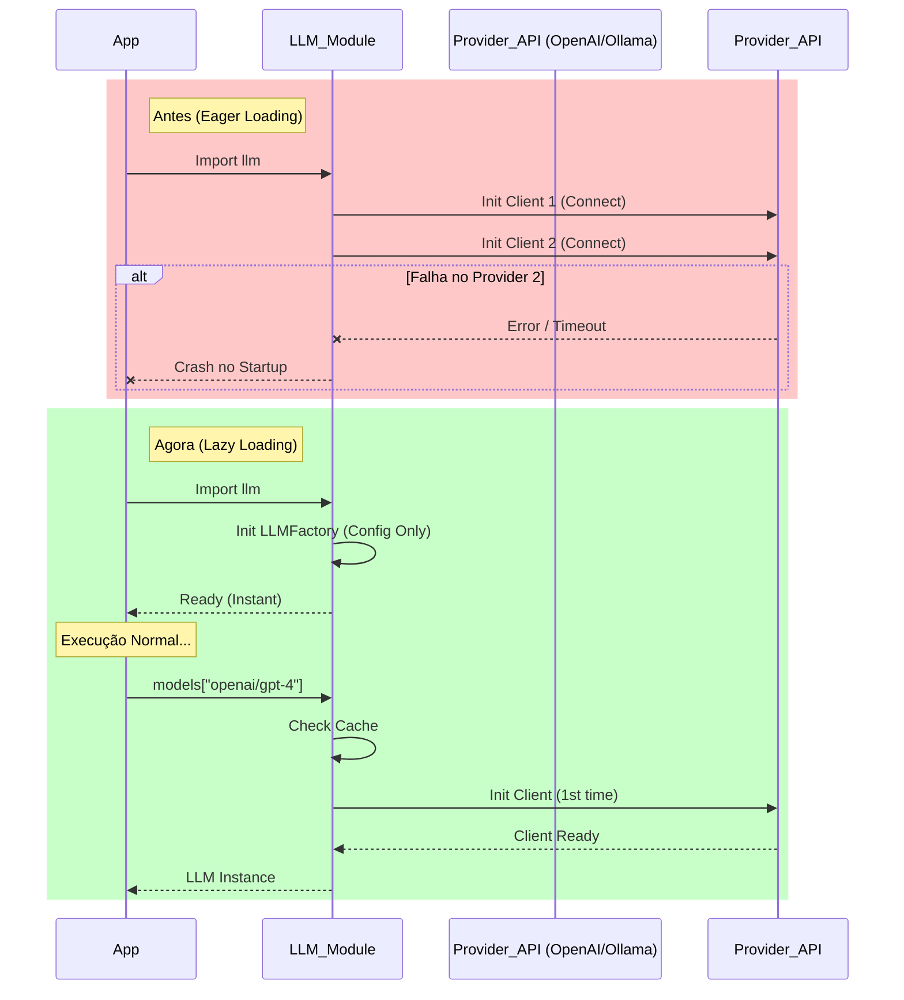
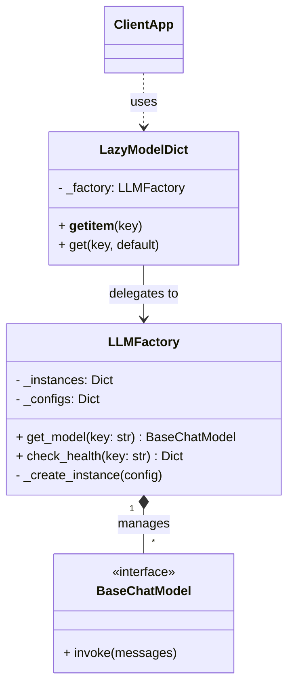
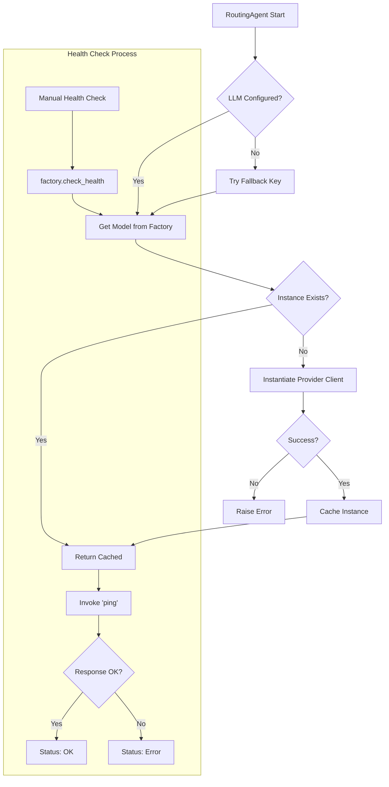

# Relatório de Implementação: LLM Lazy Loading e Health Check

**Data:** 2026-02-03  
**Atividade:** Refatoração da Infraestrutura de LLM para Lazy Loading e Observabilidade  
**Autor:** Assistant (Trae IDE)

## 1. Observação

### Local
- **Arquivo Principal:** `src/modules/ai/infrastructure/llm.py`
- **Componentes Afetados:** `RoutingAgent`, `TaskAgent`, e qualquer serviço consumidor de `models`.

### Problema
A arquitetura anterior realizava a instanciação "Eager" (ansiosa) de todos os modelos de linguagem configurados (OpenAI, Google, Groq, Ollama) no momento da importação do módulo `llm.py`. Isso causava:
1. **Tempo de Startup Elevado:** Conexões desnecessárias eram abertas simultaneamente.
2. **Fragilidade:** Se um provedor local (como Ollama) estivesse offline ou uma chave de API inválida, a aplicação falhava ao iniciar (`KeyError` ou exceções de validação), mesmo que aquele modelo específico não fosse ser utilizado.
3. **Falta de Observabilidade:** Não havia mecanismo padronizado para verificar se um modelo estava operacional antes de seu uso.

### Risco
- **Indisponibilidade do Sistema:** Uma falha em um modelo secundário impedia o boot de toda a aplicação.
- **Dificuldade de Diagnóstico:** Erros de conexão silenciosos ou catastróficos no startup dificultavam a identificação da causa raiz em ambientes de produção.
- **Desperdício de Recursos:** Alocação de memória para clientes de modelos que poderiam nunca ser chamados durante o ciclo de vida do worker.

### Solução
Implementação do padrão **Singleton Factory** com **Lazy Loading** e um proxy de compatibilidade.
1. **LLMFactory:** Classe central que gerencia configurações e instâncias. Só cria o cliente do LLM (ex: `ChatOpenAI`) quando ele é explicitamente solicitado.
2. **LazyModelDict:** Um objeto que se comporta como um dicionário (para manter retrocompatibilidade com o código existente `models["key"]`), mas delega a criação para a Factory sob demanda.
3. **Health Check:** Adição do método `check_health(key)` que realiza um teste de conectividade real ("ping") com o provedor.
4. **Fallback Dinâmico:** Capacidade de instanciar modelos não mapeados estaticamente apenas fornecendo a chave `provider/model_name`.

---

## 2. Diagramas da Solução

### 2.1. Diagrama de Sequência: Comparativo Eager vs Lazy

### 2.2. Diagrama de Componentes e Classes

### 2.3. Fluxo de Health Check e Fallback

---

## 3. Resultados e Alterações

### Alterações Realizadas
1.  **Refatoração Total de `src/modules/ai/infrastructure/llm.py`**:
    *   Substituição da lógica procedural por Orientação a Objetos (`LLMFactory`).
    *   Remoção de instâncias globais soltas.
    *   Criação de proxy `models` para evitar quebra de contrato com agentes existentes.

2.  **Atualização do `RoutingAgent`**:
    *   Arquivo: `src/modules/ai/engines/lchain/core/agents/routing_agent.py`
    *   Ajuste para usar `.get()` de forma segura com fallback, aproveitando a natureza dinâmica do `LazyModelDict`.

3.  **Testes**:
    *   Criação de suite de testes em `tests/modules/ai/infrastructure/test_llm.py` cobrindo:
        *   Lazy Loading (instanciação apenas no acesso).
        *   Criação dinâmica de configuração.
        *   Health Check (sucesso e falha).
        *   Compatibilidade de dicionário.

### Resultados Obtidos
*   **Startup Imediato:** O tempo de carga do módulo `llm` caiu para próximo de zero, pois nenhuma conexão de rede é feita na importação.
*   **Resiliência:** A aplicação agora inicia mesmo se o Ollama estiver desligado ou se a internet estiver instável. O erro só ocorrerá se/quando o modelo for efetivamente solicitado.
*   **Observabilidade:** Capacidade de monitorar a saúde dos LLMs em tempo de execução sem reiniciar o serviço.
*   **Segurança:** Redução da superfície de ataque durante a inicialização, validando credenciais apenas quando necessário.

---

## 4. Próximos Passos Sugeridos
1.  **Endpoint de API:** Expor o `llm_factory.check_health()` em uma rota `/health/ai` para monitoramento por ferramentas como Prometheus/Grafana (já existente na stack).
2.  **Retry Policy:** Implementar política de retentativa automática dentro do `_create_instance` para falhas transientes de rede na primeira conexão.
3.  **Circuit Breaker:** Utilizar o status do health check para impedir que o `RoutingAgent` tente usar um modelo sabidamente "down", chaveando automaticamente para um modelo de backup (ex: OpenAI -> Groq).
