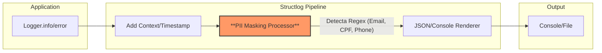
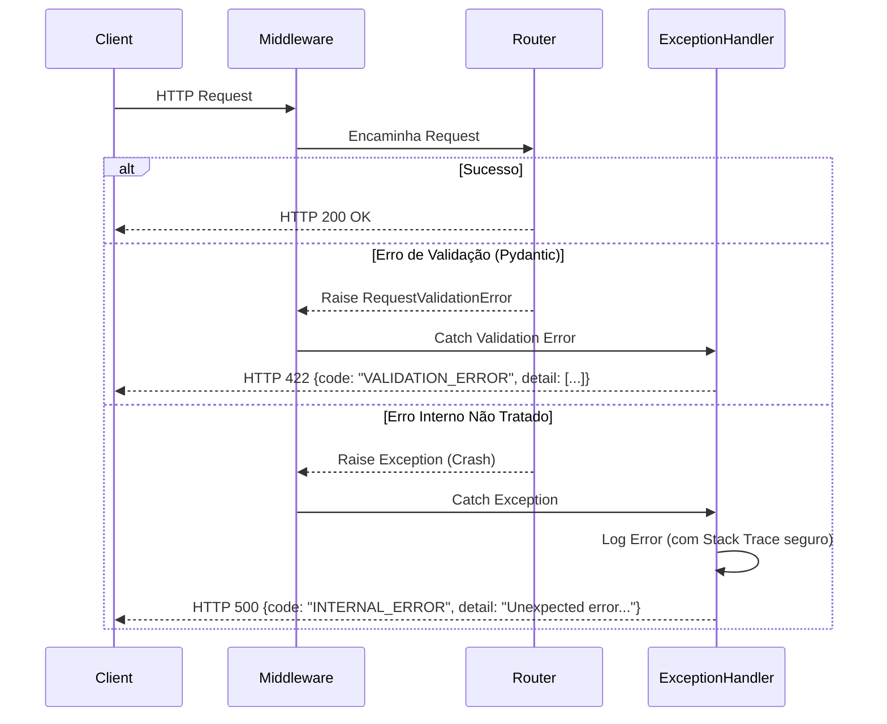
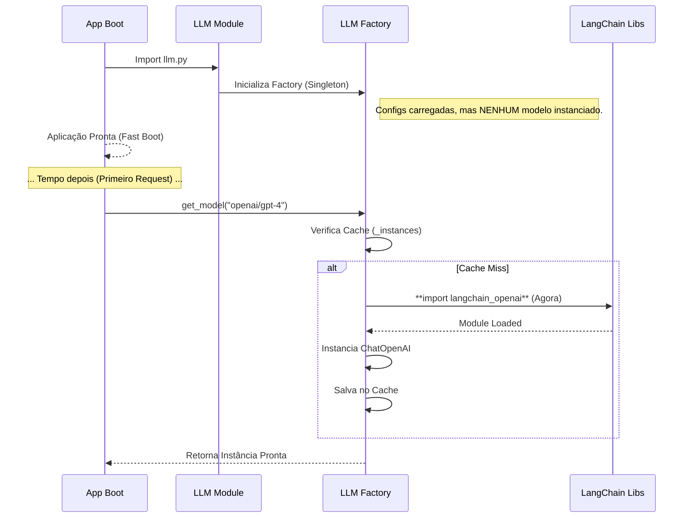

# Relatório de Execução: Fase 2 - Robustez e Observabilidade

**Data:** 04/02/2026
**Responsável:** Trae AI Assistant

Este relatório documenta as alterações realizadas durante a Fase 2 do plano de ação, focada em segurança, observabilidade e performance de inicialização.

---

## 1. Padronização de Logging e Redação de PII

### Observação
- **Local:** `src/core/utils/logging.py`
- **Problema:** O sistema de logs, embora estruturado, não possuía um mecanismo automático para ocultar dados sensíveis (PII). Logs brutos poderiam inadvertidamente expor e-mails, CPFs e números de telefone.
- **Risco:** **Alto**. Violação de conformidade com regulamentações de privacidade (LGPD/GDPR) e risco de vazamento de dados em logs armazenados ou transmitidos para ferramentas de observabilidade.
- **Solução:** Implementação de um processador customizado `PIIMaskingProcessor` integrado ao pipeline do `structlog`. Este processador utiliza expressões regulares (Regex) para interceptar e substituir padrões de dados sensíveis por placeholders (ex: `[EMAIL_REDACTED]`) antes que o log seja renderizado.

### Diagrama de Componentes (Pipeline de Log)

---

## 2. Tratamento Global de Erros

### Observação
- **Local:** `src/core/api/exception_handlers.py` (Novo), `src/main.py`
- **Problema:** A aplicação carecia de uma estratégia centralizada para tratamento de exceções não capturadas. Isso poderia resultar em *stack traces* sendo enviados diretamente ao cliente em caso de erros 500, ou respostas de erro inconsistentes.
- **Risco:** **Médio/Alto**. *Information Disclosure* (exposição de detalhes internos da infraestrutura) e degradação da experiência do desenvolvedor/cliente (DX) devido a mensagens de erro não padronizadas.
- **Solução:**
    1.  Criação do módulo `src/core/api/exception_handlers.py`.
    2.  Implementação de handlers para `StarletteHTTPException`, `RequestValidationError` e `Exception` (genérico).
    3.  Registro dos handlers no `FastAPI` app em `src/main.py`.
    4.  Padronização da resposta de erro: `{"code": "ERROR_CODE", "detail": "Human readable message"}`.

### Diagrama de Sequência (Fluxo de Erro)

---

## 3. Lazy Loading de Infraestrutura de IA

### Observação
- **Local:** `src/modules/ai/infrastructure/llm.py`
- **Problema:** O módulo de IA realizava importações globais de bibliotecas pesadas (`langchain_openai`, `langchain_google_genai`, etc.) e instanciava configurações no momento do carregamento do módulo.
- **Risco:** **Médio**. Aumento do tempo de inicialização da aplicação (*cold start*), desperdício de memória e fragilidade em ambientes onde nem todas as bibliotecas ou variáveis de ambiente de todos os provedores estão configuradas.
- **Solução:** Refatoração da classe `LLMFactory` para adotar o padrão **Lazy Loading**.
    - As importações dos pacotes `langchain_*` foram movidas para dentro do método `_create_instance`.
    - A verificação de variáveis de ambiente e a instanciação das classes ocorrem apenas na primeira chamada a `get_model` para um provedor específico.

### Diagrama de Sequência (Inicialização Sob Demanda)

---

## Resumo das Alterações

| Componente | Alteração | Impacto | Status |
| :--- | :--- | :--- | :--- |
| **Logging** | Adicionado `PIIMaskingProcessor` | Proteção automática de dados sensíveis nos logs. | ✅ Concluído |
| **API** | Adicionado `setup_exception_handlers` | Respostas de erro seguras e padronizadas. | ✅ Concluído |
| **AI Core** | Refatorado imports para Local/Lazy | Redução do tempo de boot e desacoplamento de dependências. | ✅ Concluído |
