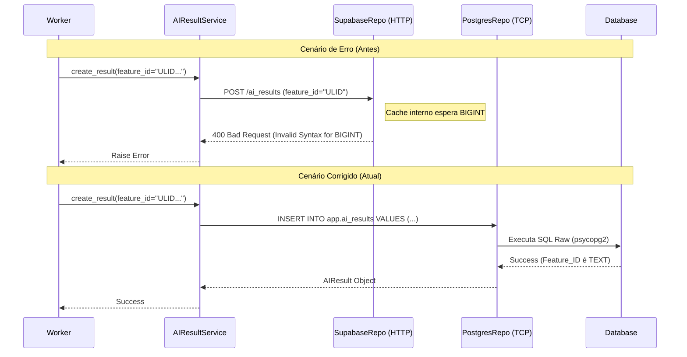
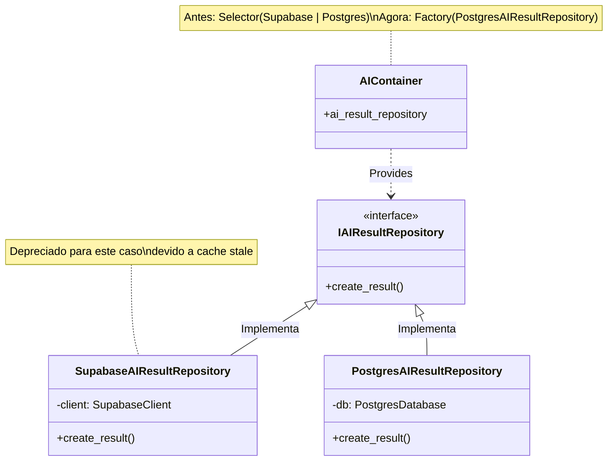
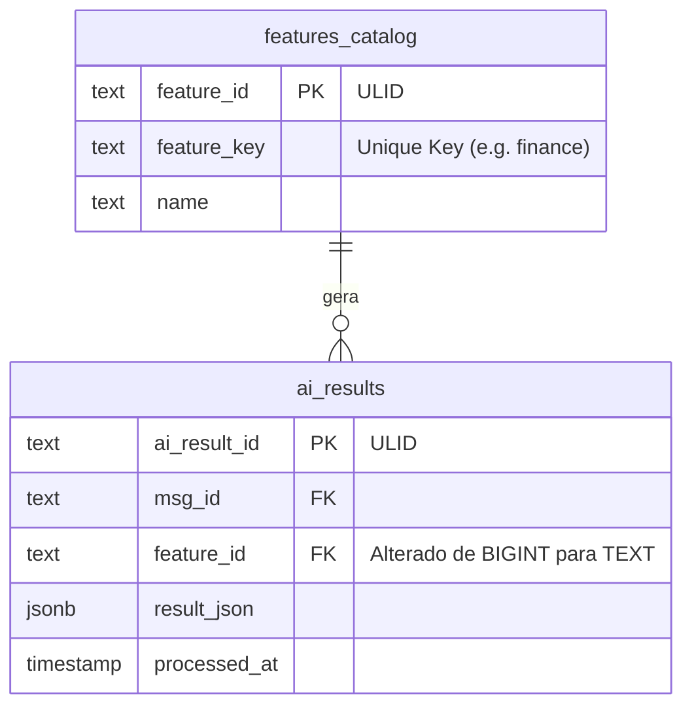

# Relatório de Correção: Persistência de Resultados de IA (AI Results)

**Data:** 06/02/2026 01:45  
**Atividade:** Correção de Erros de Schema e Cache na Persistência de `ai_results`

## 1. Resumo Executivo

O sistema de processamento de mensagens via IA estava falhando ao tentar persistir os logs de execução (`ai_results`). A falha impedia que a auditoria e o histórico de ações dos agentes fossem salvos, gerando exceções no worker e potencialmente impactando a experiência do usuário devido a retries desnecessários ou falhas silenciosas.

A causa raiz envolveu uma combinação de:
1.  Divergência de tipos no banco de dados (`BIGINT` vs `TEXT/ULID`).
2.  Ausência de dados essenciais (Features) para chaves estrangeiras.
3.  Inconsistência persistente no cache da API PostgREST (Supabase) mesmo após correções de banco.

## 2. Detalhes da Ocorrência

### Local
- **Módulo:** `src/modules/ai/ai_result`
- **Infraestrutura:** Database (Postgres), Camada de Repositório (Supabase/PostgREST vs Direct Postgres).

### Problema
Ocorreram três erros sequenciais durante a tentativa de correção:

1.  **Erro de Constraint (Null Value):**
    *   Log: `null value in column "feature_id" of relation "ai_results"`
    *   Causa: A lógica de fallback tentava usar a feature `finance`, mas ela não existia na tabela `features_catalog`, resultando em `None`.

2.  **Erro de Tipo (Invalid Syntax):**
    *   Log: `invalid input syntax for type bigint: "KP639..."`
    *   Causa: A coluna `feature_id` na tabela `ai_results` antiga era `BIGINT`. A aplicação passou a enviar ULIDs (`TEXT`).

3.  **Erro de Cache (Stale Schema):**
    *   Mesmo após alterar a coluna para `TEXT` no banco, a API do Supabase (PostgREST) continuava rejeitando ULIDs, esperando `BIGINT`. Comandos de reload de schema (`NOTIFY pgrst, 'reload'`) falharam devido a restrições de pooling de conexão.

### Risco
- **Alto:** Perda completa de rastreabilidade das ações da IA.
- **Médio:** Instabilidade no processamento de webhooks devido a exceções não tratadas na camada de persistência.

## 3. Solução Implementada

### Ações Corretivas

1.  **Seed de Dados Críticos:**
    *   Criação do script `seed_features_catalog.py` para garantir que as features base (`finance`, `relationships`, `identity`) existam com IDs válidos.

2.  **Migração de Banco de Dados:**
    *   Recriação da tabela `ai_results` (Migration `012`) com `feature_id` do tipo `TEXT` referenciando `features_catalog(feature_id)`.

3.  **Alteração Arquitetural (Bypass de Cache):**
    *   **Decisão:** Abandonar o uso do `SupabaseRepository` (via HTTP/PostgREST) para a tabela `ai_results` e forçar o uso do `PostgresRepository` (conexão direta via `psycopg2`).
    *   **Implementação:**
        *   Atualização do `PostgresRepository` para suportar schemas explícitos (`app.ai_results`).
        *   Reconfiguração do Container de Injeção de Dependência (`src/core/di/modules/ai.py`) para instanciar `PostgresAIResultRepository`.

## 4. Diagramas

### 4.1. Diagrama de Sequência: O Problema de Cache vs Solução Direta

### 4.2. Diagrama de Componentes: Mudança na Injeção de Dependência

### 4.3. Diagrama de Dados: Schema Atualizado

## 5. Conclusão

A correção foi validada através de scripts de teste (`verify_fix_ai_results.py`) que confirmaram a inserção bem-sucedida de registros com ULIDs na tabela `ai_results` utilizando a conexão direta. O sistema agora está resiliente a problemas de cache da API de dados para esta entidade crítica.
