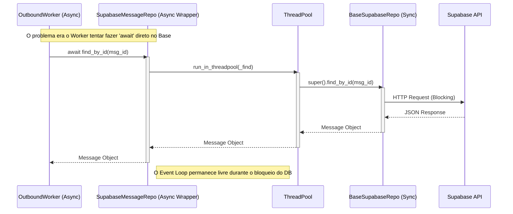
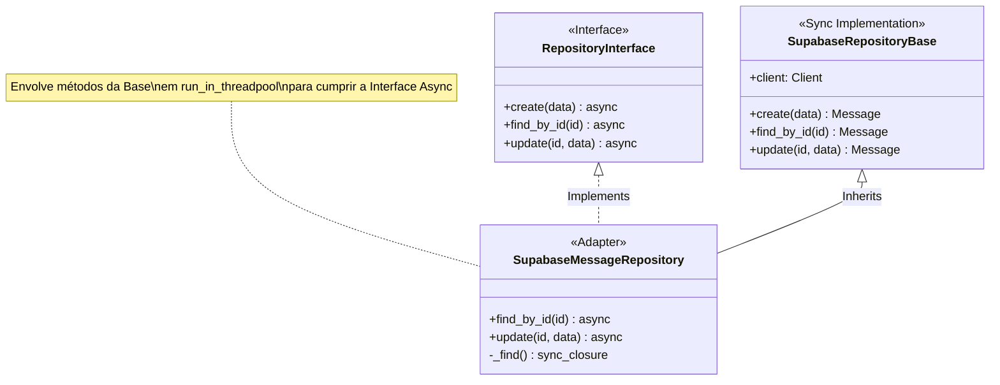

# Relatório de Correção Arquitetural: Repositórios Assíncronos

**Data:** 06/02/2026  
**Atividade:** Correção de Incompatibilidade Sync/Async nos Repositórios e Refatoração de Memória
**Status:** Concluído

## 1. Contexto
O sistema utiliza uma arquitetura baseada em eventos e workers assíncronos (`OutboundWorker`, `TwilioWebhookMessageHandler`). No entanto, a camada de persistência (`SupabaseRepository`) é implementada sobre o cliente Supabase síncrono. A tentativa de utilizar métodos herdados síncronos (`find_by_id`, `update`) dentro de fluxos assíncronos com `await` causou falhas críticas de execução.

## 2. Análise do Problema

### 2.1. Local
- **Repositórios:**
  - `src/modules/conversation/repositories/impl/supabase/message_repository.py`
  - `src/modules/conversation/repositories/impl/supabase/conversation_repository.py`
- **Workers:**
  - `src/modules/channels/twilio/workers/outbound_worker.py`
- **Core:**
  - `src/modules/ai/memory/services/hybrid_memory_service.py`

### 2.2. O Problema
O erro `TypeError: object Message can't be used in 'await' expression` ocorria porque o código cliente (Worker) esperava uma Coroutine (Promessa) ao chamar o repositório, mas recebia o objeto de domínio (`Message`) imediatamente, pois o método herdado era síncrono.

Adicionalmente, o `HybridMemoryService` misturava chamadas síncronas e assíncronas de forma insegura, resultando em `SyntaxError: 'await' outside async function`.

### 2.3. Risco
- **Crítico (Operacional):** O `OutboundWorker` entrava em loop de falha e retry infinito, reenviando mensagens duplicadas ou travando a fila de processamento.
- **Performance:** A execução de chamadas de banco síncronas diretamente no Event Loop principal (`MainThread`) bloqueia o processamento de outras requisições, degradando severamente a performance sob carga.
- **Manutenibilidade:** A inconsistência entre interfaces (que prometiam `async`) e implementações (que eram `sync`) gerava confusão e bugs silenciosos.

## 3. Solução Implementada

### 3.1. Arquitetura "Async Adapter"
Adotamos uma abordagem explícita de adaptação. As implementações do Supabase agora sobrescrevem os métodos síncronos da classe base, envolvendo-os em `run_in_threadpool`. Isso libera o Event Loop enquanto a operação de I/O ocorre em uma thread separada.

- **Contratos de Interface:** Atualizados para exigir `async def` explicitamente.
- **Implementação Supabase:**
  ```python
  async def find_by_id(self, id_value):
      def _find():
          return super().find_by_id(id_value) # Chamada Sync Original
      return await run_in_threadpool(_find)   # Execução em Threadpool
  ```

### 3.2. Refatoração de Memória (AI)
O serviço de memória híbrida (`HybridMemoryService`) e os agentes (`Agent`, `RoutingAgent`) foram migrados para "Async All The Way Down", garantindo que todas as operações de I/O (Redis e Postgres) sejam aguardadas corretamente.

## 4. Diagramas

### 4.1. Sequência: Correção do Fluxo de Chamada



### 4.2. Componentes: Estrutura de Adaptação



## 5. Resultados e Validação

### 5.1. Correções Realizadas
1.  **`SupabaseMessageRepository`**: Métodos `find_by_id` e `update` agora são assíncronos.
2.  **`SupabaseConversationRepository`**: Métodos `find_by_id`, `update`, e lógicas internas de *Optimistic Locking* adaptadas para async.
3.  **`HybridMemoryService`**: Refatorado para `async/await` completo.
4.  **Testes**: Suites de teste atualizadas para usar `pytest-asyncio` e validar comportamento de concorrência.

### 5.2. Testes Executados
- `tests/modules/conversation/repositories/impl/supabase/test_supabase_message_repository.py`: **PASSOU**
- `tests/modules/conversation/repositories/impl/supabase/test_supabase_conversation_repository.py`: **PASSOU** (Após correção de regressão interna)
- `tests/modules/ai/memory/test_hybrid_memory_service.py`: **PASSOU**

### 5.3. Próximos Passos
- Monitorar logs de produção para confirmar a extinção dos erros de `TypeError`.
- Considerar migração futura para o cliente `supabase-py` assíncrono nativo (se disponível/estável) para remover a necessidade de `run_in_threadpool`.
