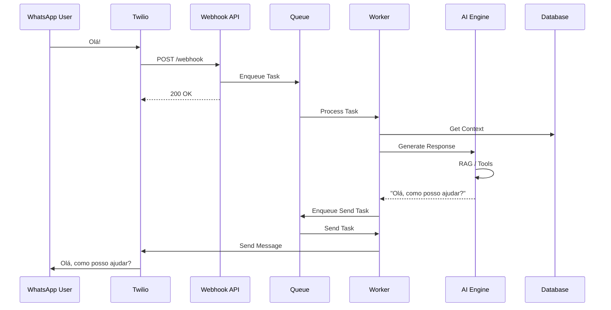

# Arquitetura do Sistema (v4)

**Data:** 30/01/2026  
**Status:** Documentação consolidada baseada na análise de conformidade dos módulos.

## 1. Visão Geral da Arquitetura

O sistema adota uma **Arquitetura Modular Monolítica** com forte desacoplamento via **Processamento Assíncrono**. O núcleo da arquitetura é a separação entre a ingestão de eventos (Webhooks síncronos) e o processamento de regras de negócio/IA (Workers assíncronos), mediados por uma fila de mensagens.

### Diagrama de Alto Nível

```mermaid
graph TD
    subgraph "External Providers"
        Twilio[Twilio / WhatsApp]
        OpenAI[OpenAI / LLMs]
        Supabase[Supabase (PostgreSQL + Vector)]
    end

    subgraph "Entry Points"
        API[FastAPI Gateway]
        Webhook[Webhook Handler]
    end

    subgraph "Core Infrastructure"
        DI[Dependency Injection Container]
        Queue[Queue Service (Redis/SQS)]
        Config[Settings & Env]
    end

    subgraph "Modules (Business Logic)"
        Identity[Identity Module]
        Conv[Conversation Module]
        AI[AI Engine Module]
        Channel[Twilio Channel Module]
    end

    subgraph "Workers"
        Worker[Background Worker]
        Scheduler[Task Scheduler]
    end

    Twilio -->|POST /webhook| Webhook
    Webhook -->|Enqueue Task| Queue
    Queue -->|Consume Task| Worker
    
    Worker -->|Invoke| Channel
    Worker -->|Invoke| AI
    
    AI -->|Context| Conv
    AI -->|Auth/Plan| Identity
    AI -->|Inference| OpenAI
    
    API -->|Manage| Identity
    API -->|Manage| Conv
    
    Channel -->|Persist| Supabase
    Conv -->|Persist| Supabase
    Identity -->|Persist| Supabase
```

## 2. Componentes Principais

### 2.1. Core (`src/core`)
A fundação do sistema. Não contém regras de negócio, apenas infraestrutura.
*   **Dependency Injection**: Gerencia o ciclo de vida dos serviços (`dependency-injector`).
*   **Database**: Abstração sobre o Supabase/PostgREST.
*   **Queue System**: Abstração de produtores/consumidores suportando múltiplos backends (Redis, Memory, SQS).
*   **Observabilidade**: Logging estruturado (`structlog`) com renderização adaptativa (JSON em prod, Colorido em dev).

### 2.2. Canais e Ingestão (`src/modules/channels/twilio`)
Responsável pela comunicação com o mundo externo (WhatsApp).
*   **Padrão "Ack-Fast"**: O webhook apenas valida a requisição, salva um placeholder e enfileira o processamento, retornando `200 OK` em milissegundos.
*   **Processamento de Mídia**: Transcrição de áudio é feita de forma assíncrona (download -> transcrição -> injeção no fluxo de texto).
*   **Outbound Async**: O envio de respostas também é enfileirado, garantindo que a IA não bloqueie o envio e permitindo retries.

### 2.3. Motor de IA (`src/modules/ai`)
O cérebro do sistema, baseado em Agentes e Tools.
*   **Arquitetura de Agentes**: Usa LangChain para orquestrar o pensamento (`ReAct` ou similar).
*   **Roteamento**: Um `RoutingAgent` decide qual especialidade (Feature) deve tratar a mensagem (ex: Financeiro, Relacionamento).
*   **Memória Híbrida**:
    *   **L1 (Curto Prazo)**: Redis (rápido, contexto da sessão atual).
    *   **L2 (Médio Prazo)**: Banco Relacional (histórico da conversa).
    *   **L3 (Longo Prazo/Semântica)**: Busca Vetorial (pgvector) para recuperar informações relevantes de conversas passadas.

### 2.4. Conversação e Estado (`src/modules/conversation`)
Mantém a coerência do diálogo.
*   **Máquina de Estados**: Controla o fluxo (ex: `ACTIVE`, `WAITING_USER`, `HANDOFF`).
*   **Human Handoff**: Permite transferir a conversa da IA para um humano, pausando a automação.
*   **Persistência**: Garante que todas as mensagens (inbound/outbound) sejam auditáveis.

### 2.5. Identidade e Multi-tenancy (`src/modules/identity`)
Gerencia quem é quem.
*   **Modelo de Domínio**: `Owner` (Tenant) -> `User` (End-user) -> `Subscription` (Plano).
*   **Feature Flags**: Permite ativar/desativar capacidades da IA por plano ou por tenant.

## 3. Fluxos de Dados Críticos

### 3.1. Fluxo de Mensagem (Inbound -> Resposta)

1.  **Ingestão**: Twilio envia POST para `/webhooks/inbound`.
2.  **Validação**: API valida assinatura (`X-Twilio-Signature`).
3.  **Enfileiramento**: Payload é normalizado e enviado para fila `process_ai_response`.
4.  **Consumo**: Worker retira a mensagem da fila.
5.  **Contexto**: Worker carrega perfil do usuário (`Identity`) e histórico (`Conversation`).
6.  **Inteligência**:
    *   `RoutingAgent` analisa a intenção.
    *   Agente especialista executa Tools (ex: consultar saldo, salvar memória).
    *   LLM gera a resposta final.
7.  **Resposta**: Resposta gerada é enfileirada na fila `send_whatsapp_message`.
8.  **Envio**: Worker de saída envia para API do Twilio.

### 3.2. Fluxo de Áudio

1.  **Webhook**: Recebe URL da mídia.
2.  **Enfileiramento**: Tarefa `transcribe_audio` é criada.
3.  **Processamento**:
    *   Worker baixa o arquivo temporariamente.
    *   Serviço de Transcrição (Whisper/API) converte para texto.
    *   Texto é injetado como se fosse uma mensagem de texto do usuário.
4.  **Continuidade**: Dispara o fluxo normal de mensagem (passo 3.1 item 3 em diante).

## 4. Considerações Transversais

### Segurança
*   **Atual**: Autenticação de Webhook (Signature) e Segredos em `.env`.
*   **Gaps Identificados**: Necessidade de autenticação JWT para API de gestão e *enforcement* rigoroso de isolamento de dados (RLS) para evitar vazamento entre tenants.

### Escalabilidade
*   **Stateless API**: A camada de API pode escalar horizontalmente.
*   **Workers**: O número de workers pode ser aumentado conforme a profundidade da fila.
*   **Gargalos Potenciais**: Banco de dados (conexões) e Limites de Rate Limit das APIs de IA/Twilio.

### Observabilidade
*   **Logs**: JSON estruturado com `correlation_id` (parcialmente implementado) para rastrear requisições através dos serviços.
*   **Auditoria**: Tabela `ai_results` armazena o "pensamento" da IA para análise posterior.

## 5. Diagrama de Sequência (Simplificado)


