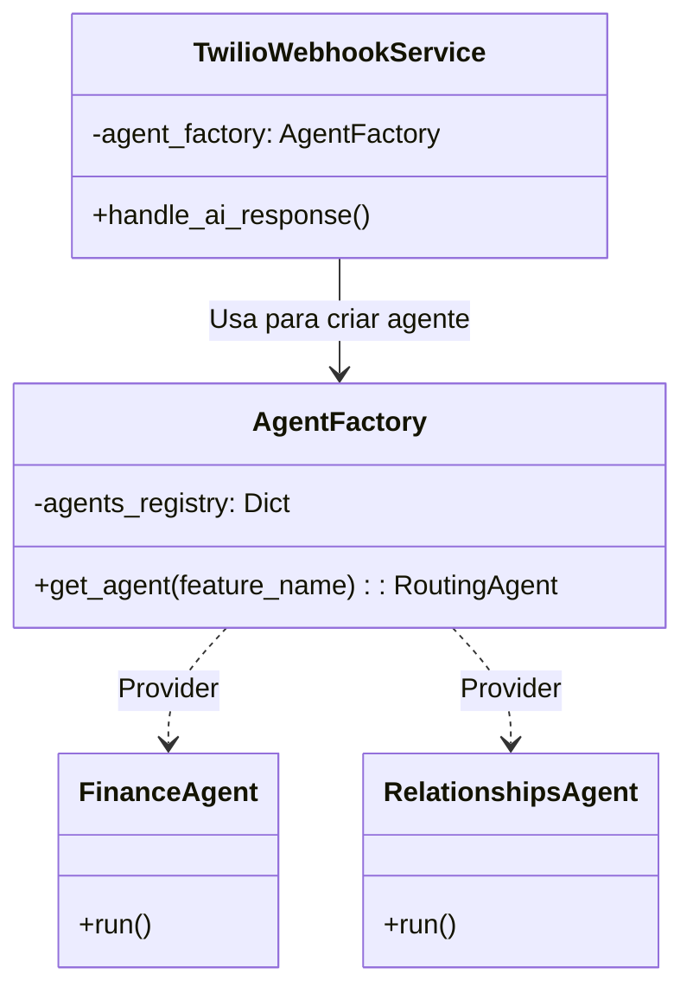
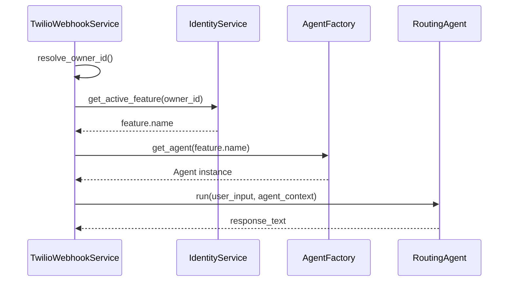

# ADR 009: Abstract Factory de Agentes e Chaveamento Dinâmico no Webhook

**Status:** Aceito  
**Data:** 2026-01-27  
**Autor:** Assistant (via Trae IDE)  
**Contexto:** Arquitetura de IA Multi-Feature e Injeção de Dependência

## 1. Contexto e Problema
- O sistema passou a suportar múltiplos módulos de IA (`finance` e `relationships`) e precisava alternar dinamicamente qual agente seria executado durante o processamento do webhook.
- O fluxo anterior injetava um único agente estático (Finance) diretamente no `TwilioWebhookService`, gerando acoplamento e inviabilizando a expansão para novos agentes.
- Durante a migração, foram observados problemas adicionais:
  - Importação circular no módulo de `relationships` (prompts).
  - Descompasso de DI entre o que o Container injeta e o que o serviço consome.

## 2. Decisão
- Adotar o padrão **Abstract Factory** para criação de agentes em tempo de execução, com um `AgentFactory` central que seleciona o agente de acordo com a feature ativa do usuário/owner.
- Alterar o `TwilioWebhookService` para depender de `AgentFactory` ao invés de um `RoutingAgent` fixo.
- Corrigir o namespace de prompts do módulo `relationships` para eliminar dependências circulares.

## 3. Solução
### 3.1. AgentFactory
- Implementado `AgentFactory` em [agent_factory.py](file:///Users/lennon/projects/ai_engineering/whatsapp_twilio_ai/src/modules/ai/engines/lchain/core/agents/agent_factory.py), mantendo um `agents_registry`:
  - `finance` → [finance_agent.py](file:///Users/lennon/projects/ai_engineering/whatsapp_twilio_ai/src/modules/ai/engines/lchain/feature/finance/finance_agent.py)
  - `relationships` → [relationships_agent.py](file:///Users/lennon/projects/ai_engineering/whatsapp_twilio_ai/src/modules/ai/engines/lchain/feature/relationships/relationships_agent.py)
- Fallback para `finance` quando a feature não estiver mapeada.

### 3.2. Container de DI
- Registro dos providers dos agentes e injeção de `AgentFactory` com `providers.Dict` em [container.py](file:///Users/lennon/projects/ai_engineering/whatsapp_twilio_ai/src/core/di/container.py#L159-L179).

### 3.3. Webhook
- `TwilioWebhookService` agora consulta a feature ativa e solicita o agente à factory antes de executar `run()`. Fonte: [twilio_webhook_service.py](file:///Users/lennon/projects/ai_engineering/whatsapp_twilio_ai/src/modules/channels/twilio/services/twilio_webhook_service.py#L419-L447).

### 3.4. Correções de Import/DI
- `prompts/__init__.py` do módulo `relationships` ajustado para remover importações que geravam ciclo. Fonte: [__init__.py](file:///Users/lennon/projects/ai_engineering/whatsapp_twilio_ai/src/modules/ai/engines/lchain/feature/relationships/prompts/__init__.py).
- Construtor do `TwilioWebhookService` atualizado para aceitar `AgentFactory`.

## 4. Diagramas
### 4.1. Componentes

### 4.2. Sequência

## 5. Consequências
- **Positivas:**
  - Flexibilidade para adicionar novos módulos de IA sem tocar no webhook.
  - Escopo de instância por requisição evita vazamento de memória de conversas.
  - Remoção de acoplamento e alinhamento com arquitetura multi-tenant.
- **Negativas:**
  - Pequeno overhead de criação de instância por requisição.
  - Necessidade de manter o `agents_registry` sincronizado com features ativas.
- **Mitigações:**
  - Uso de `providers.Factory` garante escopo de instância adequado.
  - Fallback para `finance` e logs de chave não mapeada.

## 6. Referências
- Pesquisa: [research_agent_factory_02.md](file:///Users/lennon/projects/ai_engineering/whatsapp_twilio_ai/plan/v4/research/research_agent_factory_02.md)
- Relatório de Implementação: [report_agent_factory_02.md](file:///Users/lennon/projects/ai_engineering/whatsapp_twilio_ai/plan/v4/report/report_agent_factory_02.md)
- Correções: 
  - [correction_circular_import_di_fix_06.md](file:///Users/lennon/projects/ai_engineering/whatsapp_twilio_ai/plan/v4/corrections/correction_circular_import_di_fix_06.md)
  - [report_circular_import_di_fix_06.md](file:///Users/lennon/projects/ai_engineering/whatsapp_twilio_ai/plan/v4/report/report_circular_import_di_fix_06.md)

