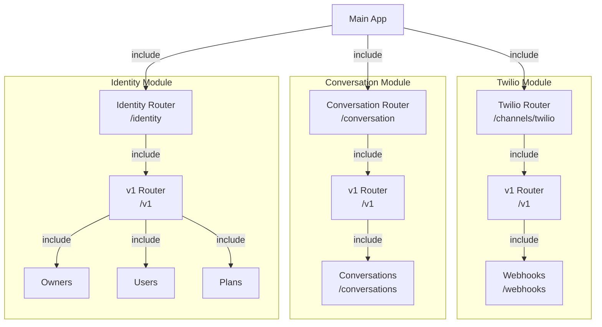

# ADR: Padronização da Estrutura de Módulos da API (v5)

## Status
Aceito e Implementado

## Contexto
O projeto apresentava inconsistência na estrutura dos módulos de API. O módulo `identity` seguia uma arquitetura limpa com versionamento explícito (`api/v1/`), enquanto os módulos `channels/twilio` e `conversation` expunham seus endpoints diretamente em arquivos únicos ou planos (`api/webhooks.py`, `api/conversations.py`), sem hierarquia clara de rotas ou versionamento.

Essa disparidade dificultava:
1.  **Escalabilidade**: Adicionar novas versões da API (v2) seria confuso nos módulos antigos.
2.  **Navegação**: Desenvolvedores precisavam entender padrões diferentes para cada módulo.
3.  **Manutenção**: O arquivo `conversations.py` estava crescendo sem uma estrutura que encorajasse a separação por sub-recursos no futuro.

## Decisão
Padronizar todos os módulos de API (`conversation` e `channels/twilio`) para seguir rigorosamente o padrão estabelecido no módulo `identity`.

O padrão adotado é:
1.  **Main Router (`api/router.py`)**: Define o prefixo do módulo (ex: `/channels/twilio`) e inclui os routers de versão.
2.  **Version Router (`api/v1/router.py`)**: Agrega todos os recursos daquela versão.
3.  **Resource Endpoints (`api/v1/{resource}.py`)**: Contém a implementação dos endpoints FastAPI.

## Alterações Realizadas

### 1. Módulo Twilio (`src/modules/channels/twilio`)
- **Antes**:
  - `api/webhooks.py` (rota `/webhooks/twilio`)
- **Depois**:
  - `api/router.py` (prefixo `/channels/twilio`)
  - `api/v1/router.py` (prefixo `/v1`)
  - `api/v1/webhooks.py` (prefixo `/webhooks`)
  - **Nova Rota Final**: `/channels/twilio/v1/webhooks/inbound`

### 2. Módulo Conversation (`src/modules/conversation`)
- **Antes**:
  - `api/conversations.py` (rota `/conversations`)
- **Depois**:
  - `api/router.py` (prefixo `/conversation`)
  - `api/v1/router.py` (prefixo `/v1`)
  - `api/v1/conversations.py` (prefixo `/conversations`)
  - **Nova Rota Final**: `/conversation/v1/conversations/...`

### 3. Application Wiring (`src/main.py` & `src/core/di/container.py`)
- Atualizado `main.py` para incluir apenas os **Main Routers** de cada módulo.
- Atualizado `container.py` para refletir os novos caminhos dos arquivos Python para injeção de dependência.

## Diagrama da Nova Estrutura de Rotas

## Consequências

### Positivas
- **Consistência**: Todos os módulos agora "falam a mesma língua" estrutural.
- **Versionamento**: Caminho pavimentado para introduzir `v2` sem quebrar clientes existentes (apenas criando pastas `v2`).
- **Clareza**: URLs da API agora são mais descritivas e hierárquicas (`/domain/version/resource`).

### Negativas / Riscos Mitigados
- **Quebra de Compatibilidade (Breaking Change)**: As URLs mudaram.
  - *Mitigação*: Atualizamos todos os workers internos (`sender.py`) e testes automatizados para usar as novas URLs. Clientes externos (Webhooks do Twilio) precisarão ter suas URLs de callback atualizadas no console do Twilio.

## Próximos Passos
1. Atualizar a configuração de Webhook no Console do Twilio (Ambiente de Staging/Prod) para apontar para a nova URL: `.../channels/twilio/v1/webhooks/inbound`.
2. Verificar se há outros consumidores externos dessas APIs que precisam de atualização.
