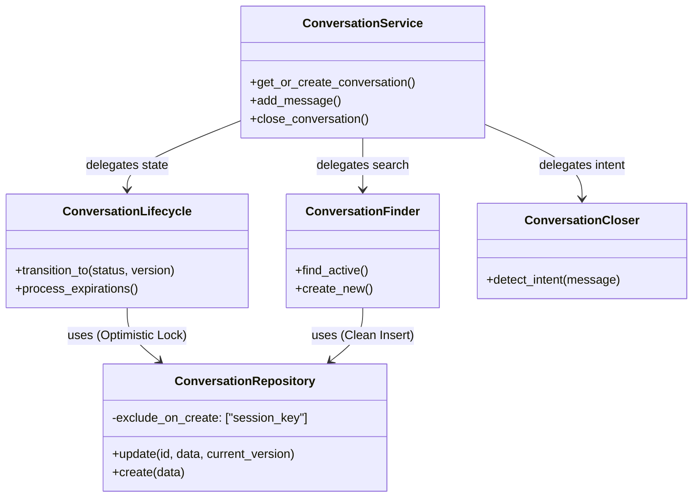
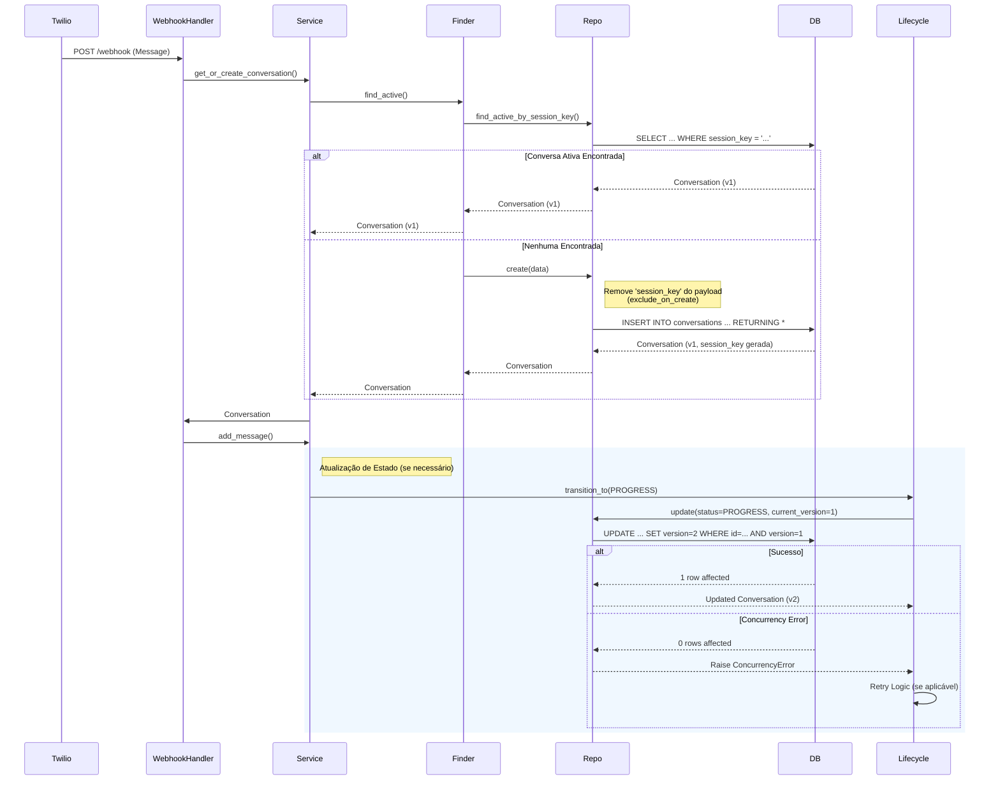

# ADR 001: Migração, Estabilização e Consolidação do Módulo de Conversação (V2)

**Data:** 29 de Janeiro de 2026
**Status:** ✅ Aceito e Implementado
**Responsável:** Lennon (AI Assistant)

## 1. Contexto

O módulo de conversação original (`ConversationService` V1) operava como um monolito, acumulando responsabilidades de gestão de ciclo de vida, busca de sessões, persistência e lógica de encerramento. Isso resultou em:

1.  **Dificuldade de Testes:** Testes unitários complexos e frágeis devido ao alto acoplamento.
2.  **Problemas de Concorrência:** Race conditions em atualizações de estado simultâneas (ex: webhook recebendo mensagem enquanto um job de expiração roda).
3.  **Falhas de Persistência:** Erros ao tentar inserir registros contendo colunas geradas automaticamente pelo banco de dados (ex: `session_key`), causando falhas 400/500 no webhook do Twilio.
4.  **Código Legado:** Coexistência confusa entre implementações V1 e V2 durante a fase de transição.

O objetivo era migrar para uma arquitetura robusta, modular, segura contra concorrência e, finalmente, consolidar essa nova arquitetura como o padrão do sistema.

## 2. Decisões Arquiteturais

### 2.1. Decomposição em Componentes (Single Responsibility Principle)

O `ConversationService` foi refatorado para atuar como um **Facade**, delegando a lógica de negócios para componentes especializados:

*   **`ConversationFinder`**: Responsável exclusivamente por estratégias de busca (`find_active`, `find_last`) e criação de novas conversas, encapsulando a lógica de cálculo de `session_key`.
*   **`ConversationLifecycle`**: Responsável pela máquina de estados, transições válidas e gestão de expiração/timeout.
*   **`ConversationCloser`**: Responsável pela detecção de intenção de encerramento baseada em análise de conteúdo de mensagens.

### 2.2. Controle de Concorrência (Optimistic Locking)

Para mitigar race conditions sem o custo de locks de banco de dados pessimistas, implementamos **Optimistic Locking** na camada de repositório.

*   **Implementação:** Adição de uma coluna `version` na tabela `conversations`.
*   **Mecanismo:** Toda operação de `update` deve fornecer a `current_version`. O repositório executa o update com a cláusula `WHERE conv_id = :id AND version = :current_version`. Se nenhuma linha for afetada, uma `ConcurrencyError` é lançada.
*   **Tratamento:** O `ConversationLifecycle` trata esses erros, permitindo retries automáticos ou falha rápida, dependendo da criticidade da operação.

### 2.3. Gestão de Colunas Geradas (`exclude_on_create`)

Para resolver os erros de inserção do webhook (ex: `cannot insert a non-DEFAULT value into column "session_key"`), alteramos a infraestrutura do `SupabaseRepository`.

*   **Decisão:** Introduzir o parâmetro `exclude_on_create` no construtor do repositório base.
*   **Aplicação:** O `ConversationRepository` configura `exclude_on_create=["session_key"]`. Isso instrui o repositório a remover o campo `session_key` do payload Pydantic antes de enviá-lo ao banco, permitindo que a *Generated Column* do Postgres funcione corretamente.

### 2.4. Consolidação e Limpeza (V2 ➡️ Main)

Após a validação da V2, decidimos não manter o sufixo "V2" indefinidamente.

*   **Ação:** O código V2 foi promovido para os diretórios principais (`src/modules/conversation/`), substituindo a V1.
*   **Renomeação:** Classes como `ConversationServiceV2` voltaram a se chamar `ConversationService`, simplificando a DX (Developer Experience) e removendo débito técnico cognitivo.

## 3. Diagramas da Solução

### 3.1. Diagrama de Componentes e Dados

### 3.2. Fluxo de Webhook com Correções (Sequência)

Este diagrama ilustra como o fluxo do Webhook Twilio foi corrigido para lidar com a geração de chaves e concorrência.

## 4. Consequências e Resultados

### Positivas
1.  **Estabilidade do Webhook:** A eliminação do erro de `session_key` restaurou o funcionamento correto da integração com Twilio (HTTP 200/201).
2.  **Integridade de Dados:** O Optimistic Locking impede que estados inconsistentes sejam persistidos em cenários de alta carga.
3.  **Manutenibilidade:** A estrutura de diretórios está limpa (`src/modules/conversation/components`), sem sufixos de versão ou arquivos mortos.
4.  **Confiabilidade de Testes:** A suíte de testes foi corrigida e agora valida o comportamento real dos componentes, incluindo cenários de concorrência.

### Negativas / Trade-offs
1.  **Complexidade de Update:** Todo update agora exige o envio da `current_version`, o que aumenta a complexidade da chamada do método `update` no repositório.
2.  **Refatoração de Testes:** A mudança exigiu uma reescrita massiva dos testes antigos que mockavam comportamentos que não existem mais.

## 5. Referências

*   [Correction: Conversation V2 Migration](file:///Users/lennon/projects/ai_engineering/whatsapp_twilio_ai/plan/v4/corrections/correction_conversation_v2_migration_01.md)
*   [Correction: Twilio Webhook & Update](file:///Users/lennon/projects/ai_engineering/whatsapp_twilio_ai/plan/v4/corrections/correction_twilio_webhook_conversation_update_16.md)
*   [Report: Consolidação Final](file:///Users/lennon/projects/ai_engineering/whatsapp_twilio_ai/plan/v4/report/report_phase6_consolidation_01.md)
