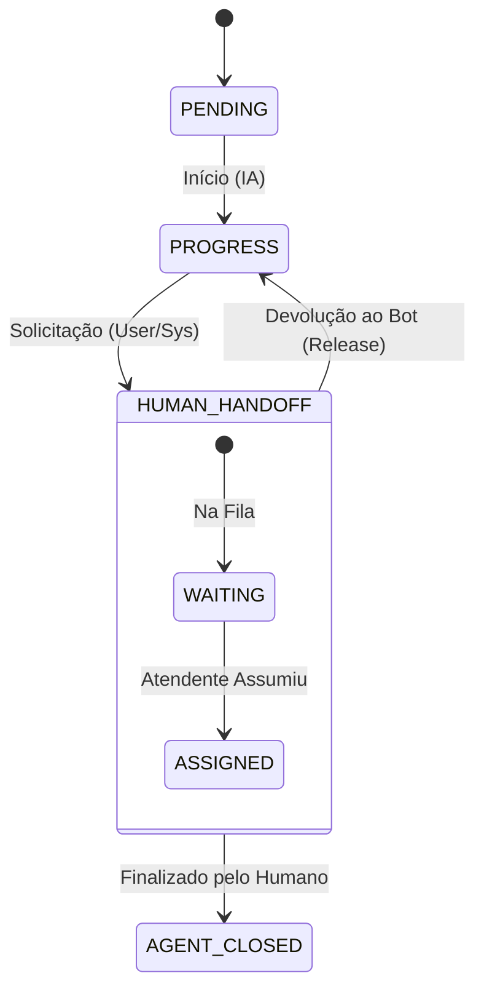
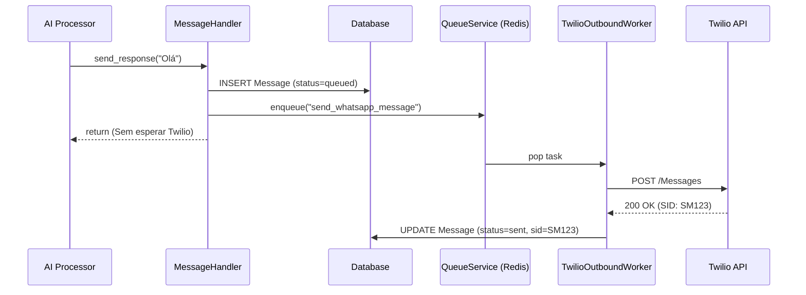

# ADR 022: Implementação de Human Handoff e Twilio Outbound Worker

**Status:** Aceito
**Data:** 2024-01-29
**Autor:** Equipe de Engenharia AI
**Contexto:** [Research Handoff Compliance 17](../research/research_compliance_handoff_17.md)

## 1. Contexto e Problema

O sistema precisava evoluir para suportar dois requisitos críticos que surgiram com o amadurecimento da plataforma:

1.  **Intervenção Humana (Handoff):** A necessidade de permitir que um atendente humano assuma uma conversa iniciada pelo Bot (IA) sem que ambos entrem em conflito (ex: respondendo simultaneamente).
2.  **Resiliência no Envio (Outbound):** O envio de mensagens para o WhatsApp (Twilio) era feito de forma síncrona dentro do processamento do Webhook ou da IA. Falhas na API do Twilio causavam perda de mensagens ou bloqueio de threads de processamento. Além disso, o diretório `src/modules/channels/twilio/workers/` estava sendo usado incorretamente para scripts de teste.

## 2. Decisões Arquiteturais

### 2.1. Human Handoff (Transferência para Humano)

Decidimos implementar um modelo de **Máquina de Estados** explícita para a conversa, onde o controle é exclusivo (Bot OU Humano).

*   **Novo Estado:** Adicionado `HUMAN_HANDOFF` ao enum `ConversationStatus`.
*   **Bypass de IA:** O `TwilioWebhookService` foi alterado para verificar o estado da conversa antes de acionar a IA. Se estiver em `HUMAN_HANDOFF`, a mensagem do usuário é salva (persistência), mas o pipeline de IA é curto-circuitado (não gera resposta).
*   **API de Controle:** Criados endpoints REST (`/conversations/{id}/handoff/*`) para que o frontend do atendente possa:
    *   Listar fila de espera (`GET /queue`).
    *   Assumir conversa (`POST /assign`).
    *   Devolver para o bot (`POST /release`).
*   **Realtime:** Optamos por **Polling** (Frontend consulta API) nesta fase MVP, descartando a complexidade de WebSockets no backend Python (Decisão baseada em KISS/YAGNI).

#### Diagrama de Estados

### 2.2. Twilio Outbound Worker (Envio Assíncrono)

Decidimos desacoplar o envio de mensagens da lógica de negócios usando o padrão **Persist-then-Enqueue**.

*   **Persistência Primeiro:** Ao gerar uma resposta (seja da IA ou do Agente), a mensagem é salva no banco imediatamente com status `queued` ou `pending`.
*   **Fila de Envio:** Em vez de chamar `twilio.messages.create` diretamente, o sistema enfileira uma tarefa `send_whatsapp_message`.
*   **Worker Dedicado:** Criado o `TwilioOutboundWorker` (agora ocupando corretamente o diretório `workers/`) que consome essa fila e executa o envio real com retries.

#### Diagrama de Sequência: Envio Assíncrono

## 3. Implementação Técnica

### 3.1. Mudanças no Banco de Dados
*   Tabela `conversations`: Adicionados campos `agent_id` (quem está atendendo) e `handoff_at` (quando começou).
*   Migration: `009_add_handoff_fields.sql`.

### 3.2. Estrutura de Código
*   **Limpeza:** Scripts de teste (`sender.py`) movidos de `src/modules/channels/twilio/workers/` para `scripts/twilio/`.
*   **Novo Worker:** `src/modules/channels/twilio/workers/outbound_worker.py`.
*   **Service Layer:** Refatoração de `ConversationService` e `TwilioWebhookService` para suportar as novas regras de negócio.

## 4. Consequências

### Positivas
*   **Isolamento:** O Bot nunca interrompe um atendimento humano.
*   **Performance:** Webhooks respondem mais rápido (200 OK) pois não esperam I/O externo de envio.
*   **Robustez:** Mensagens não são perdidas se o Twilio oscilar; elas ficam salvas e podem ser reprocessadas.
*   **Organização:** O projeto segue uma estrutura de diretórios mais semântica e limpa.

### Negativas / Trade-offs
*   **Complexidade:** O fluxo de envio agora é assíncrono, o que dificulta o debug imediato (é preciso olhar logs do Worker).
*   **Latência de Realtime:** A decisão pelo Polling introduz um leve atraso (ex: 5s) para o atendente ver novas mensagens, em troca de simplicidade no backend.

## 5. Próximos Passos
*   Frontend: Integrar com a API de Handoff.
*   Monitoramento: Criar alertas para a fila `send_whatsapp_message` (DLQ).
*   Webhooks de Status: Implementar processamento de `delivered`/`read` do Twilio para atualizar o status da mensagem no banco.
