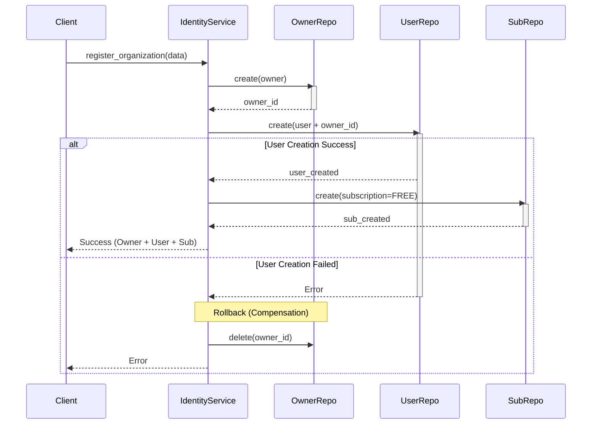
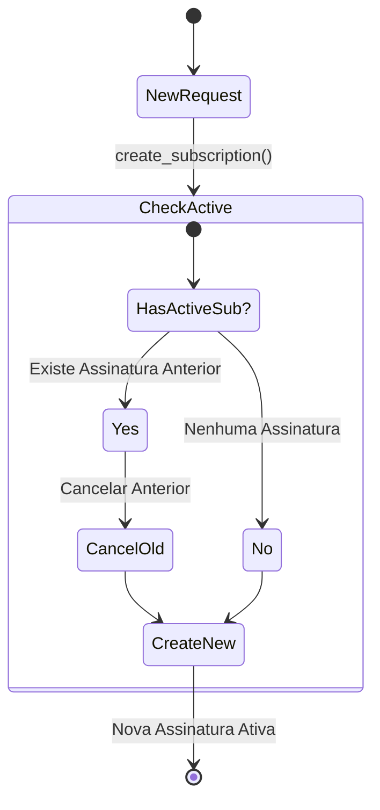

# ADR: Unificação do Onboarding e Modelo de Assinaturas

**Data:** 26/01/2026
**Status:** Aceito
**Relacionado a:** [Relatório de Implementação Identity](../report/result_identity_implementation_07.md)

## Contexto

O sistema de identidade (`IdentityModule`) foi inicialmente concebido com entidades separadas (`Owner`, `User`, `Plan`, `Subscription`) que eram criadas de forma independente. Isso gerou diversos problemas de consistência e experiência do usuário:

1.  **Onboarding Fragmentado**: Era possível criar uma Organização (`Owner`) sem um usuário administrador, ou um usuário sem vínculo claro com uma organização, resultando em "registros órfãos".
2.  **Múltiplas Assinaturas**: O sistema permitia tecnicamente que um mesmo Owner tivesse múltiplas assinaturas ativas simultaneamente, gerando conflitos de limites (quotas) e ambiguidade sobre qual plano estava vigente.
3.  **Estado Inicial Inconsistente**: Novos Owners não recebiam um plano padrão, exigindo uma etapa manual adicional de "assinar um plano" antes de poder usar o sistema.
4.  **Complexidade no Frontend**: A interface precisava orquestrar múltiplas chamadas de API (criar owner -> criar user -> assinar plano) sujeitas a falhas parciais.

## Decisão

Decidimos unificar o fluxo de entrada e impor regras estritas de assinatura na camada de serviço.

### 1. Onboarding Orquestrado e Atômico

O processo de registro (`IdentityService.register_organization`) foi reestruturado para ser uma operação atômica lógica (Orchestration Pattern). Embora o banco de dados (via API REST) não suporte transações distribuídas complexas nativamente, implementamos o padrão de **Compensação (Manual Rollback)**:

*   **Fluxo**:
    1.  Cria-se o **Owner**.
    2.  Tenta-se criar o **User Admin**. Se falhar, o Owner é deletado.
    3.  Tenta-se atribuir o **Plano Gratuito** (Subscription). Se falhar, loga-se o erro (não crítico, pois o usuário pode assinar depois), mas o acesso básico é garantido.
    
Isso garante que nunca teremos um Owner sem User, ou um User sem Owner no momento do cadastro.

### 2. Regra de Assinatura Única (Single Active Subscription)

Impusemos a regra de negócio de que **um Owner só pode ter uma única assinatura com status `active` ou `trial` por vez**.

*   **Implementação**: No `SubscriptionService.create_subscription`, antes de criar uma nova assinatura, o sistema verifica se já existe uma ativa.
*   **Ação Automática**: Se existir, a assinatura anterior é automaticamente cancelada (`canceled_at` preenchido, status alterado).
*   **Benefício**: Simplifica drasticamente a lógica de verificação de features e cobrança, pois basta buscar "a assinatura ativa".

### 3. Seeding de Planos Padrão

Para garantir que o fluxo de onboarding funcione em qualquer ambiente (Dev, Staging, Prod), definimos que os planos base ("Free" e "Pro") são infraestrutura essencial, não apenas dados.

*   Criado script `scripts/seed_plans.py` que deve ser executado no deploy.
*   Isso remove a dependência de inserção manual de dados para que o sistema funcione.

## Design Detalhado

### Fluxo de Onboarding

### Fluxo de Assinatura (Upgrade)

## Consequências

### Positivas
*   **Consistência de Dados**: Eliminação de registros "zumbis" (Owners sem users).
*   **UX Superior**: O usuário entra no sistema e já está "pronto para uso" no plano gratuito, sem telas de configuração bloqueantes.
*   **Simplicidade de Manutenção**: A lógica de "qual plano o usuário tem?" se torna uma query simples (`status=active`), sem necessidade de resolver conflitos de datas ou prioridades entre múltiplos planos.

### Negativas
*   **Acoplamento Temporal**: A criação do Owner e User depende da disponibilidade sequencial do banco. Uma falha de rede no meio do processo exige o rollback manual, que também pode falhar (embora raro), exigindo limpeza posterior.
*   **Rigidez**: A regra de "assinatura única" impede cenários complexos de "Add-ons" como assinaturas separadas (ex: comprar apenas pacote de SMS extra sem mudar o plano base). Caso isso seja necessário no futuro, o modelo precisará evoluir para suportar "Assinaturas Principais" e "Assinaturas de Add-on".
