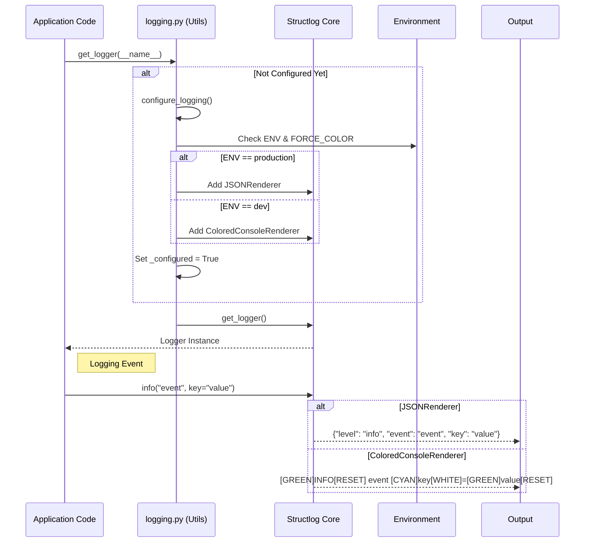
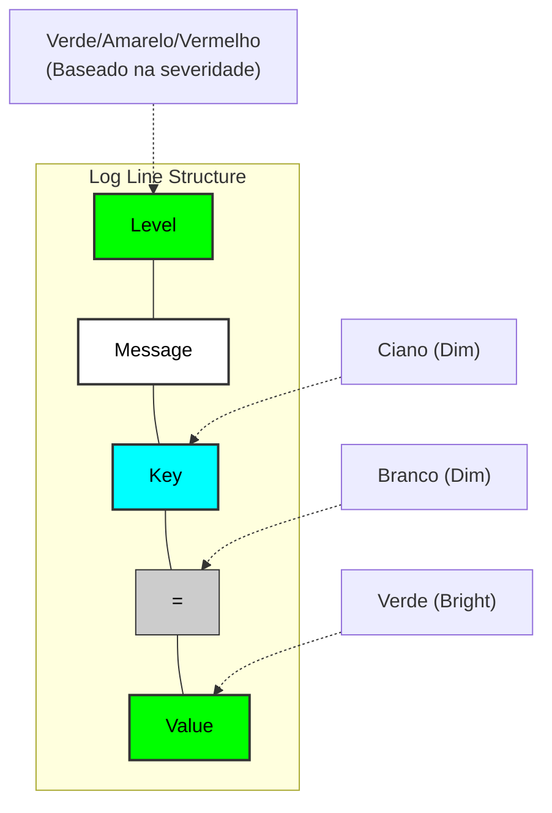

# ADR 13: Estratégia Híbrida de Logging e Observabilidade

**Status:** Aceito
**Data:** 28/01/2026
**Autores:** Equipe de Engenharia AI
**Contexto Técnico:** Logging, Observabilidade, DX (Developer Experience)

## 1. Contexto
O sistema carecia de uma estratégia unificada de logging. Enfrentávamos três problemas principais:
1.  **Poluição Visual Local:** Logs em desenvolvimento eram monocromáticos ou difíceis de ler quando redirecionados para arquivos (perda de cor por detecção de TTY).
2.  **Risco de Ingestão:** Logs coloridos (ANSI) são inadequados para ferramentas de observabilidade (Datadog, Splunk) pois quebram o parsing de JSON.
3.  **Boilerplate:** A inicialização do logging exigia chamadas explícitas (`configure_logging()`) em cada entrypoint (`main.py`, `scheduler.py`, `worker.py`), violando o princípio DRY e criando risco de falha silenciosa se esquecido.

## 2. Decisão
Decidimos refatorar o módulo `src/core/utils/logging.py` para adotar uma arquitetura de **Logging Híbrido com Inicialização Preguiçosa (Lazy Initialization)**.

### 2.1. Componentes da Solução
*   **Lazy Initialization:** A função `get_logger()` agora gerencia o estado global. Se o logging não estiver configurado, ela o configura automaticamente antes de retornar o logger. Isso elimina a necessidade de chamadas de setup manuais.
*   **Dual Rendering Strategy:**
    *   **Ambiente de Desenvolvimento (`ENV != production`):** Utiliza um `ColoredConsoleRenderer` customizado.
        *   Suporta `FORCE_COLOR=true` para manter cores mesmo em pipes/arquivos.
        *   Formatação semântica: Chaves em Ciano, Valores em Verde, estilo `logfmt`.
    *   **Ambiente de Produção (`ENV == production`):** Utiliza `JSONRenderer` nativo do `structlog`.
        *   Gera JSON puro, sem códigos ANSI.
        *   Garante compatibilidade total com agentes de coleta de logs.

### 2.2. Alterações de Infraestrutura
*   **Makefile:** Atualizado para injetar `FORCE_COLOR=true` em comandos de execução local (`make run`, `make run-worker`), garantindo que os logs gerados em arquivos (`app.log`) mantenham a formatação rica para leitura via `tail -f`.

## 3. Diagramas

### 3.1. Fluxo de Configuração e Renderização

### 3.2. Mapa de Cores Semântico

## 4. Consequências

### Positivas
*   **DX Aprimorada:** Logs locais são visualmente ricos e fáceis de escanear, facilitando o debug.
*   **Segurança Operacional:** Garantia de que logs de produção serão sempre JSON puro, evitando problemas de ingestão.
*   **Simplicidade de Código:** Remoção de código de configuração duplicado em múltiplos arquivos.

### Negativas/Riscos
*   **Dependência de Variável:** Desenvolvedores devem lembrar que `FORCE_COLOR` é necessário para ver cores em arquivos locais (automatizado no Makefile, mas relevante para execução manual).
*   **Complexidade do Renderizador:** O `ColoredConsoleRenderer` é uma classe customizada que precisa ser mantida, ao contrário do `ConsoleRenderer` padrão.

## 5. Referências
*   [Structlog Documentation](https://www.structlog.org/)
*   [12 Factor App - Logs](https://12factor.net/logs)
