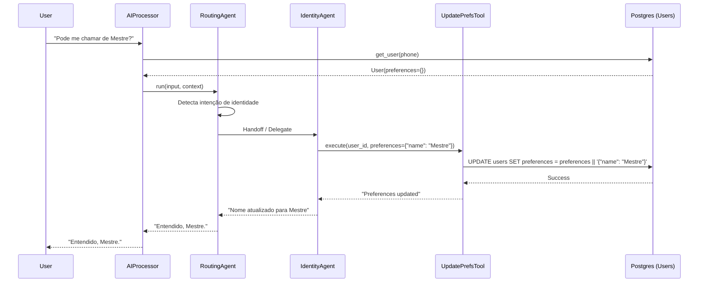
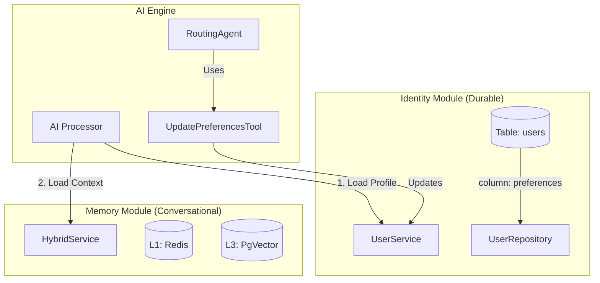
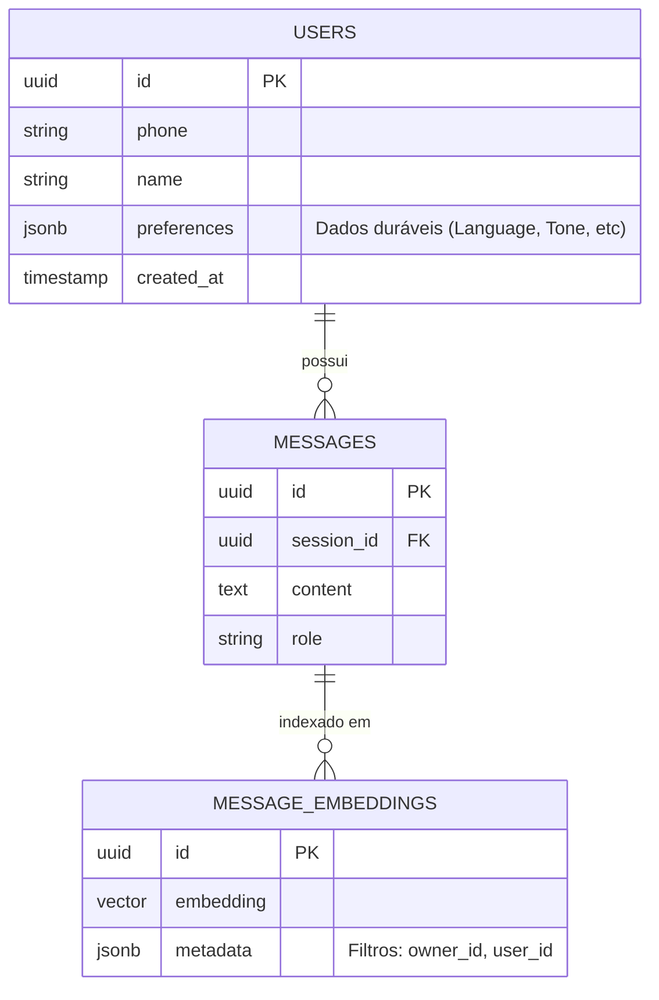

# ADR 23: Separação de Identity e Memory + Toolchain de Preferências

## Status
Aceito e Implementado

## Contexto
Conforme detalhado no [Research 18](../research/research_memory_rag_hybrid_18.md) e consolidado no [Report 22](../report/report_memory_structural_22.md), o sistema enfrentava desafios na gestão de "memória de longo prazo" do usuário.
As limitações identificadas foram:
1.  **Ambiguidade de Escopo**: Preferências duráveis (ex: "me chame de João", "fale pt-BR") estavam misturadas com o histórico conversacional (vetorial/textual), dificultando a recuperação garantida.
2.  **Governança**: O módulo de memória L3 permitia buscas sem filtro estrito de `owner_id`/`user_id`.
3.  **Agência Limitada**: O Agente não tinha meios explícitos e seguros de atualizar as preferências do usuário de forma estruturada.

## Decisões

### 1. Separação Estrita: Identity vs Memory
Decidimos separar as responsabilidades arquiteturais:
-   **Identity Module (`users` table)**: Responsável por dados **duráveis** e estruturados (Perfil, Configurações, Preferências).
-   **Memory Module (L1/L2/L3)**: Responsável pelo **histórico conversacional** e contexto semântico.

### 2. Persistência de Preferências em JSONB
Adotamos uma coluna `preferences` (tipo `JSONB`) na tabela `users`. Isso permite flexibilidade para armazenar chaves arbitrárias (ex: `{"language": "pt-BR", "verbosity": "low"}`) sem migrações constantes de schema, mantendo a performance de leitura do Postgres.

### 3. Toolchain de Auto-Gestão
Implementamos a `UpdateUserPreferencesTool` e o `identity_management_agent`. Isso permite que o sistema de IA detecte intenções de mudança de perfil (ex: "Mude meu idioma para inglês") e execute a alteração diretamente na base de dados de Identity, fechando o ciclo de feedback.

## Implementação Técnica

### Schema de Dados
```sql
ALTER TABLE users ADD COLUMN preferences JSONB DEFAULT '{}';
```

### Componentes de Software
1.  **`UpdateUserPreferencesTool`**: Ferramenta atômica que recebe `user_id` e um dicionário `preferences` para realizar o *merge* com os dados existentes.
    *   *Correção Realizada*: Durante a implementação, ajustamos a classe para incluir o atributo `model: Type[BaseModel]` exigido pela classe base `Tool` do framework LChain, corrigindo um erro de validação do Pydantic.
2.  **`identity_management_agent`**: Agente especializado configurado com prompts de sistema focados em gestão de identidade.
3.  **Injeção de Contexto**: O `TwilioWebhookAIProcessor` foi atualizado para ler `user.preferences` e injetar no prompt de sistema do LLM a cada requisição.

## Diagramas

### 1. Diagrama de Sequência: Fluxo de Atualização de Preferências



### 2. Diagrama de Componentes: Separação de Módulos



### 3. Diagrama de Dados



## Resultados e Correções

### Resultados
-   **Consistência**: O LLM agora tem acesso garantido às preferências do usuário em 100% das interações, pois elas são injetadas no contexto inicial (via `TwilioWebhookAIProcessor`) e não dependem da "sorte" do retrieval vetorial.
-   **Segurança**: O acesso à memória vetorial (L3) agora exige filtros de `owner_id` e `user_id`, impedindo vazamento de dados entre tenants.
-   **Manutenibilidade**: A lógica de atualização de perfil está encapsulada em uma Tool testável unitariamente.

### Correções Aplicadas
-   **Pydantic Validation**: Corrigido erro `ValidationError` na inicialização da `UpdateUserPreferencesTool` adicionando o campo `model` explicitamente na definição da classe.
-   **Testes**: Adicionados testes unitários cobrindo cenários de sucesso (update) e falha (user not found).

## Próximos Passos
-   Monitorar o uso da ferramenta de preferências em produção.
-   Avaliar a necessidade de validação de schema para o JSONB de preferências no futuro, caso a complexidade aumente.
