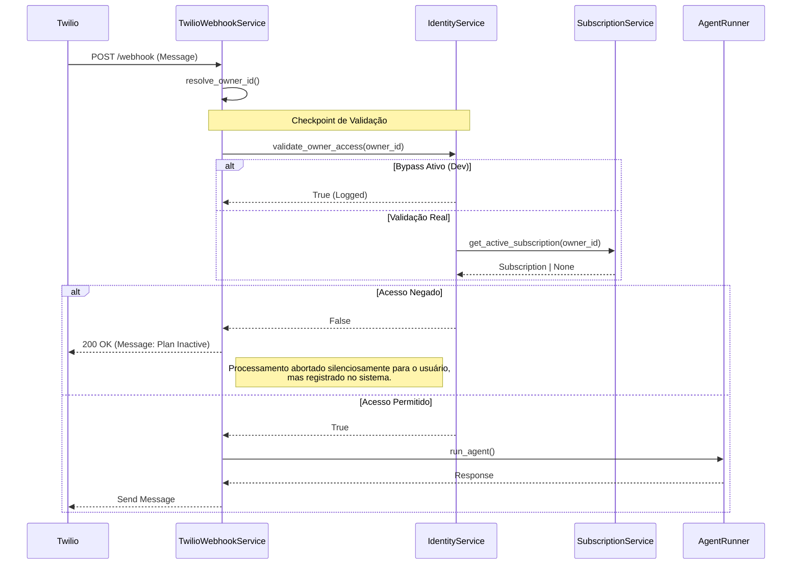
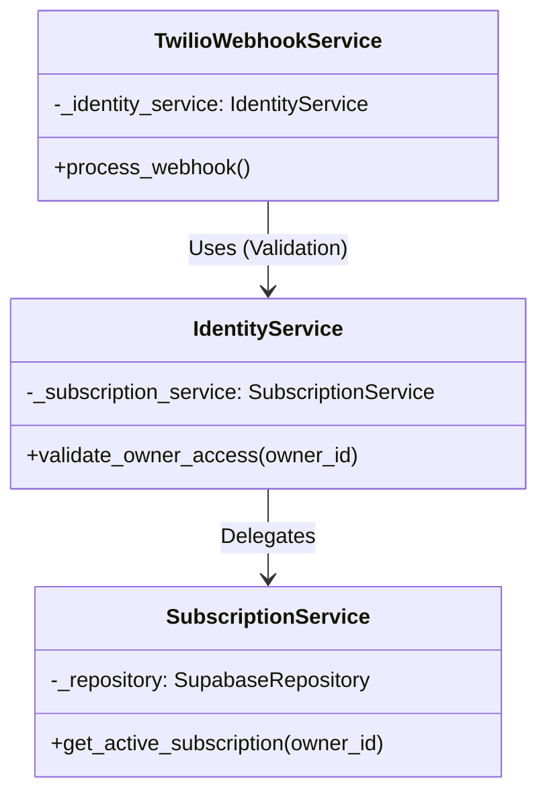

# ADR 008: Validação Centralizada de Plano e Assinatura no Webhook

**Status:** Aceito  
**Data:** 2026-01-27  
**Autor:** Assistant (via Trae IDE)  
**Contexto:** Segurança e Monetização de API

## 1. Contexto e Problema

O sistema processa mensagens via Webhook da Twilio. Anteriormente, o fluxo não verificava explicitamente se o `Owner` (proprietário do bot/número) possuía uma assinatura ativa (`Subscription`) válida antes de processar a mensagem e invocar os agentes de IA.

Isso gerava dois problemas críticos:
1.  **Revenue Leakage:** Usuários sem plano ou com plano expirado continuavam consumindo recursos (tokens de IA, processamento).
2.  **Segurança:** Falta de um "Gatekeeper" centralizado para validar o acesso ao serviço.

A necessidade era implementar uma validação robusta, performática e arquiteturalmente correta, sem acoplar a lógica de negócio de assinaturas diretamente no controlador do Webhook (SRP).

## 2. Decisão Arquitetural

Decidimos implementar a validação utilizando o padrão **Facade** através do `IdentityService`, servindo como ponto único de verdade para o contexto do usuário/owner.

### 2.1. Centralização no IdentityService
O `IdentityService` foi escolhido para encapsular a regra de negócio. Ele orquestra a chamada ao `SubscriptionService`.

- **Método Criado:** `validate_owner_access(owner_id: str) -> bool`
- **Responsabilidade:** Verificar se existe uma assinatura ativa para o owner.

### 2.2. Integração no TwilioWebhookService
O serviço de webhook (`TwilioWebhookService`) atua como um consumidor desta validação. A verificação é feita logo após a resolução do `Owner` e antes de qualquer processamento pesado.

### 2.3. Bypass em Desenvolvimento
Para facilitar o desenvolvimento e testes locais sem necessidade de mockar todo o banco de dados de assinaturas, foi introduzida uma flag de configuração: `API_BYPASS_SUBSCRIPTION_CHECK`.

## 3. Solução Técnica

### 3.1. Diagrama de Sequência (Fluxo de Validação)



### 3.2. Diagrama de Componentes



## 4. Implementação

### 4.1. IdentityService (`src/modules/identity/services/identity_service.py`)

```python
def validate_owner_access(self, owner_id: str) -> bool:
    """
    Check if the owner has a valid subscription to access the service.
    """
    # 1. Check Development Bypass
    if settings.api.bypass_subscription_check and settings.api.environment == "development":
        logger.warning(f"Bypassing subscription check for owner {owner_id} (DEV mode)")
        return True

    try:
        # 2. Check Active Subscription
        subscription = self.subscription_service.get_active_subscription(owner_id)
        if not subscription:
            logger.warning(f"Access denied for owner {owner_id}: No active subscription.")
            return False

        return True
    except Exception as e:
        logger.error(f"Error validating access for owner {owner_id}: {e}")
        return False
```

### 4.2. Configuração (`.env` e `settings.py`)

Nova variável de ambiente adicionada para controle em desenvolvimento:

```bash
# .env
API_BYPASS_SUBSCRIPTION_CHECK=True
```

## 5. Consequências

| Tipo | Descrição |
|------|-----------|
| **Positiva** | **Proteção de Receita:** Garante que apenas pagantes usem o serviço. |
| **Positiva** | **Desacoplamento:** O Webhook não conhece regras de expiração ou planos, apenas pergunta "posso prosseguir?". |
| **Positiva** | **DX (Developer Experience):** O modo Bypass permite testar o fluxo do bot sem configurar assinaturas complexas localmente. |
| **Negativa** | **Latência:** Adiciona uma leitura extra ao banco de dados (Supabase) no caminho crítico do webhook. |
| **Mitigação** | O impacto de latência é mínimo comparado à inferência de IA. Futuramente, pode ser mitigado com cache (Redis) no `SubscriptionService`. |

## 6. Referências
- [Research Report: Plan Validation](../research/research_plan_validation_01.md)
- [Ticket Relacionado: Implementar verificação de plano](#)
