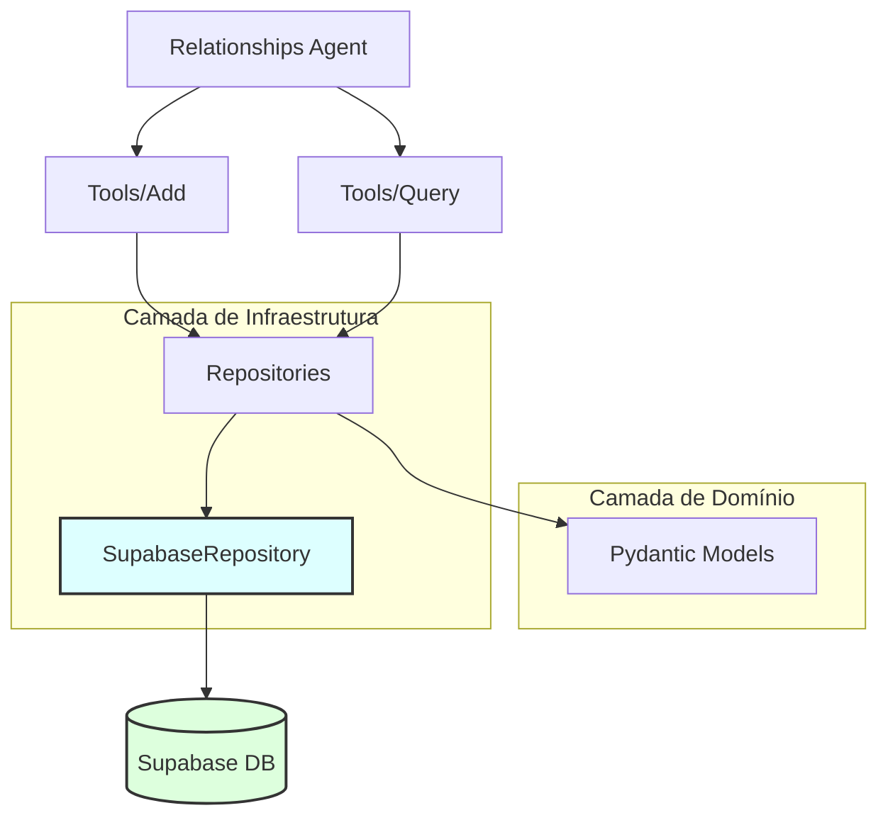

# ADR 07: Padronização do Módulo Relationships e Migração para Supabase

## Status
**Implementado**

## Contexto
O módulo `relationships` (Gestão de Relacionamentos Pessoais - PRM) foi inicialmente desenvolvido como um protótipo isolado, utilizando:
1.  **Persistência Local**: Banco de dados SQLite (`mock_data.db`) gerenciado diretamente no sistema de arquivos.
2.  **ORM Misto**: Uso de `SQLModel` misturando definição de tabelas e modelos de dados.
3.  **Estrutura Divergente**: Organização de pastas (`persistence/`) e ferramentas monolíticas que não seguiam os padrões estabelecidos em módulos mais maduros, como o módulo `finance`.

Essa divergência causava:
-   Inconsistência na arquitetura do sistema.
-   Dificuldade de manutenção e evolução.
-   Falta de integração com o banco de dados principal (Supabase).
-   Impossibilidade de escalar a solução em ambiente de produção (devido ao SQLite local em container).

## Decisão
Decidiu-se refatorar completamente o módulo `relationships` para alinhar-se estritamente à arquitetura do módulo `finance`, adotando o padrão **Repository Pattern** com **Supabase** e **Pydantic**.

### Mudanças Estruturais
A estrutura de diretórios foi alterada para espelhar o módulo `finance`:

| Antes (Legacy) | Depois (Standard) | Descrição |
| :--- | :--- | :--- |
| `persistence/db.py` | `repositories/repository_relationships.py` | Migração de SQLite Engine para `SupabaseRepository` |
| `persistence/models.py` | `models/models.py` | Unificação de modelos Pydantic (Schema/Create/Update) |
| `tools/relationships.py` | `tools/add.py`, `tools/query.py` | Segregação de responsabilidades (CQRS-like) |
| `persistence/mock_data.py` | *(Removido)* | Dados mockados substituídos por persistência real |

### Mudanças Técnicas
1.  **Adoção de SupabaseRepository**:
    -   Implementadas classes `PersonRepository`, `InteractionRepository` e `ReminderRepository` herdando de `SupabaseRepository`.
    -   Uso de injeção de dependência via Singleton (`get_person_repository()`).

2.  **Padronização de Modelos Pydantic**:
    -   Substituição de `SQLModel` por classes `Pydantic` puras.
    -   Definição clara de schemas para Leitura (`Person`), Criação (`PersonCreate`) e Atualização (`PersonUpdate`).
    -   Validadores customizados para datas e tipos numéricos.

3.  **Refatoração de Tools**:
    -   Tools reescritas para utilizar os Repositórios em vez de sessões diretas do SQLAlchemy.
    -   Separação física de ferramentas de escrita (`add.py`) e leitura (`query.py`) para melhor organização e redução de tamanho dos arquivos.

## Diagramas

### Antes (Arquitetura Legacy - SQLite)
```mermaid
graph TD
    Agent[Relationships Agent] --> Tools[Tools Monolítico]
    Tools --> SQLite[SQLite Local (File)]
    Tools --> SQLModel[SQLModel Models]
    SQLModel -.-> SQLite
    
    style SQLite fill:#ffdddd,stroke:#333,stroke-width:2px
```

### Depois (Arquitetura Padronizada - Supabase)


## Consequências

### Positivas
-   **Consistência**: Todos os módulos de features (`finance`, `relationships`) agora seguem o mesmo padrão, facilitando a rotação de desenvolvedores e entendimento do código.
-   **Escalabilidade**: A persistência no Supabase permite que a aplicação escale horizontalmente sem problemas de bloqueio de arquivo (SQLite).
-   **Manutenibilidade**: Código mais limpo, tipado e testável. Separação clara entre definição de dados (Models) e acesso a dados (Repositories).
-   **Segurança**: Credenciais e acesso a dados centralizados via client Supabase autenticado, ao invés de arquivos locais.

### Riscos e Mitigações
-   **Dependência de Schema**: O código agora assume que as tabelas `person`, `interaction` e `reminder` existem no Supabase.
    -   *Mitigação*: Deve-se garantir que as migrações SQL correspondentes sejam aplicadas no banco de produção.
-   **Migração de Dados**: Dados existentes no SQLite local (se houver uso real) não são migrados automaticamente.
    -   *Ação*: Como era um protótipo, assume-se perda de dados aceitável ou migração manual se necessário.

## Próximos Passos
-   Validar a criação das tabelas no Supabase (DDL).
-   Adicionar testes unitários para os novos repositórios (mockando o client Supabase).
