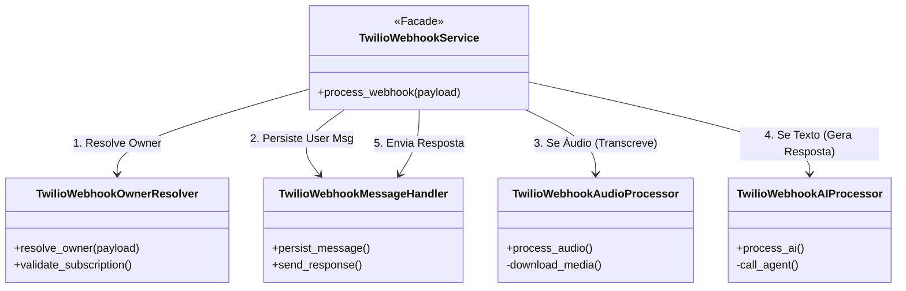
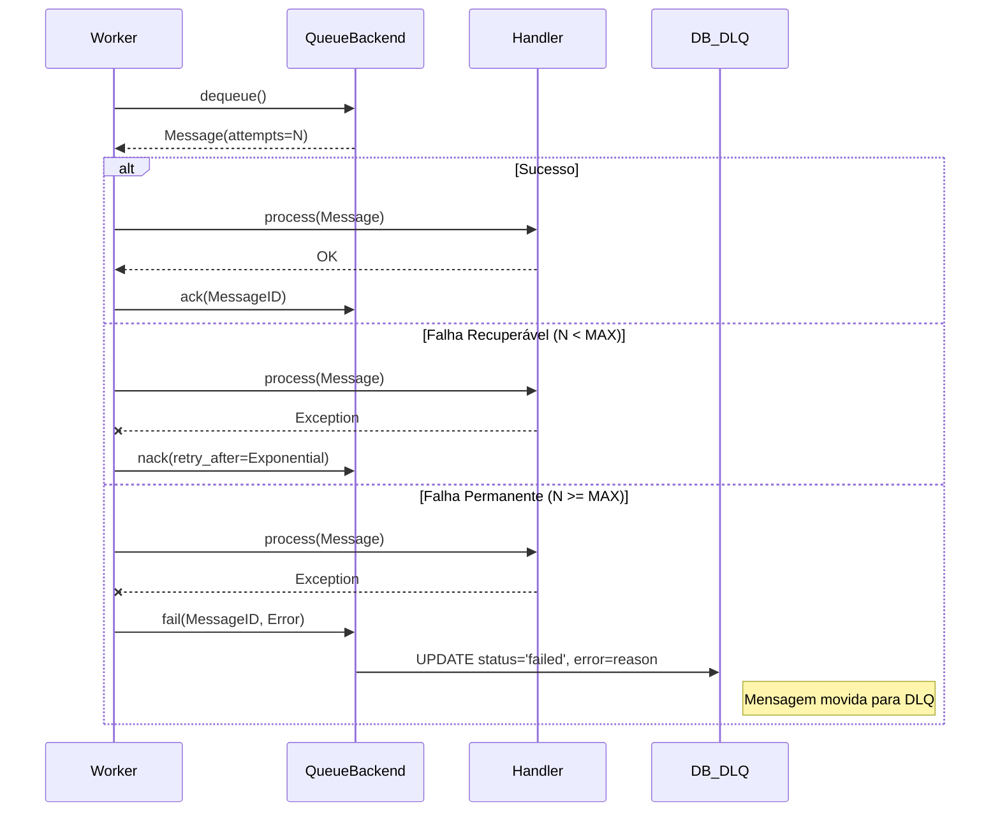

# ADR 015: Refatoração do Twilio Webhook e Implementação de Dead Letter Queue (DLQ)

**Data:** 2026-01-28
**Status:** Aceito
**Contexto:** Refatoração de Serviço Monolítico e Robustez de Mensageria

## 1. Contexto e Problema

O serviço `TwilioWebhookService` cresceu organicamente e tornou-se uma classe monolítica ("God Class") com mais de 500 linhas, acumulando múltiplas responsabilidades:
1.  Resolução e validação de `Owner` (proprietário da conta).
2.  Persistência de mensagens (User/Assistant).
3.  Lógica de envio de respostas via API do Twilio.
4.  Gerenciamento de download e transcrição de áudio.
5.  Orquestração de chamadas para a IA (Agentes).

**Problemas identificados:**
-   **Alta Complexidade Ciclomática**: Dificuldade de leitura e manutenção.
-   **Baixa Testabilidade**: Testes unitários complexos e frágeis, exigindo mocks excessivos.
-   **Violação do SRP**: Uma mudança na lógica de persistência impactava o fluxo de áudio, por exemplo.
-   **Gestão de Falhas Ineficiente**: Mensagens com erro de processamento entravam em loop de retentativas ou falhavam silenciosamente, sem um mecanismo de Dead Letter Queue (DLQ).
-   **Configuração Rígida**: Parâmetros do modelo Whisper (tamanho, device) estavam hardcoded ou dispersos.

## 2. Decisão Arquitetural

Decidiu-se realizar uma refatoração estrutural profunda e implementar padrões de resiliência:

### 2.1. Decomposição em Componentes (Modularização)
O `TwilioWebhookService` foi convertido em uma **Facade**, delegando responsabilidades para 4 novos componentes especializados (localizados em `src/modules/channels/twilio/services/webhook/`):

1.  **`TwilioWebhookOwnerResolver`**: Responsável exclusivamente por identificar o owner baseando-se no payload do webhook (`From`/`To`) e validar status da assinatura/plano.
2.  **`TwilioWebhookMessageHandler`**: Gerencia a persistência de mensagens no banco de dados e o envio de respostas para o Twilio.
3.  **`TwilioWebhookAudioProcessor`**: Trata payloads de mídia, realiza download temporário e orquestra a transcrição via `TranscriptionService`.
4.  **`TwilioWebhookAIProcessor`**: Prepara o contexto e aciona o `IdentityService` ou `Agent` apropriado para gerar respostas inteligentes.

### 2.2. Implementação de Dead Letter Queue (DLQ)
Para garantir robustez no processamento assíncrono (Queue System):
-   **Interface `QueueBackend`**: Adicionado método `fail(message_id, error)` e lógica de retentativa exponencial (`start_consuming`).
-   **Backend SQLite**: Implementada persistência de falhas permanentes.
    -   Nova coluna `error_reason` na tabela `message_queue`.
    -   Mensagens que excedem `MAX_RETRIES` (3) mudam status para `failed` e registram o motivo, saindo da fila de processamento ativo.

### 2.3. Parametrização via Variáveis de Ambiente
Configurações do modelo Whisper movidas para o `.env` e mapeadas em `Settings`:
-   `WHISPER_SIZE`, `WHISPER_DEVICE`, `WHISPER_COMPUTE_TYPE`, `WHISPER_BEAM_SIZE`.

## 3. Detalhes Técnicos e Diagramas

### 3.1. Nova Arquitetura de Componentes

### 3.2. Fluxo de Processamento com DLQ

## 4. Consequências

### Positivas
-   **Manutenibilidade**: Código desacoplado; alterações na lógica de áudio não afetam a lógica de mensagens.
-   **Testabilidade**: Testes unitários agora são focados em componentes específicos (`test_owner_resolver.py`, etc.), tornando-os mais rápidos e legíveis.
-   **Observabilidade de Erros**: Falhas persistentes não bloqueiam o worker e ficam registradas no banco para análise (post-mortem).
-   **Flexibilidade**: Ajustes de performance no modelo de transcrição podem ser feitos via infraestrutura (Env Vars) sem deploy de código.

### Negativas / Trade-offs
-   **Aumento no Número de Arquivos**: De 1 arquivo de serviço para 5 (1 Facade + 4 Componentes).
-   **Complexidade na Injeção de Dependência**: O container DI precisou ser atualizado para instanciar e injetar todos os sub-componentes.

## 5. Referências
-   Relatório de Refatoração: `plan/v4/report/report_refactoring_twilio_webhook_service_15.md`
-   Correção de Testes: `plan/v4/corrections/correction_fix_twilio_webhook_tests_15.md`
