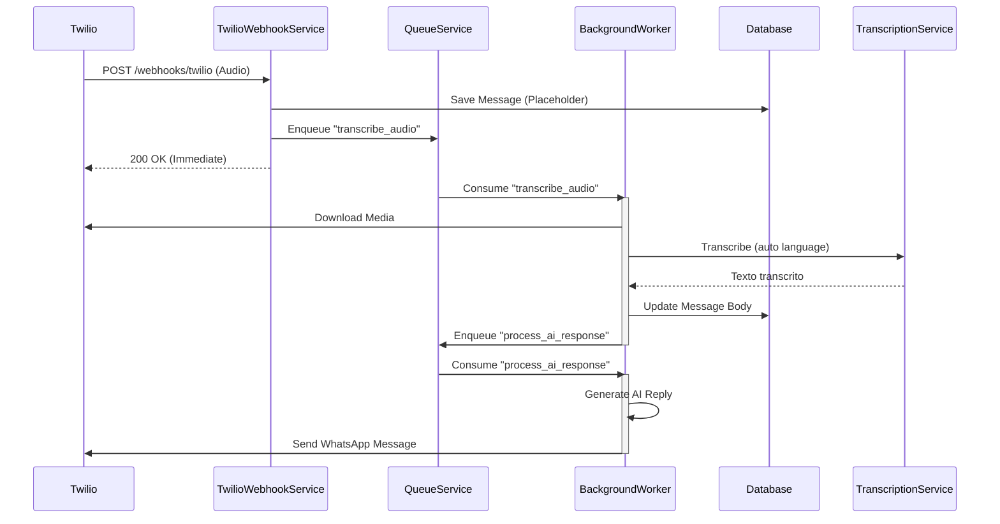

# ADR 12 — Processamento Assíncrono de Transcrição de Áudio em Webhooks Twilio

Status: Aceito  
Data: 2026-01-28  
Autor: Equipe de Engenharia (AI Assistant)

## Contexto
- O webhook do Twilio possui janela de resposta limitada (~15s). Processar download e transcrição de áudio dentro da requisição aumenta risco de timeout (erro 11200) e reentregas.
- O sistema já utiliza uma arquitetura unificada de tarefas em segundo plano via QueueService (Producer-Consumer). A oportunidade é mover atividades de I/O e CPU para o Worker, mantendo o webhook leve.<mccoremem id="01KFXQTGVNHESX8RW0ACX0T20H|01KFYGPRSSWNYHR1DX4MA1H4EA" />
- A transcrição via Faster-Whisper precisa de auto-detecção de idioma e parâmetros de desempenho/acurácia configuráveis (modelo, device, compute_type, beam_size). Configuração deve ser centralizada e injetada por DI.<mccoremem id="01KG18MDR1CWNX7WGC4RPV3EA2" />

## Decisão
- Tornar o processamento de áudio totalmente assíncrono:
  - O webhook apenas persiste a mensagem inicial com placeholder e enfileira uma tarefa de transcrição.
  - Um Worker baixa a mídia, executa a transcrição com Faster-Whisper e atualiza a mensagem no banco.
  - Em seguida, encadeia a próxima tarefa de geração de resposta da IA.
- Centralizar configurações do Whisper em `settings.whisper` e injetar no `TranscriptionService` via Container.
- Habilitar auto-detecção de idioma (language=None) e permitir tuning de acurácia via `beam_size`.

## Implementação
- Webhook:
  - Registro de handler de transcrição no serviço: [twilio_webhook_service.py](file:///Users/lennon/projects/ai_engineering/whatsapp_twilio_ai/src/modules/channels/twilio/services/twilio_webhook_service.py#L52-L58)
  - Enfileiramento assíncrono na recepção do áudio e placeholder: [twilio_webhook_service.py](file:///Users/lennon/projects/ai_engineering/whatsapp_twilio_ai/src/modules/channels/twilio/services/twilio_webhook_service.py#L230-L312)
  - Handler de transcrição (download, transcreve, atualiza, encadeia IA): [twilio_webhook_service.py](file:///Users/lennon/projects/ai_engineering/whatsapp_twilio_ai/src/modules/channels/twilio/services/twilio_webhook_service.py#L339-L424)
- Configuração:
  - Parâmetros do Whisper (size, device, compute_type, beam_size) centralizados em settings e injetados no DI Container: [container.py](file:///Users/lennon/projects/ai_engineering/whatsapp_twilio_ai/src/core/di/container.py) e [settings.py](file:///Users/lennon/projects/ai_engineering/whatsapp_twilio_ai/src/core/config/settings.py)
- Ambiente:
  - Variáveis de ambiente documentadas em `.env.example` para o Whisper (sem valores reais).

## Resultados
- Resiliência: o webhook responde imediatamente; elimina timeouts mesmo com áudios grandes.
- Escalabilidade: processamento pesado migra para Workers; pode ser escalado horizontalmente sem afetar a ingestão.
- UX: o usuário vê a mensagem recebida rapidamente; posterior atualização com a transcrição e resposta da IA ocorre em background.

## Correções e Ajustes
- Pydantic: renomeado `model_size` para `size` em `WhisperSettings` para evitar conflito com namespace protegido `model_`.
- Arquitetura: removida iniciativa prematura de criar um módulo separado de transcrição; o serviço permanece onde já há domínio claro. Nova localização só será considerada com justificativa forte.
- Segurança: nenhuma chave secreta em código; `.env.example` documenta variáveis necessárias. Nunca manipular `.env` real sem aprovação.<mccoremem id="03fhbtti2ywitz6bjxcetxvsv" />

## Consequências
- Positivas:
  - Menor acoplamento entre webhook e operações pesadas.
  - Melhor controle operacional via filas (retries, monitoramento, backpressure).
  - Configuração de Whisper coesa e reutilizável.
- Negativas:
  - Requer execução correta de Scheduler/Worker.
  - Aumenta necessidade de observabilidade (logs/metrics) nas filas.

## Diagrama

## Rollout e Operação
- Garantir execução de Scheduler e Worker (ex.: `make run-scheduler` e processos de worker conforme docker-compose).
- Monitorar filas e erros de transcrição; aplicar tuning de `beam_size` conforme SLA desejado.
- Validar variáveis de ambiente configuradas antes da execução; nunca comitar `.env`.

## Referências
- Arquitetura de Background Tasks unificada (QueueService).<mccoremem id="01KFXQTGVNHESX8RW0ACX0T20H|01KFYGPRSSWNYHR1DX4MA1H4EA" />
- Configuração de Whisper centralizada.<mccoremem id="01KG18MDR1CWNX7WGC4RPV3EA2" />
- Padrão de Documentação ADR (plan/v4/adr).<mccoremem id="03fhdhhvd18qkcwlce4qbsmv6" />
