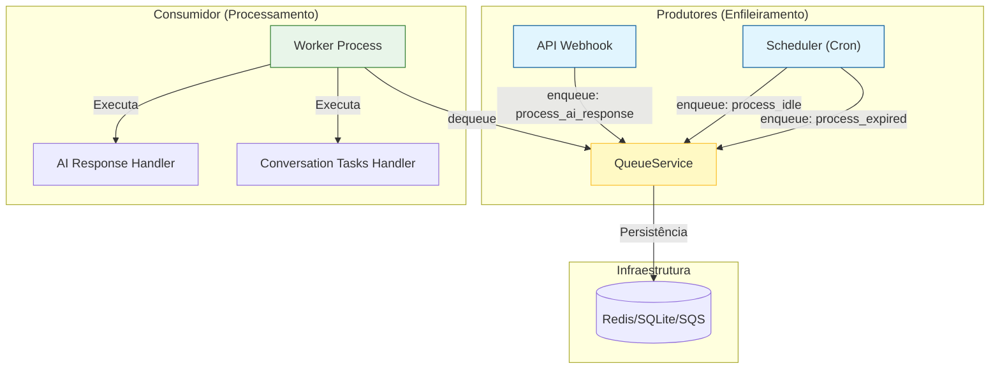

# ADR: Unificação do Processamento em Background

## Status
Aceito e Implementado

## Contexto
O sistema apresentava uma "Dualidade Perigosa" no tratamento de tarefas assíncronas, caracterizada por dois fatores principais:
1.  **Concorrência de Tecnologias**: O código mantinha importações e potencial uso de `fastapi.BackgroundTasks` (processamento em memória, volátil) concorrendo com o `QueueService` (processamento em fila, persistente). Isso gerava incerteza sobre a garantia de execução de tarefas críticas em caso de reinicialização da aplicação.
2.  **Ambiguidade Semântica**: O módulo `src/modules/conversation/workers/background_tasks.py` tinha um nome que conflitava com o conceito de "Background Tasks" do FastAPI, além de não deixar claro se sua responsabilidade era *executar* tarefas ou apenas *agendá-las*.

## Decisão
Decidimos unificar todo o processamento assíncrono sob a arquitetura **Producer-Consumer** robusta, utilizando o `QueueService` como espinha dorsal.

As ações específicas tomadas foram:

1.  **Remoção de BackgroundTasks (FastAPI)**:
    *   Eliminamos importações e usos residuais de `fastapi.BackgroundTasks` em `src/modules/channels/twilio/api/webhooks.py`.
    *   Estabelecemos a regra de que a API (Webhooks) deve apenas **enfileirar** (`enqueue`) tarefas, delegando a execução inteiramente para os workers.

2.  **Renomeação e Redefinição de Papéis**:
    *   Renomeamos `src/modules/conversation/workers/background_tasks.py` para **`src/modules/conversation/workers/scheduler.py`**.
    *   Definimos explicitamente o papel do **Scheduler**: Um componente do tipo "Cron" responsável apenas por gerar eventos periódicos (heartbeat) e enfileirar tarefas de manutenção (ex: timeouts, expiração). Ele **não executa** lógica de negócios.

3.  **Arquitetura Unificada**:
    *   **Produtores**: API Webhook (eventos externos) e Scheduler (eventos temporais).
    *   **Canal**: QueueService (abstração sobre Redis/SQS/SQLite).
    *   **Consumidor**: Worker Process (execução isolada e resiliente).

## Consequências

### Positivas
*   **Confiabilidade de Dados**: Eliminamos o risco de perda de tarefas em memória (ex: respostas de AI) caso o servidor reinicie durante o processamento, pois agora tudo é persistido na fila.
*   **Clareza Cognitiva**: A distinção entre `scheduler.py` (quem agenda) e `worker.py` (quem trabalha) elimina a confusão para novos desenvolvedores.
*   **Escalabilidade**: A separação estrita permite escalar os Workers horizontalmente independentemente da API ou do Scheduler.

### Negativas / Trade-offs
*   **Dependência de Infraestrutura**: O sistema agora depende estritamente da saúde do serviço de fila (Redis/SQS) para qualquer processamento assíncrono. Se a fila parar, o processamento para (diferente de tarefas em memória que poderiam rodar localmente, embora com risco).
*   **Complexidade Operacional**: É obrigatório manter o processo do Worker rodando separadamente da API para que as tarefas sejam processadas.

## Diagrama da Nova Arquitetura

