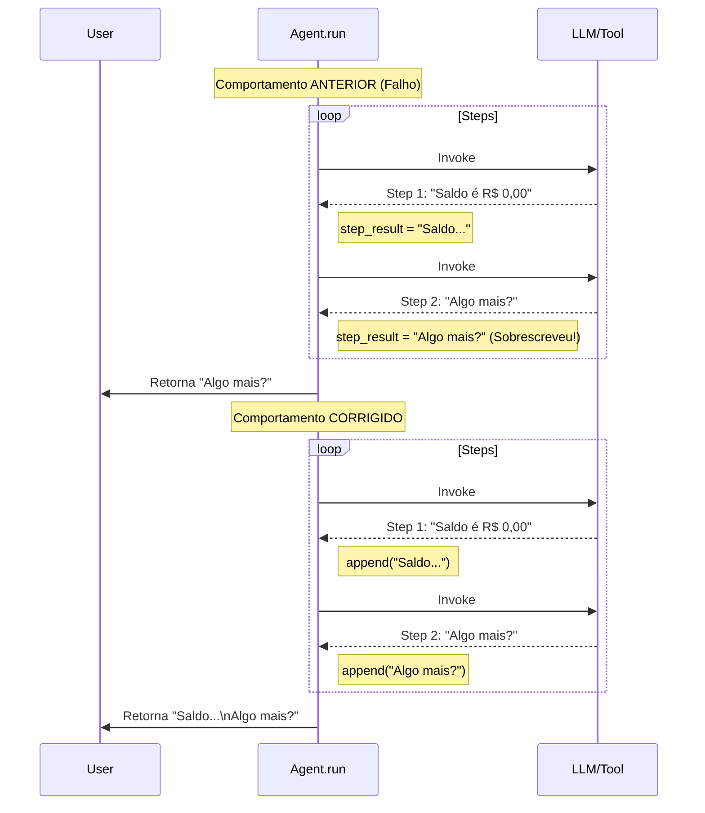
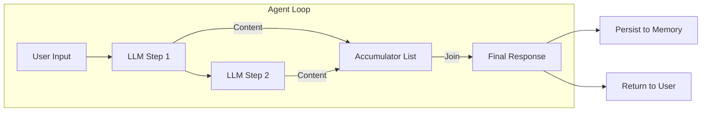

# Relatório de Correção: Acumulação de Respostas do Agente

**ID**: correction_agent_response_accumulation_18
**Data**: 2026-02-03
**Autor**: Assistant

## 1. Contexto
Durante a interação com o agente, observou-se que respostas compostas por múltiplos passos (ex: resultado de uma query seguido de uma mensagem de encerramento) estavam sendo truncadas. O usuário recebia apenas a última mensagem gerada, perdendo a informação principal (o resultado da query).

## 2. Detalhes da Correção

### Local
- **Arquivo**: [`src/modules/ai/engines/lchain/core/agents/agent.py`](../../../../../src/modules/ai/engines/lchain/core/agents/agent.py)
- **Método**: `Agent.run`

### Problema
O loop de execução do agente (`while i < self.max_steps`) processava sequencialmente as respostas do LLM. A variável que armazenava o resultado final (`step_result.content`) era sobrescrita a cada iteração.
Quando o agente decidia emitir múltiplas mensagens de texto em passos sequenciais (ex: Passo 1: "O saldo é R$ 0,00", Passo 2: "Posso ajudar em algo mais?"), apenas o conteúdo do último passo era retornado e persistido.

### Risco
- **Baixo/Médio**: Perda de informação relevante para o usuário final.
- **Impacto**: O usuário pode achar que o sistema falhou ou não encontrou a informação, quando na verdade ela foi processada mas descartada na resposta final.

### Solução
Implementação de um mecanismo de acumulação de respostas (`assistant_responses`).
1. Criada uma lista `assistant_responses = []` antes do loop.
2. A cada iteração, se o evento for `assistant` ou `finish` e contiver texto, este é adicionado à lista.
3. Ao final, se houver mensagens acumuladas, elas são unidas por quebra de linha (`\n`), garantindo que o usuário receba todo o contexto gerado.

## 3. Diagramas

### Diagrama de Sequência: Fluxo Anterior vs. Corrigido

### Diagrama de Componentes: Fluxo de Dados

## 4. Validação
Foi criado um teste unitário dedicado para garantir que múltiplas mensagens sejam concatenadas corretamente.

- **Teste**: `tests/test_agent_accumulation.py` (Criado e executado com sucesso)
- **Cenário**: Simulação de múltiplos `StepResult` do tipo `assistant` seguidos por um `finish`.
- **Resultado**: O output final contém todas as mensagens unidas.

## 5. Próximos Passos
- Monitorar logs de produção para garantir que não haja duplicação excessiva em casos onde o modelo repete informações (embora o prompt do sistema deva mitigar isso).
