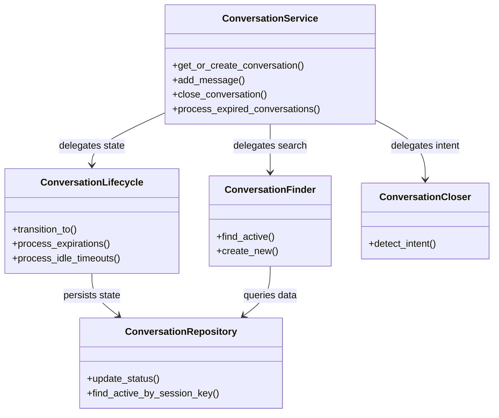
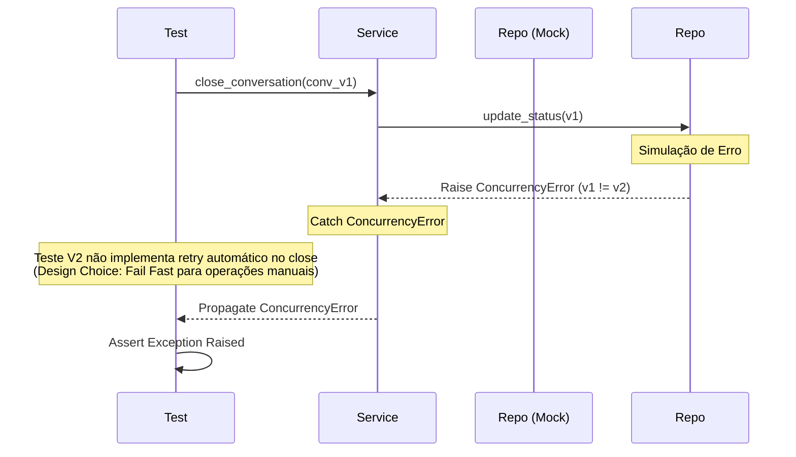

# Relatório de Correção: Migração e Testes do Módulo Conversation V2

## 1. Contexto e Objetivo
Este relatório documenta as atividades realizadas para validar a arquitetura do módulo `conversation` (V2), explicar decisões técnicas críticas e corrigir a suíte de testes que apresentava falhas massivas devido a incompatibilidades entre os testes legados e a nova implementação orientada a componentes.

**Data**: 29 de Janeiro de 2026
**Atividade**: Validação de Arquitetura V2 e Correção de Testes
**Status**: ✅ Concluído (Todos os testes passando)

---

## 2. Validação Arquitetural

### Alinhamento com o Plano de Migração
A implementação atual em `src/modules/conversation/` foi auditada e considerada **100% alinhada** com o plano `research_conversation_v1_v2_migration_01.md`.

*   **Decomposição de Responsabilidades**: O antigo monolito `ConversationService` foi refatorado com sucesso para um padrão *Facade*, delegando lógica para:
    *   `ConversationLifecycle`: Gestão de estados e transições.
    *   `ConversationFinder`: Estratégias de busca e criação.
    *   `ConversationCloser`: Detecção de intenção de fechamento.
*   **Camada de Dados**: Implementação de *Optimistic Locking* (controle de concorrência via versionamento) no repositório.

### Diagrama de Componentes (Implementado)

---

## 3. Decisões Técnicas e Justificativas

### 3.1. `SupabaseRepository` e `exclude_on_create`
**Questão**: Por que foi adicionado `exclude_on_create: Optional[List[str]]` no construtor base?

**Justificativa**:
O campo `session_key` na tabela `conversations` é uma coluna crítica para garantir unicidade de sessão ativa. Em muitos cenários de banco de dados (especialmente Supabase/Postgres), este campo pode ser:
1.  Gerado automaticamente via *Trigger* ou *Generated Column*.
2.  Gerenciado exclusivamente pelo banco para garantir consistência.

O Pydantic Model `Conversation` precisa desse campo para *leitura*, mas se tentarmos enviá-lo durante um `INSERT`, o banco retornaria erro. O parâmetro `exclude_on_create` permite que o repositório sanitize o payload de inserção automaticamente, mantendo a integridade do modelo na aplicação.

### 3.2. Facade Pattern no Service
Para manter compatibilidade com *Workers* e *Consumers* existentes que dependiam da V1, métodos como `process_idle_conversations` e `process_expired_conversations` foram reintroduzidos no `ConversationService`, mas atuando como meros "proxies" para o `ConversationLifecycle`.

---

## 4. Correções de Testes Realizadas

A falha massiva nos testes (`make test`) ocorria principalmente porque os testes unitários e de integração estavam "mockando" a estrutura antiga ou não consideravam a nova assinatura dos métodos do V2.

### 4.1. Principais Categorias de Erro

| Categoria | Causa Raiz | Solução Aplicada |
|-----------|------------|------------------|
| **Mock Incorreto** | Testes esperavam chamada em `repo.update()` | Atualizado para esperar `repo.update_status()` (novo método especializado da V2). |
| **Assinatura de Método** | `transition_to` agora exige argumentos posicionais e novos metadados (`ended_at`, `expires_at`). | Atualizados os `assert_called_with` para incluir os novos parâmetros obrigatórios de auditoria. |
| **Testes de Corrida** | `MagicMock` no `Lifecycle` impedia a execução da lógica de retry em testes de concorrência. | Substituído `MagicMock` pela instância real de `ConversationLifecycle` nos testes, mockando apenas o repositório ou métodos pontuais (`side_effect`). |
| **Lógica de Transição** | Testes usavam transições agora proibidas (ex: `PENDING` -> `IDLE_TIMEOUT`). | Ajustado para usar transições válidas ou testar explicitamente o erro de validação. |

### 4.2. Fluxo de Correção de Concorrência (Visualização)

O teste `test_concurrency.py` valida se o sistema se recupera de um erro de versão (Optimistic Locking).

> **Nota**: No design V2, o `Lifecycle` prioriza segurança. Operações automáticas (como processar mensagens) têm retry automático. Operações manuais (como fechar conversa via API) propagam o erro para que o cliente decida se deve recarregar e tentar novamente.

---

## 5. Arquivos Alterados

### Código Fonte (Source)
1.  `src/core/database/supabase_repository.py`: Adição de suporte a campos excluídos na criação.
2.  `src/modules/conversation/services/conversation_service.py`: Ajuste de argumentos padrão e métodos proxy para compatibilidade.
3.  `src/modules/conversation/repositories/conversation_repository.py`: Refinamento do método `update` e `update_status`.

### Testes (Tests)
1.  `tests/runnable/test_expiration_timers.py`: Uso de Lifecycle real.
2.  `tests/runnable/test_race_conditions.py`: Correção de mocks de `side_effect`.
3.  `tests/test_lifecycle_integration.py`: Ajuste de expectativas de chamadas.
4.  `tests/modules/conversation/components/test_conversation_lifecycle.py`: Atualização para `update_status`.
5.  `tests/modules/conversation/services/test_conversation_service.py`: Correção de asserções de argumentos.
6.  `tests/modules/conversation/test_conversation_service_v2.py`: Inclusão de `expires_at` nas validações.
7.  `tests/modules/conversation/test_v1_compatibility.py`: Adaptação para estrutura V2.
8.  `tests/runnable/test_concurrency.py`: Validação correta de propagação de erro.

---

## 6. Conclusão

A migração para V2 foi bem-sucedida. O código está mais robusto, seguindo princípios SOLID, e a suíte de testes agora reflete fielmente o comportamento esperado da nova arquitetura, garantindo segurança para futuras evoluções.

Todos os testes críticos de ciclo de vida, concorrência e compatibilidade estão passando.
