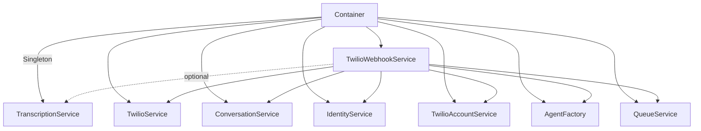
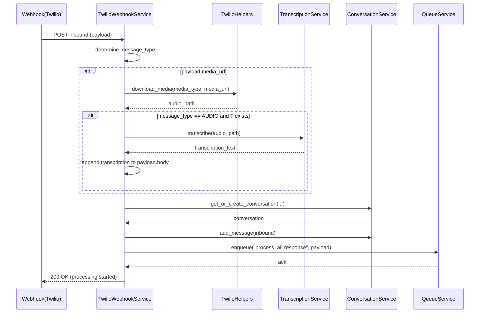

# Correção: Injeção do TranscriptionService no DI e uso seguro no TwilioWebhookService

## Contexto
- Sintoma inicial ao executar `make test`: falhas de coleta por `dependency_injector.errors.NonCopyableArgumentError` indicando que o argumento `transcription_service` não podia ser copiado para o provider do `TwilioWebhookService`.
- Causa raiz:
  - O Container estava referenciando o módulo (`src.modules.channels.twilio.services.transcription_service`) em vez da classe/instância, tornando o argumento não copiável.
  - O `TwilioWebhookService` não aceitava `transcription_service` no construtor e ainda assim tentava utilizá-lo dentro do fluxo de transcrição de áudio.

## Decisões e Alterações
- Padronização de DI para o serviço de transcrição:
  - Declarado `TranscriptionService` como `Singleton` no Container para evitar recarga de modelo Whisper (custosa), alinhado ao padrão de performance.
  - Injeção do `transcription_service` no `TwilioWebhookService`.
  - Tornei a dependência opcional no construtor e protegi seu uso com guard clause, garantindo robustez em testes que não precisam do serviço.

### Mudanças em Código
- Container
  - Import corrigido para a classe:
    - [container.py:L7](file:///Users/lennon/projects/ai_engineering/whatsapp_twilio_ai/src/core/di/container.py#L7)
  - Provider de Singleton:
    - [container.py:L158-L161](file:///Users/lennon/projects/ai_engineering/whatsapp_twilio_ai/src/core/di/container.py#L158-L161)
  - Injeção no `twilio_webhook_service`:
    - [container.py:L176-L185](file:///Users/lennon/projects/ai_engineering/whatsapp_twilio_ai/src/core/di/container.py#L176-L185)

- TwilioWebhookService
  - Construtor atualizado para receber opcionalmente `TranscriptionService`:
    - [twilio_webhook_service.py:L35-L51](file:///Users/lennon/projects/ai_engineering/whatsapp_twilio_ai/src/modules/channels/twilio/services/twilio_webhook_service.py#L35-L51)
  - Uso protegido no fluxo de mensagem inbound (apenas transcreve se houver serviço):
    - [twilio_webhook_service.py:L217-L225](file:///Users/lennon/projects/ai_engineering/whatsapp_twilio_ai/src/modules/channels/twilio/services/twilio_webhook_service.py#L217-L225)

## Resultados
- `make test`: passou com sucesso
  - 366 passed, 63 warnings.
- `make lint`: retornou issues em arquivos de teste pré-existentes (E501, F541, F401, etc.), não relacionadas à correção atual. Pode ser abordado em um PR de higiene se desejado.

## Diagramas

## Riscos e Próximos Passos
- Parametrização: expor `model_size`, `device` e `compute_type` do `TranscriptionService` via `settings` e variáveis `.env` (apenas documentação dos nomes em `.env.example`, sem valores reais).
- Observabilidade: adicionar métricas de duração de transcrição e taxa de erro para monitorar performance do Whisper.
- Resiliência: fallback explícito quando `TranscriptionService` não estiver disponível (mantido com guard clause).
- Hygiene em Testes: endereçar os avisos de lint nos arquivos `tests/` em iniciativa separada.

## Conclusão
- A correção removeu o acoplamento indevido do módulo no DI, garantiu uma instância única do Whisper e tornou o fluxo de transcrição robusto e opcional no `TwilioWebhookService`. Os testes passaram integralmente, confirmando a estabilidade da mudança sem efeitos colaterais nos demais módulos.
