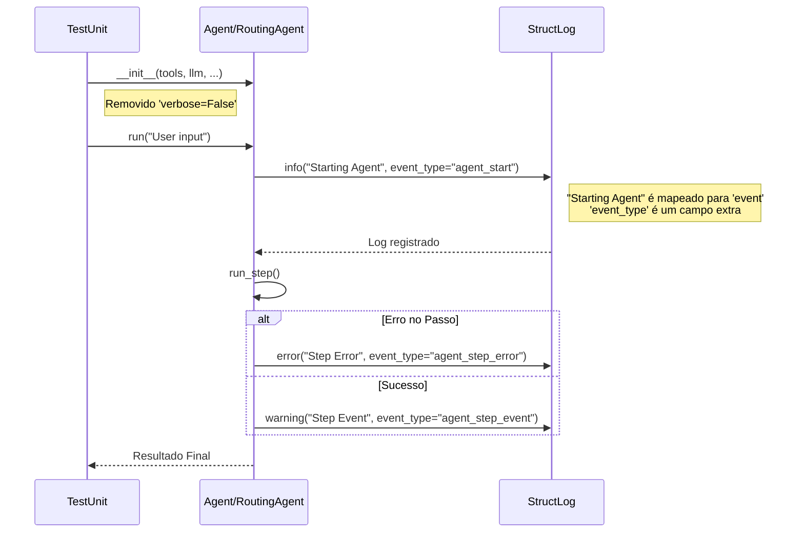
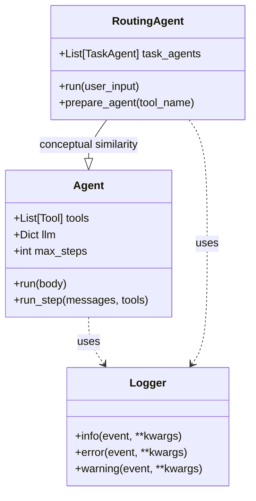

# Relatório de Correção: Testes do Agente e Conflitos de Logging

## 1. Contexto e Problema

Durante a execução da suíte de testes (`make test`), foram identificadas falhas críticas nos testes dos módulos `Agent` e `RoutingAgent`.

### Erros Identificados:

1.  **Argumento Inválido (`TypeError`)**:
    ```
    TypeError: Agent.__init__() got an unexpected keyword argument 'verbose'
    ```
    Isso ocorreu porque o parâmetro `verbose` foi removido das classes `Agent` e `RoutingAgent`, mas os testes unitários ainda tentavam instanciá-las passando esse argumento.

2.  **Conflito de Argumentos no Logger (`TypeError`)**:
    Após corrigir o erro de inicialização, surgiu um novo erro em runtime durante os testes:
    ```
    TypeError: ... got multiple values for argument 'event'
    ```
    Este erro foi causado por um conflito na biblioteca de logging (`structlog`). A configuração atual trata o primeiro argumento posicional como o `event` principal. Ao passar simultaneamente uma mensagem posicional e um argumento nomeado `event="..."`, o interpretador Python detectava duplicidade na atribuição do parâmetro `event`.

## 2. Solução Implementada

### 2.1. Correção da Instanciação (Testes)

Os arquivos de teste `test_agent.py` e `test_routing_agent.py` foram atualizados para remover o argumento `verbose=False` das fixtures de criação dos agentes.

### 2.2. Correção do Logging (Código Fonte)

Para resolver o conflito no `structlog`, alteramos a chave do argumento nomeado de `event` para `event_type` em todas as chamadas de log dentro de `agent.py` e `routing_agent.py`. Isso permite manter a mensagem legível como evento principal e ainda estruturar o tipo do evento separadamente.

**De:**
```python
logger.info("Starting Agent", event="agent_start")
```

**Para:**
```python
logger.info("Starting Agent", event_type="agent_start")
```

## 3. Diagramas Explicativos

### 3.1. Diagrama de Sequência: Fluxo de Execução do Teste e Log



### 3.2. Diagrama de Componentes: Estrutura do Agente



## 4. Arquivos Alterados

### Testes
- `tests/modules/ai/engines/lchain/core/agents/test_agent.py`
- `tests/modules/ai/engines/lchain/core/agents/test_routing_agent.py`

### Código Fonte (Core)
- `src/modules/ai/engines/lchain/core/agents/agent.py`
- `src/modules/ai/engines/lchain/core/agents/routing_agent.py`

## 5. Conclusão

As correções garantiram que:
1.  Os testes refletem a assinatura atual das classes (sem `verbose`).
2.  O sistema de logging funciona corretamente sem conflitos de argumentos, mantendo a rastreabilidade estruturada.
3.  A suíte de testes (`pytest`) para estes módulos agora executa com sucesso (17 testes aprovados).
